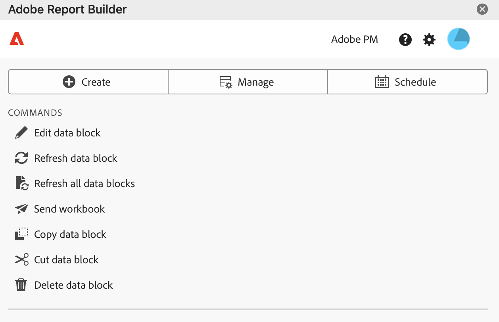

# Report Builder ハブ


Report Builder ハブは、Excel リボン バーから **[!UICONTROL Report Builder]**&#x200B;を選択すると、Excel ブック内に表示される右側のペインです。

Report Builder ハブを使用して、データブロックの作成、更新、管理を行います。

Report Builder ハブには、 **[!UICONTROL Create]**、 **[!UICONTROL Manage]**&#x200B;および **[!UICONTROL スケジュール]** ボタン、**[!UICONTROL コマンド]** パネル、および&#x200B;**[!UICONTROL クイック編集]** パネルが含まれています。

{zoomable="yes"}


選択

*  **[!UICONTROL Create]** ～ [新しいデータブロックを作成](create-a-data-block.md)。
*  **[!UICONTROL Manage]** ～ [既存のデータブロックを管理](manage-reportbuilder.md)。
*  **[!UICONTROL スケジュール]** ～ [電子メールでワークブックを送信するスケジュールを管理](schedule-reportbuilder.md)。

## コマンドパネル

**[!UICONTROL コマンド]** パネルを使用して、選択したセルまたは以前のアクションと互換性のあるコマンドにアクセスします。

| コマンド | 使用条件... | 目的 |
|------|------------------|--------|
|  **[!UICONTROL データブロックを編集]** | 選択したセル範囲が、1 つのデータブロックのみの一部である。 | を使用してデータブロックを編集します。 |
|  **[!UICONTROL データブロックを更新]** | 選択範囲に少なくとも 1 つのデータブロックが含まれている。 このコマンドは、選択範囲のデータブロックのみを更新します。 | を使用して、1つ以上のデータブロックを更新します。 |
|  **[!UICONTROL すべてのデータブロックを更新]** | ワークブックには、1 つ以上のデータブロックが含まれています。 | を使用して、ブック内のすべてのデータブロックを更新します |
|  **[!UICONTROL ワークブックを送信]** | ワークブックには、1 つ以上のデータブロックが含まれています。 | を使用すると、ワークブックを電子メール [&#128279;](schedule-reportbuilder.md)でファイルとして送信できます。 |
|  **[!UICONTROL データブロックをコピー]** | 選択したセルまたはセル範囲は、1 つ以上のデータブロックの一部です。 | を使用して、データブロックをコピーします。 |
|  **[!UICONTROL データブロックをカット]** | 選択したセルまたはセル範囲は、1 つ以上のデータブロックの一部です。 | データブロックをカットする場合に使用します。 |
|  **[!UICONTROL データブロックを削除]** | 選択したセル範囲が、1 つのデータブロックのみの一部である。 | データブロックの削除に使用 |

## クイック編集パネル

スプレッドシートで1つ以上のデータブロックを選択すると、Report Builderに&#x200B;**[!UICONTROL クイック編集]** パネルが表示されます。 **[!UICONTROL クイック編集]** パネルを使用すると、1つ以上のデータブロック内のパラメーターを同時に変更できます。

**[!UICONTROL クイック編集]** セクションを使用する際に行った変更は、選択したすべてのデータブロックに適用されます。

### レポートスイート

データブロックは、選択したレポートスイートからデータを取得します。 ワークシートで複数のデータブロックが選択されていて、同じレポートスイートからデータを取得しない場合、**レポートスイート** リンクに&#x200B;**[!UICONTROL _Multiple_]**&#x200B;と表示されます。

レポートスイートを変更すると、選択範囲のすべてのデータブロックで新しいレポートスイートが採用されます。 データブロック内のコンポーネントは、IDに基づいて新しいレポートスイートと照合されます。 データブロック内にコンポーネントが見つからない場合、そのコンポーネントは削除され、**[!UICONTROL 無効な値]**&#x200B;に置き換えられるか、特定のコンポーネントにが表示されます。

レポートスイートを変更するには、**[!UICONTROL レポートスイート]** ドロップダウンメニューから新しいレポートスイートを選択します。


### 日付範囲

**日付範囲**&#x200B;は、選択したデータブロックの日付範囲を表示します。 複数の日付範囲を持つ複数のデータブロックが選択されている場合、**[!UICONTROL 日付範囲]** リンクには&#x200B;**[!UICONTROL _複数_]**&#x200B;が表示されます。

### セグメント

**セグメント** リンクには、選択したデータブロックで使用されているセグメントの概要リストが表示されます。 複数のセグメントを適用して複数のデータブロックを選択した場合、**セグメント** リンクには&#x200B;**[!UICONTROL _複数_]**&#x200B;が表示されます。

>[!MORELIKETHIS]
>
>[&#x200B; レポートスイートを選択](select-report-suite.md)
>[日付範囲の選択](select-date-range.md)
>[フィルターの操作](work-with-segments.md)
>

<!--

Use the Report Builder hub to create, update, delete, and manage data blocks.

The Report Builder hub contains the Create, Manage, and Schedule buttons, the COMMANDS panel, and The QUICK EDIT panel.


## Create, Manage, and Schedule buttons

Use the Create, Manage, and Schedule buttons to create new data blocks, manage existing data blocks, or schedule datablocks.

## COMMANDS panel

Use the COMMANDS panel to access commands that are compatible with the selected cells or a previous action.

### Commands

| Commands displayed      | Available when…   | Purpose          |
|------|------------------|--------|
| Edit data block | The selected cell or cells range is part of one data block only. | Used to edit a data block |
| Refresh data block | The selection contains at least one data block. The command refreshes only the data blocks in the selection. | Used to refresh one or more data blocks |
| Refresh all data blocks | The workbook contains one or more data blocks. | Used to refresh ALL data blocks in the workbook |
| Send workbook |   |  Send a workbook on a schedule. |
| Copy data block   | The selected cell or cell range is part of one or more data blocks. | Used to copy a data block   |
| Cut data block |   | Used to cut a data block |
| Delete data block | The selected cell or cells range is part of one data block only. | Used to delete a data block |

## QUICK EDIT panel

When you select one or more data blocks in a spreadsheet, Report Builder displays the QUICK EDIT panel. You can use the QUICK EDIT panel to change parameters in a single data block or to change parameters in multiple data blocks at the same time.


The changes made using the Quick Edit sections apply to all selected data blocks.

### Report suites

Data blocks pull data from a selected report suite. If multiple data blocks are selected in a worksheet and they don't pull data from the same report suite, the **Report Suites** link displays *Multiple*.

When you change the report suite, all data blocks in the selection adopt the new report suite. Components in the data block are matched to the new report suite based on ID, for example, matching ```evars```). If a component isn't found in a data block, a warning message is displayed and the component is removed from the data block.

To change the report suite, select a new report suite from the drop-down menu.


### Date range

**[!UICONTROL Date range]** shows the date range for the selected data blocks. If multiple data blocks are selected with multiple date ranges, the **[!UICONTROL Date range]** link displays *Multiple*. [Learn more](/help/analyze/report-builder/select-date-range.md)

### Segments

The **Segments** link displays a summary list of the segments used by the selected data blocks. If multiple data blocks are selected with multiple segments applied, the **Segments** link displays *Multiple*. [Learn more](/help/analyze/report-builder/work-with-segments.md)

-->