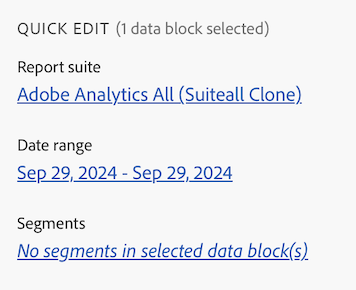

# Report Builder ハブ


Report Builder ハブは、Excel のリボン バーから  **[!UICONTROL Report Builder]** を選択すると、Excel ブック内に表示される右側のウィンドウです。

Report Builder ハブを使用して、データブロックの作成、更新、管理を行います。

Report Builder ハブには、**[!UICONTROL Create]**、**[!UICONTROL Manage]**、**[!UICONTROL Schedule]** ボタン、**[!UICONTROL Commands]** パネル、**[!UICONTROL Quick Edit]** パネルが含まれています。

{zoomable="yes"}


選択

* **[!UICONTROL Create]** して [ 新しいデータブロックを作成 ](create-a-data-block.md) します。
* **[!UICONTROL Manage]** 既存のデータブロックを [ 管理 ](manage-reportbuilder.md) します。
*  **[!UICONTROL スケジュール]**[ ワークブックをメールで送信するスケジュールを管理 ](schedule-reportbuilder.md) します。

## コマンドパネル

**[!UICONTROL コマンド]** パネルを使用して、選択したセルまたは以前のアクションと互換性のあるコマンドにアクセスします。

| コマンド | 使用条件... | 目的 |
|------|------------------|--------|
| **[!UICONTROL データブロックを編集]** | 選択したセル範囲が、1 つのデータブロックのみの一部である。 | データブロックの編集に使用します。 |
|  **[!UICONTROL データブロックを更新]** | 選択範囲に少なくとも 1 つのデータブロックが含まれている。コマンドは、選択範囲内のデータブロックのみを更新します。 | を使用して、1 つ以上のデータブロックを更新します。 |
| **[!UICONTROL すべてのデータブロックを更新]** | ワークブックには、1 つ以上のデータブロックが含まれています。 | ワークブック内のすべてのデータブロックを更新するために使用します |
| **[!UICONTROL 送信]** | ワークブックには、1 つ以上のデータブロックが含まれています。 | を使用して [ ワークブックをファイルとして電子メールで送信 ](schedule-reportbuilder.md) します。 |
| **[!UICONTROL データブロックをコピー]** | 選択したセルまたはセル範囲は、1 つ以上のデータブロックの一部です。 | データブロックのコピーに使用します。 |
| **[!UICONTROL データブロックを切り取り]** | 選択したセルまたはセル範囲は、1 つ以上のデータブロックの一部です。 | データブロックの切り取りに使用します。 |
| **[!UICONTROL データブロックを削除]** | 選択したセル範囲が、1 つのデータブロックのみの一部である。 | データブロックの削除に使用 |

## クイック編集パネル

スプレッドシートで 1 つ以上のデータブロックを選択すると、Report Builderに **[!UICONTROL クイック編集]** パネルが表示されます。 **[!UICONTROL クイック編集]** パネルを使用して、1 つ以上のデータブロックのパラメーターを同時に変更できます。

「**[!UICONTROL クイック編集]**」セクションを使用して行った変更は、選択したすべてのデータブロックに適用されます。

### レポートスイート

データブロックは、選択したレポートスイートからデータを取り込みます。 ワークシートで複数のデータブロックが選択されていて、それらが同じレポートスイートからデータを取り込まない場合、「**レポートスイート**」リンクに **[!UICONTROL _複数_]** と表示されます。

レポートスイートを変更すると、選択範囲内のすべてのデータブロックに新しいレポートスイートが採用されます。 データブロック内のコンポーネントは、ID に基づいて新しいレポートスイートと照合されます。 コンポーネントがデータブロック内に見つからない場合、そのコンポーネントは削除され、**[!UICONTROL 無効な値]** または特定のコンポーネントに対して  が表示されます。

レポートスイートを変更するには、「**[!UICONTROL レポートスイート]**」ドロップダウンメニューから新しいレポートスイートを選択します。


### 日付範囲

**日付範囲**&#x200B;は、選択したデータブロックの日付範囲を表示します。複数の日付範囲を持つ複数のデータブロックが選択されている場合、「**[!UICONTROL 日付範囲]**」リンクに「**[!UICONTROL _複数_]**」と表示されます。

### セグメント

**セグメント** リンクには、選択したデータブロックで使用されているセグメントの概要リストが表示されます。 複数のセグメントが適用された状態で複数のデータブロックが選択されている場合、「**セグメント**」リンクに **[!UICONTROL _複数_]** と表示されます。

>[!MORELIKETHIS]
>
>[レポートスイートの選択](select-report-suite.md)
>[日付範囲を選択 ](select-date-range.md)
>[フィルターの操作 ](work-with-segments.md)
>

<!--

Use the Report Builder hub to create, update, delete, and manage data blocks.

The Report Builder hub contains the Create, Manage, and Schedule buttons, the COMMANDS panel, and The QUICK EDIT panel.


## Create, Manage, and Schedule buttons

Use the Create, Manage, and Schedule buttons to create new data blocks, manage existing data blocks, or schedule datablocks.

## COMMANDS panel

Use the COMMANDS panel to access commands that are compatible with the selected cells or a previous action.

### Commands

| Commands displayed      | Available when…   | Purpose          |
|------|------------------|--------|
| Edit data block | The selected cell or cells range is part of one data block only. | Used to edit a data block |
| Refresh data block | The selection contains at least one data block. The command refreshes only the data blocks in the selection. | Used to refresh one or more data blocks |
| Refresh all data blocks | The workbook contains one or more data blocks. | Used to refresh ALL data blocks in the workbook |
| Send workbook |   |  Send a workbook on a schedule. |
| Copy data block   | The selected cell or cell range is part of one or more data blocks. | Used to copy a data block   |
| Cut data block |   | Used to cut a data block |
| Delete data block | The selected cell or cells range is part of one data block only. | Used to delete a data block |

## QUICK EDIT panel

When you select one or more data blocks in a spreadsheet, Report Builder displays the QUICK EDIT panel. You can use the QUICK EDIT panel to change parameters in a single data block or to change parameters in multiple data blocks at the same time.



The changes made using the Quick Edit sections apply to all selected data blocks.

### Report suites

Data blocks pull data from a selected report suite. If multiple data blocks are selected in a worksheet and they don't pull data from the same report suite, the **Report Suites** link displays *Multiple*.

When you change the report suite, all data blocks in the selection adopt the new report suite. Components in the data block are matched to the new report suite based on ID, for example, matching ```evars```). If a component isn't found in a data block, a warning message is displayed and the component is removed from the data block.

To change the report suite, select a new report suite from the drop-down menu.


### Date range

**[!UICONTROL Date range]** shows the date range for the selected data blocks. If multiple data blocks are selected with multiple date ranges, the **[!UICONTROL Date range]** link displays *Multiple*. [Learn more](/help/analyze/report-builder/select-date-range.md)

### Segments

The **Segments** link displays a summary list of the segments used by the selected data blocks. If multiple data blocks are selected with multiple segments applied, the **Segments** link displays *Multiple*. [Learn more](/help/analyze/report-builder/work-with-segments.md)

-->