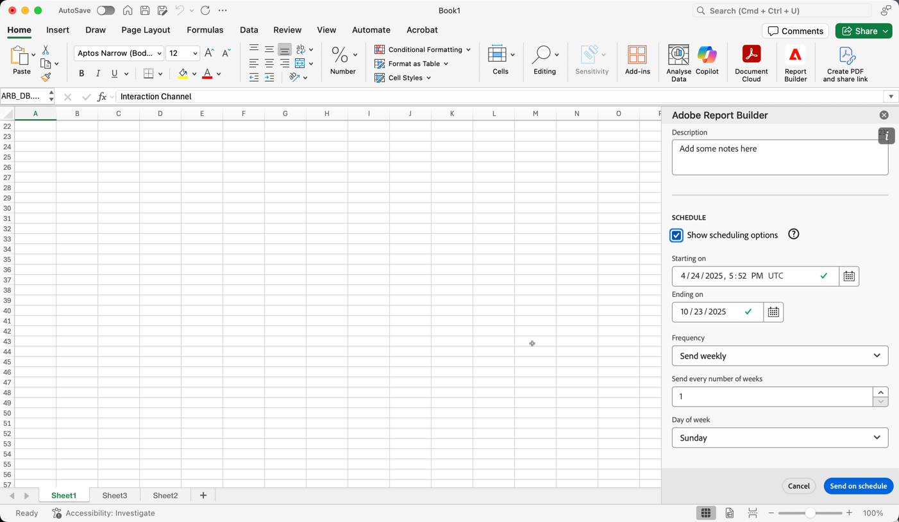

# 電子メールを通じて共有してワークブックをスケジュールする

>[!NOTE]
>
>この節で説明するように、電子メールを通じて共有するためのワークブックのスケジュール設定に加えて、[&#x200B; クラウド宛先に書き出すためのワークブックのスケジュール &#x200B;](/help/analyze/report-builder/report-builder-export.md)で説明しているように、クラウド宛先に書き出すためのワークブックのスケジュール設定を設定できます。

ワークブックを保存して分析を完了した後、スケジュール機能を使用してチームの他のユーザーとワークブックを簡単に共有できます。 スケジュール機能を使用すると、ワークブック内のデータを自動的に更新するスケジュールを作成し、指定した日時、指定したオーディエンスに Excel ワークブックの.xlsx ファイルをメールの添付ファイルとして送信できます。 スケジュールを設定すると、受信者には、自動的かつ定期的にアップデートが送られます。 また、スケジュール機能を使用して、自動更新のスケジュールを設定せずに、ワークブックを 1 回送信することもできます。

1 つのワークブックに対して複数のスケジュールを作成できます。 例えば、チームに毎日ワークブックを送信し、2 つの異なるスケジュールを作成して週に 1 回、管理者にワークブックを送信できます。

また、スケジュール機能を使用すると、ワークブックのパスワード保護を設定したり、以前にスケジュールされたワークブックを編集したりできます。

>[!BEGINSHADEBOX]

デモ動画については、 [&#x200B; ワークブックのスケジュール &#x200B;](https://video.tv.adobe.com/v/3417506?captions=jpn&quality=12&learn=on){target="_blank"}を参照してください。

>[!ENDSHADEBOX]

## ワークブックのスケジュール設定

ワークブックをスケジュールするには：

1. Report Builder ハブで「**[!UICONTROL スケジュール]**」を選択してスケジュールを作成し、ブック Excel ファイル （.xlsx）を個人またはグループに自動的に配布できるようにします。

   {zoomable="yes"}

1. 「**[!UICONTROL ワークブックをスケジュール]**」または「」を選択して、新しいスケジュール済みワークブックを作成します。

   {zoomable="yes"}

   スケジュールウィンドウには、ブック名やブックの最終変更日など、ブックに関する事前定義済みの情報が表示されます。

### ファイル

「**[!UICONTROL ファイル]**」セクションでは、ファイルを保護するためのファイルの種類、名前、パスワードの詳細を指定します。

{zoomable="yes"}

1. まだ選択されていない場合は、を使用して現在のワークブックを選択します。

1. （オプション） **[!UICONTROL ファイル名]**&#x200B;を入力します。

   ワークブックのファイル名は、デフォルトではワークブックの名前になりますが、必要に応じてファイル名を変更できます。

1. **[!UICONTROL ファイルタイプ]**&#x200B;を選択します。

   * **[!UICONTROL Excel]**
   * **[!UICONTROL PDF]**
   * **[!UICONTROL CSV]**

   **[!UICONTROL CSV]**&#x200B;を選択すると、スケジュールされたワークブックがzip形式の添付ファイルとして送信されます。 一部の企業のメール管理機能では、zip ファイルを含む電子メールをブロックする場合があります。 それに応じて警告が表示されます。

1. （オプション）「**[!UICONTROL ファイル名にタイムスタンプを追加する]**」を選択します。

   ファイル名にタイムスタンプを付加して、ワークブックの更新日を識別できます。 タイムスタンプは、特定の日付に送信されたワークブックのバージョンを確認するのに役立ちます。 選択すると、次のいずれかを選択できます。

   * **[!UICONTROL ISO日付形式]**。これにより、`YYYY-MM-DD`がファイル名に追加されます。
   * **[!UICONTROL ISO日付形式+タイムスタンプ]**。これにより、`YYYY-MM-DD_HH-MM-SS`がファイル名に追加されます。

<!--
Does no longer seem to be an option? 
1. (Optional) Select **.zip compression** to compress the file and set up password protection on the file.

    When you make this selection, you're prompted to enter a password to open the file. This is helpful if you have concerns about data security and you want to password protect the workbook. Protecting the file with a password requires you to select **.zip compression**. The password must be at least 8 characters and contain a number and a special character.

    {zoomable="yes"}{width="55%"}
-->

1. **[!UICONTROL パスワードを入力して、ワークブックを保護]**&#x200B;します。 有効なパスワードには、少なくとも8文字、数字、特殊文字が必要です。 パスワードを表示するにはを選択し、パスワードを非表示にするにはを選択します（デフォルト）。

### 電子メール

「**[!UICONTROL 電子メール]**」セクションでは、電子メールの受信者、件名、説明を指定します。

{zoomable="yes"}

1. **受信者**&#x200B;を入力します。 組織で認識されている人物の名前を入力できます。 または、組織外のユーザーのメールアドレスを入力することもできます。

1. 受信者向けに、メールの&#x200B;**件名**&#x200B;と説明を入力します。 件名はデフォルトでワークブックファイル名に設定されますが、必要に応じて変更できます。 説明セクションに詳細を追加できます。

1. オプションで、**[!UICONTROL 説明]** テキスト領域に説明を入力できます。

### スケジュール

「**[!UICONTROL スケジュール]**」セクションで、ワークブックを含むメールを受信者に送信するスケジュールを定義できます。

{zoomable="yes"}

1. 「**[!UICONTROL スケジュール設定オプションを表示]**」を選択して、スケジュールを定義します。

1. **[!UICONTROL 開始日を]**&#x200B;から入力してください。 または、を選択して、カレンダーから開始日を選択します。

1. 終了日を&#x200B;**&#x200B;**&#x200B;に入力してください。 または、を選択して、カレンダーから終了日を選択します。

1. **[!UICONTROL 頻度]**&#x200B;を選択します。 選択した頻度に応じて、追加のオプションがあります。 以下の表を参照してください。

   | 頻度 | オプション |
   |---|---|
   | **[!UICONTROL 1時間ごとに送信]** | **[!UICONTROL 時間ごとに送信]**&#x200B;する値を入力してください。 |
   | **[!UICONTROL 毎日送信]** | **[!UICONTROL 毎日の頻度]**&#x200B;を選択：**[!UICONTROL 毎日の送信]**、**[!UICONTROL 毎週毎日の送信]**、または&#x200B;**[!UICONTROL カスタム頻度]**。  「**[!UICONTROL カスタム頻度]**」を選択した場合、**[!UICONTROL 日数ごとに送信]**&#x200B;の値を入力します。 |
   | **[!UICONTROL 毎週送信]** | **[!UICONTROL 週ごとに送信]**&#x200B;する値を入力してください。 「**[!UICONTROL 週の日]**」を選択します。 |
   | **[!UICONTROL 曜日ごとに月単位で送信]** | **[!UICONTROL 週の日]**&#x200B;と&#x200B;**[!UICONTROL 週の月]**&#x200B;を選択します。 |
   | **[!UICONTROL 月ごとの月次送信]** | **[!UICONTROL 月のこの日に送信]**&#x200B;から値を選択します。 |
   | **[!UICONTROL 月の日付ごとに毎年送信]** | **[!UICONTROL 週の日]**&#x200B;を選択し、**[!UICONTROL 月]**&#x200B;を選択し、**[!UICONTROL 年の月]**&#x200B;を選択します。 |
   | **[!UICONTROL 特定の日付ごとに毎年送信]** | **[!UICONTROL 年の月]**&#x200B;を選択し、**[!UICONTROL 月のこの日に送信]**&#x200B;から値を選択します。 |

### 送信

ワークブックを送信するには：

* **[!UICONTROL スケジュール設定オプションを表示]**&#x200B;を使用してスケジュールを定義していない場合は、**[!UICONTROL 今すぐ送信]**&#x200B;を選択して、ワークブックをすぐに電子メールで送信します。
* **[!UICONTROL スケジュール設定オプションを表示]**&#x200B;を使用してスケジュールを定義した場合は、**[!UICONTROL スケジュールに従って送信]**&#x200B;を選択して、定義したスケジュールを使用してワークブックを電子メールで送信します。

どちらの場合も、Report Builder ハブの下部に確認トーストが表示されます。

ワークブックの送信をキャンセルするには、**[!UICONTROL キャンセル]**&#x200B;を選択します。

## 従来のスケジュールされたワークブックの管理

既にスケジュールされている従来のワークブックの管理について詳しくは、[&#x200B; スケジュールされたワークブックの変換](/help/analyze/report-builder/convert-workbooks.md#schedule-a-converted-legacy-workbook)を参照してください。

