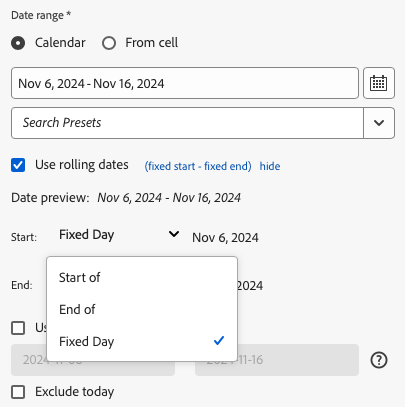

# 日付範囲を選択します。

既存のデータブロックの日付範囲を変更するには、データブロックの編集を選択するか、クイック編集パネルを使用します。

データブロックの日付範囲を変更するには、次のオプションを使用します。

**カレンダー**

カレンダーでは、次のオプションを使用して、固定日付または相対日付を作成できます。

- 日付範囲フィールド
- カレンダー
- プリセットドロップダウンメニュー
- 相対日付モード
- 式をカスタマイズ


**セルから取得**

「セルから取得」オプションでは、ワークシートのセルに入力した日付を参照できます。

選択した日付範囲の今日を除外するオプションもあります。


## カレンダーの使用

**カレンダー**&#x200B;を使用する場合、日付範囲フィールドには、データブロックリクエストに応じた現在の日付範囲が表示されます。 日付は、日付範囲フィールドに直接入力するか、日付範囲選択オプションを使用して入力します。

### 日付範囲フィールド

日付を日付範囲フィールドに直接入力する方法

1. カレンダーアイコンの横にある日付範囲フィールドをクリックします。

1. 日付範囲の開始日と終了日を入力します。

### カレンダー

カレンダーを使用して日付を選択するには

1. カレンダーアイコンをクリックして、月別のカレンダーを表示します。

1. 開始日をクリックします。

1. 終了日をクリックします。

日付範囲を逆の順序で設定するには、終了日を最初にクリックしてから、開始日をクリックします。


### プリセットドロップダウンメニュー

プリセットドロップダウンメニューには、標準のプリセット日付範囲と、保存したデータビューまたは共有したデータビューの日付範囲コンポーネントが含まれています。

### 相対日付

「相対日付」オプションでは、相対日付を使用して日付範囲を選択できます。

1. **相対日付を使用**&#x200B;を選択します。

1. 開始日または終了日、あるいはその両方の相対式を選択します。

   

   **開始時** - 日、週、月、四半期、年の始めを選択できます。

   **終了時** - 日、週、月、四半期、年の終わりを選択できます。

   **固定日** - 開始日と終了日を固定し、他の日付を相対日付に設定できます。

1. 相対期間として日、週、月、四半期、年を選択します。

   

1. 相対日付から日数、週数、月数、四半期数または年数を加算または減算します。

   

1. 「次へ」をクリックして、データ範囲を定義します。

   日付プレビューを使用して、結果の日付範囲が目的の範囲であることを確認します。

### カスタム式

「カスタム式」オプションを使用すると、カスタム式を作成するか、数式を入力して日付範囲を変更できます。

1. 「**相対日付を使用**」を選択します。

1. 「**カスタム式の使用**」を選択します。

   「**カスタム式の使用**」オプションを選択すると、標準の相対日付範囲コントロールは無効になります。

   

1. カスタム式を入力します。

   カスタム式のサンプルリストについては、**日付式**&#x200B;を参照してください。

1. 日付プレビューを使用して、結果の日付範囲が目的の範囲になっていることを確認します。

#### カスタム式の作成

1. **日付参照**&#x200B;を入力します。

1. **日付演算子**&#x200B;を追加して、日付を過去または未来に移動します。

```tm-11m-1d``` など、複数の演算子を含むカスタムの日付式を入力できます。

#### 日付参照

次のテーブルに、日付参照の例を示します。

| 日付参照 | タイプ | 説明 |
|----------------|--------------|----------------------------|
| 1/1/10 | 静的な日付 | ISO 日付形式で入力 |
| td | 相対日付 | 本日の開始時 |
| tw | 相対日付 | 今週の開始日 |
| tm | 相対日付 | 今月の開始日 |
| tq | 相対日付 | 今四半期の開始日 |
| ty | 相対日付 | 今年の開始日 |

#### 日付演算子

次のテーブルに、日付演算子の例を示します。

| 日付演算子 | 単位 | 説明 |
|----------------|---------|--------------------|
| +6d | 日 | 日付参照に 6 日間を追加 |
| +1w | 週 | 日付参照に 1 週間を追加 |
| -2m | 月 | 日付参照から 2 か月を減算 |
| -4q | 四半期 | 日付参照から 4 四半期を減算 |
| -1y | 年 | 日付参照から 1 年を減算 |

#### 日付式

次のテーブルに、日付式の例を示します。

| 日付式 | 意味 |
|-----------------|--------------------------------------|
| td-1w | 先週の最初の日 |
| tm-1d | 先月の最終日 |
| td-52w | 52 週間前の同じ曜日 |
| tm-11m-1d | 昨年同月の最終日 |
| 「2020-09-06」 | 2020 年 9 月 9 日（PT） |

## セルからの日付範囲

日付範囲は、ワークシートのセルで指定できます。「**セルからの日付範囲**」オプションを使用して、選択したセルからデータブロックの開始日と終了日を選択します。「**セルから**」オプションを選択すると、パネルに「**開始**」フィールドと「**終了**」フィールドが表示され、セルの場所を入力できます。


## 今日を除外

「**今日を除外**」オプションを選択して、選択した日付範囲から今日を除外します。「今日を含める」を選択すると、今日の不完全なデータが取り込まれる可能性があります。

「**今日を除外**」オプションを選択すると、カレンダー、相対日付、カスタム式など、すべての日付範囲モードから現在の日付が除外されます。

## 有効な日付範囲

次のリストは、有効な日付範囲の形式を示しています。

- 開始日と終了日は、「YYYY-MM-DD」の形式で指定する必要があります。

- 開始日は、終了日以前にする必要があります。どちらの日付も将来の日付に設定できます。

- 相対な日付を使用する場合は、開始日を今日または過去の日付にする必要があります。「**今日を除外**」をオンにした場合は、過去にする必要があります。

- 将来の静的な日付範囲セットを作成できます。例えば、来週予定されているマーケティングキャンペーンのローンチに、将来の日付を設定する必要が出ることがあります。このオプションを選択すると、事前にキャンペーンを監視するワークブックが作成されます。

## 日付範囲の変更

「コマンド」パネルで「データブロックの編集」を選択するか、「クイック編集」パネルで「日付範囲」リンクを選択することにより、既存のデータブロックの日付範囲を編集できます。

**データブロックの編集** - 単一のデータブロックについて、日付範囲を含む複数のデータブロックパラメーターを編集できます。

**クイック編集：日付範囲** - 1 つ以上のデータブロックの日付範囲を編集できます。

クイック編集パネルから日付範囲を編集するには

1. ワークシートで、1 つ以上のデータブロック内のセルを選択します。

1. クイック編集パネルで「**日付範囲**」リンクをクリックします。

1. 任意の日付選択オプションを使用して日付範囲を選択します。

1. 「**適用**」をクリックします。


Report Builder は、選択範囲内のすべてのデータブロックに新しい日付範囲を適用します。
