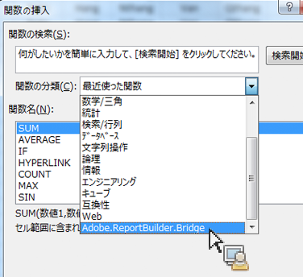
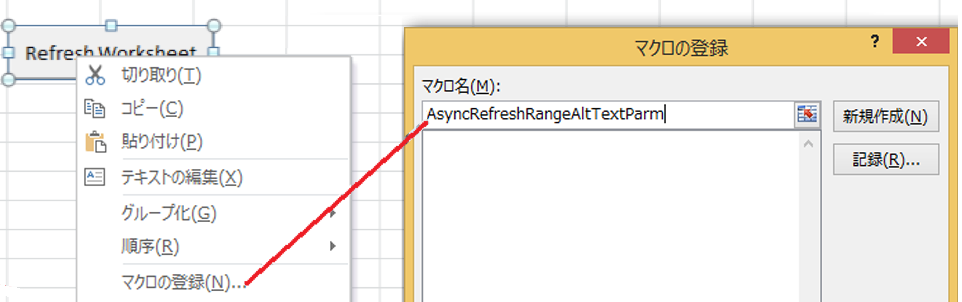
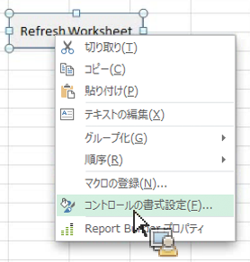
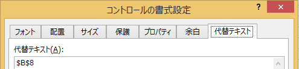

# Microsoft Excelの関数からReport Builder機能を呼び出す

Report Builder のユーザーインターフェイスにアクセスすることなく、Excel の関数のみで Report Builder リクエストを操作できます。

例えば、Excel 内で他のソースから取得されたデータに基づいて入力フィルターを適用する Report Builder リクエストを自動的に更新することができます。このような処理を、string RefreshRequestsInCellsRange(..) 関数を使用して実行できます。すべての呼び出しは非同期で実行されます。関数は、呼び出しの処理が完全に実行されるまで待機せず、すぐに制御が戻ります。

>[!NOTE]
>
>この機能を動作させるには、Report Builder5.0（以降）がインストールされている必要があります。

利用可能な関数は以下の通りです。

| 関数名 | 説明 |
|---|---|
| string AsyncRefreshAll() | ワークブックに存在するすべての Report Builder リクエストを更新します。 |
| string AsyncRefreshRange(string rangeAddressInA1Format) | 指定したセル範囲のアドレスに存在するすべての Report Builder リクエストを更新します（A1 形式でセルの範囲を表す文字列。「Sheet1!A2:A10」など）。 |
| string AsyncRefreshRangeAltTextParam() | MS フォームコントロールの代替テキストから渡される、指定されたセル範囲にあるすべての Report Builder リクエストを更新します。 |
| string AsyncRefreshActiveWorksheet() | アクティブなワークシートにあるすべての Report Builder リクエストを更新します。 |
| string AsyncRefreshWorksheet(string worksheetName) | 指定したワークシート（タブに表示されるワークシート名）にあるすべての Report Builder リクエストを更新します。 |
| string AsyncRefreshWorksheetAltTextParam(); | MS フォームコントロールの代替テキストから渡される、特定のワークシート名にあるすべての Report Builder リクエストを更新します。 |
| string GetLastRunStatus() | 最後に実行した関数のステータスを示す文字列を返します。 |

Excel でこれらの関数にアクセスするには、[!UICONTROL 数式]／[!UICONTROL 関数の挿入]を実行し、分類のリスト下部にある Adobe.ReportBuilder.Bridge を選択します。



## Use these functions in a formula {#section_034311081C8D4D7AA9275C1435A087CD}

例えば、次の数式があるとします。

```
=IF(OR(ISTEXT(P5),ISBLANK(P5)),AsyncRefreshRange("P9"),"")
```

この数式は、「セル P5 の値がテキストであるか、または空白の場合は、指定した範囲（セル P9）を更新する」と言う意味です。

## Use Report Builder functions with format control {#section_26123090B5BD49748C8D8ED7A1C5ED84}

作成したコントロールにマクロを割り当てて、Report Builder のリクエストを更新することもできます。例えば、関数 AsyncRefreshActiveWorksheet は、ワークシートのすべてのリクエストを更新します。しかし、すべてのリクエストではなく、特定のリクエストのみを更新することが必要な場合もあります。

1. コントロールを配置します。
1. Right-click the control and select **[!UICONTROL Assign Macro]**.
1. Report Builder 関数名を入力します（パラメーターや括弧は入力しないでください）。



## Pass parameters to Report Builder functions via format control {#section_ECCA1F4990D244619DFD79138064CEF0}

以下の 2 つの関数では、「コントロールの書式設定」の代替テキストフィールドにセットされた値を受け取ることができます。

* AsyncRefreshRange(string rangeAddressInA1Format)
* AsyncRefreshWorksheet(string worksheetName)

1. Right-click the control and select **[!UICONTROL Format Control]**.

   

1. 「[!UICONTROL 代替テキスト]」タブをクリックします。

   

1. 「[!UICONTROL 代替テキスト]」に、更新するセルの範囲を入力します。
1. コントロールにマクロを割り当てます

1. Pick one of the two functions that end with AltTextParam and click **[!UICONTROL OK]**.

