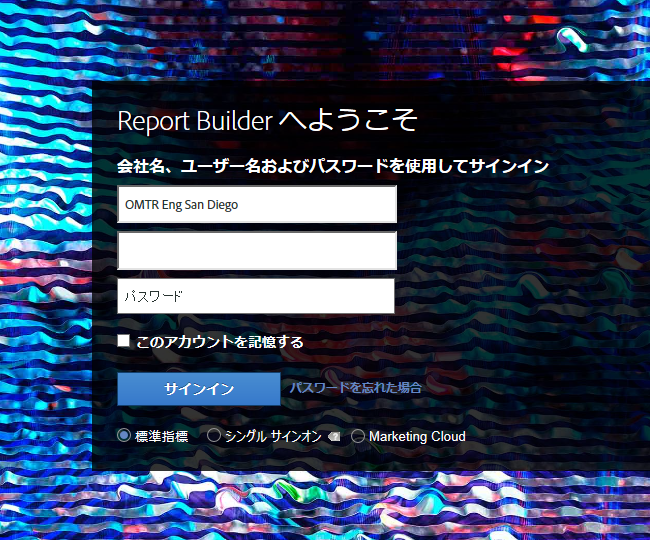
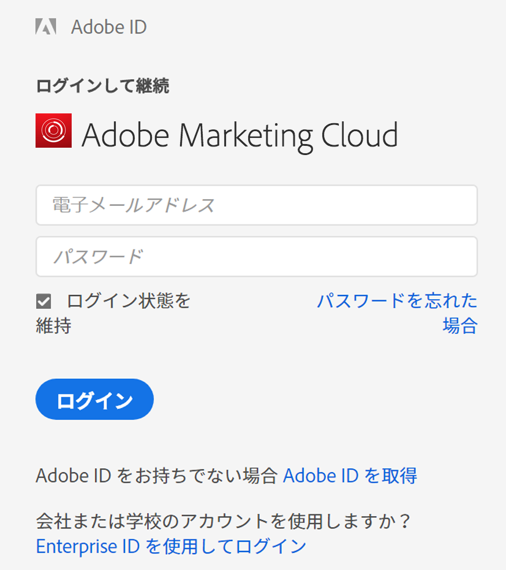

# Report Builder へのログイン

Report Builder への 3 種類のログイン方法に関する情報です。

現在、Report Builder の「**[!UICONTROL ログイン]**」をクリックしたときに使用できるログインオプションは次のとおりです。

* [標準 ](/help/analyze/report-builder/setup/login.md#section_6D54B8ADAE7F416BB83F5082B3771CFA)
* [シングルサインオン ](/help/analyze/report-builder/setup/login.md#section_6970A5F926774976B85FFE576610E85F)
* [Experience Cloud とシングルサインオン ](/help/analyze/report-builder/setup/login.md#section_1FA230F35AB54021A874A7A28DE4C850)

## 標準 {#section_6D54B8ADAE7F416BB83F5082B3771CFA}

Adobe Analytics の資格情報を使用して Report Builder にログインする場合は、このログインを使用します。

**Report Builder ログイン - フィールド定義**

| フィールド | 定義 |
|--- |--- |
| 会社名 | Adobe Analytics でログイン資格情報として使用する会社名。 |
| ユーザー名 | Adobe Analytics でログインに使用するユーザー名。ユーザー名には、スケジュールされたタスクが関連付けられています。同じログイン情報で Report Builder にログインすると、スケジュールされたタスクがどのコンピューター上でも表示されます。 |
| パスワード | Analytics のパスワード。 |
| このアカウントを記憶する | ログイン情報が暗号化され、Report Builder がインストールされたコンピューター上のユーザープロファイル用のファイルに保存されます。ログイン情報が保存されるので、レポートの作成者と同じ PC を使用してレポートを含むスプレッドシートを開く場合は誰でもデータの更新と編集ができます。他のユーザーとコンピューターを共有している場合に、スプレッドシートのデータが他のユーザーによって更新されるのを防ぐには、このオプションを無効にしておいてください。自動ログイン設定を無効にするには、ツールバーの「**[!UICONTROL 別の資格情報を使用してログインする]**」をクリックし、「**[!UICONTROL このアカウントを記憶する]**」を無効にします。 |
| プロキシサーバーを使用 | プロキシサーバーを経由してインターネットにアクセスしていて、プロキシ用のユーザー名とパスワードが必要な場合に、有効にします。 |

## シングルサインオン {#section_6970A5F926774976B85FFE576610E85F}

この（レガシー）シングルサインオンでログインできるのは Adobe Analytics のみです。Experience Cloud 全体にはログインできません。

また、ドメインを入力すると、そのドメインをシステムが認識し、会社のログインページにリダイレクトされて Adobe Analytics へのログインが可能になります。

## Experience Cloud {#section_1FA230F35AB54021A874A7A28DE4C850}

Experience Cloud ログインを使用すると、Enterprise ID（電子メールとパスワード）を使用して Adobe Experience Cloud にログインできます。**[!UICONTROL ログイン]**／**[!UICONTROL Enterprise ID を使用してログイン]**&#x200B;をクリックして、会社のシングルサインオンページに移動します。Enterprise ID について詳しくは、[ここ](https://helpx.adobe.com/jp/enterprise/kb/enterprise-id-faq.html#whatis)をクリックしてください。

>[!NOTE]
>
>Experience Cloud ログインはセッションベースであり、トークンは 30 日後に期限切れになります。

