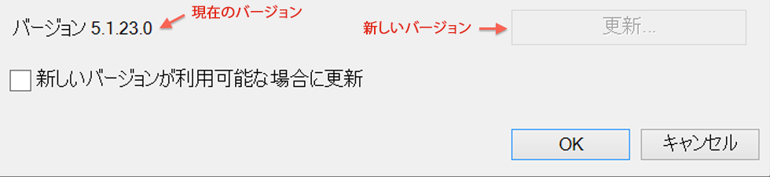

# Report Builder のアップグレード

Report Builder のアップグレードに関する手順と考慮事項です。

## アップグレードに関する FAQ {#section_AFE40FF5544C418790A1C298C25CC18A}

**質問：Report Builder をアップグレードするときに、古いバージョンを保持できますか。**

回答：いいえ。古いバージョンは削除されます。

**質問：既存のレポートが失われることはありますか。**

回答：いいえ。既存のレポートはすべて引き続き使用できます。

**質問：新しいバージョンに対して再認証が必要ですか。**

回答：いいえ。認証設定も含め、すべての設定は引き継がれます。

## アップグレードの手順 {#section_73B8110A619549189A30079735E81867}

1. 現バージョンの Report Builder にログインします。
1. **[!UICONTROL オプション]**&#x200B;メニューに移動して最新バージョンにアップグレードします。現在のバージョン番号はオプションダイアログの下に表示されます。

   

1. 新しいバージョンが利用できる場合、「**[!UICONTROL 更新...]**」をクリックします。ボタンには、更新後のバージョンが、「バージョン 5.0.50 に更新」のように表示されます。

   >[!NOTE]
   >
   >このボタンがグレイで表示されている場合、利用できる Report Builder の新しいバージョンはありません。

1. オプションとして、「**[!UICONTROL 新しいバージョンが利用可能な場合に更新]**」チェックボックスを選択すると、将来新しいバージョンが利用可能になったときに、更新プロセスが自動的に開始されます。
1. セットアップ画面が表示されたら、「**[!UICONTROL 次へ >]**」をクリックします。

   

1. アップグレードが完了したら、Report Builder に再ログインします。

## 手動アップグレードの手順 {#section_27A0200010DC4747A718F1A65B180599}

Adobe Analytics からいつでも最新バージョンの Report Builder を入手できます。

1. Adobe Analytics にログインして「**[!UICONTROL ツール]**」に移動します。
1. 「**[!UICONTROL Report Builder]**」をクリックします。
1. **[!UICONTROL 概要]**&#x200B;画面で、32 ビットまたは 64 ビットバージョンを選択します。
1. 「**[!UICONTROL 今すぐダウンロード]**」をクリックします。

