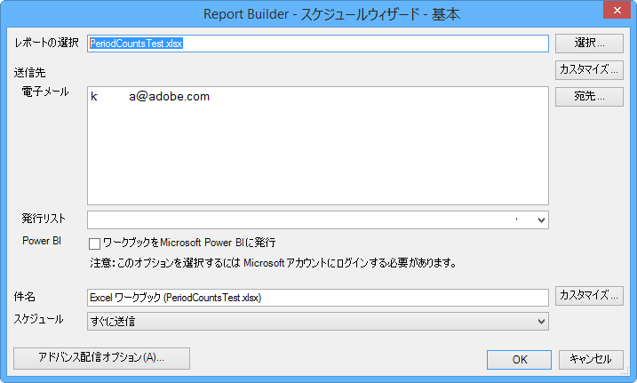

# ワークブックのスケジュール設定

ワークブックのスケジュール設定、アドバンス配信オプションの指定、受信者の指定およびスケジュールの履歴の表示を行うことができます。アドバンス配信オプションでは、特定の時間または間隔で送信するワークブックを設定できます。ワークブックを送信するファイル形式を指定することもできます。

For example, you can schedule workbooks to be delivered immediately or on a recurring schedule, and specify the file format in [!DNL Advanced Delivery Options]. レポートをアップロードする場合のファイルサイズの上限は 5 MB です。

Additionally, after you create a workbook schedule in Report Builder, you can view and edit the schedule in **[!UICONTROL Analytics]** &gt; **[!UICONTROL Reports]**. （Reports &amp; Analytics ヘルプの[レポートのスケジュールと配信](/help/analyze/reports-analytics/scheduling.md)を参照してください）。

>[!NOTE]
>
>ワークブックをスケジュールするには、Excel2007または互換パックがインストールされている必要があります。Report Builderライセンスごとに最大10個のスケジュール済みワークブックを使用できます。ただし、他のライセンスの最大件数を減らすことにより、最大件数を増やすことができます。To do so, go to **[!UICONTROL Admin]** &gt; **[!UICONTROL Company Settings]** &gt; **[!UICONTROL Report Builder Reports]**. スケジュールされた（またはワークブックライブラリにアップロードされた）ワークブックが削除され、28か月以上にわたってタッチ（更新、置き換え）されていません。

**ワークブックをスケジュールするには**

1. ワークブックを生成して保存します。
1. On the Report Builder Toolbar, click **[!UICONTROL Schedule]**.

   「[!UICONTROL 予定レポート]」タブでは、作成したすべてのタスクと残りのタスク数などの概要が表示されます。
1. **[!UICONTROL 「予定レポート]** »タブで、??«新規??****
1. 基本のスケジュールウィザードに、次のように表示されます。

   

1. [!UICONTROL 基本のスケジュールウィザード]で、次のオプションを設定します。

* **レポート**&#x200B;の選択:ワークブックの名前。新しいスケジュールされたワークブックの場合、このフィールドにはアクティブなワークブック名が入力されます。

<table id="table_6D5B1B832EB0451293F1902E2A1D1068"> 
 <thead> 
  <tr> 
   <th colname="col1" class="entry"> フィールド </th> 
   <th colname="col2" class="entry"> 説明 </th> 
  </tr>
 </thead>
 <tbody> 
  <tr> 
   <td colname="col1"> 
レポートの選択 
 </td> 
   <td colname="col2"> 
レポートの名前。新規の予定レポートでは、このフィールドに実行中のワークブック名が入力されます。 
 </td> 
  </tr> 
  <tr> 
   <td colname="col1"> 
選択 
 </td> 
   <td colname="col2"> 
「レポートの選択」ページが表示されます。レポートは、サーバー（以前に作成されたすべてのワークブックが格納されている）またはローカルマシンから選択できます。ローカルドライブ上で .xls 形式のワークブックを選択すると、そのファイルは .xlsx に変換されます。変換の一環として、ファイルが Excel で開かれてアクティブになります。予定レポートで選択されているワークブックのファイル名が現在 Excel で開かれているワークブックと同じである場合、前にアップロードされたファイルではなく、ローカルファイルが選択されます。スケジュールリポジトリからレポートを選択する場合は、ワークブックのコピーがサーバー上に作成されます。その場合、ワークブックのファイル名は末尾に 1 を追加して更新されます。新規に作成された予定レポートはこのコピーされたワークブックを使用します。 
 </td> 
  </tr> 
  <tr> 
   <td colname="col1"> 
カスタマイズ 
 </td> 
   <td colname="col2"> 
日付形式をカスタマイズできます。 
 </td> 
  </tr> 
  <tr> 
   <td colname="col1"> 
宛先 
 </td> 
   <td colname="col2"> 
該当する場合、Outlook のアドレス帳を表示します。 
 </td> 
  </tr> 
  <tr> 
   <td colname="col1"> 
送信先：電子メール 
 </td> 
   <td colname="col2"> 
ワークブックの電子メール受信者。 
 </td> 
  </tr> 
  <tr> 
   <td colname="col1"> 
送信先：発行リスト 
 </td> 
   <td colname="col2"> 
この会社で使用可能な配信リストの一覧が表示されます。 
 </td> 
  </tr> 
  <tr> 
   <td colname="col1"> 
Power BI 
 </td> 
   <td colname="col2"> 
詳しくは、<a href="../../analyze/report-builder/c-publish-power-bi/integration-power-bi.md#section_BA137EA92A46483F83BB5C1C40FBA002" format="dita" scope="local">ワークブックを Microsoft Power BI に発行</a>を参照してください。 
 </td> 
  </tr> 
  <tr> 
   <td colname="col1"> 
件名 
 </td> 
   <td colname="col2"> 
メールの件名。 
 </td> 
  </tr> 
  <tr> 
   <td colname="col1"> 
スケジュール 
 </td> 
   <td colname="col2"> 
 ワークブックをいつ送信するかを指定できます。（即時、毎時、毎日、毎月、毎年から選択できます）。 
 </td> 
  </tr> 
 </tbody> 
</table>

1. Click **[!UICONTROL Advanced Delivery Options]** to configure file and publishing options:

<table id="table_1BA8A5600DE94A33B83B096E69CE15F3"> 
 <thead> 
  <tr> 
   <th colname="col1" class="entry"> フィールド </th> 
   <th colname="col2" class="entry"> 説明 </th> 
  </tr>
 </thead>
 <tbody> 
  <tr> 
   <td colname="col1"> 
「<b>スケジュール</b>」タブ 
 </td> 
   <td colname="col2"> </td> 
  </tr> 
  <tr> 
   <td colname="col1"> 
配信時間 
 </td> 
   <td colname="col2"> 
ワークブックをすぐにスケジュールしたり、後でスケジュールしたりできます。タイムゾーンは変更できます。 
 </td> 
  </tr> 
  <tr> 
   <td colname="col1"> 
繰り返しパターン 
 </td> 
   <td colname="col2"> 
選択内容に基づいてワークブックを送信します。 
 </td> 
  </tr> 
  <tr> 
   <td colname="col1"> 
繰り返しの範囲 
 </td> 
   <td colname="col2"> 
ワークブックの配信を開始および停止するタイミングを指定できます。 
 
 
注意:現在の期間（週、月、四半期、年）の最初の日にワークブックをスケジュールすると、最初の日のデータのみが返されます。 
 
 </td> 
  </tr> 
  <tr> 
   <td colname="col1"> 
「<b>ファイルオプション</b>」タブ 
 </td> 
   <td colname="col2"> </td> 
  </tr> 
  <tr> 
   <td colname="col1"> 
ファイル形式 
 </td> 
   <td colname="col2"> 
配信形式として、Excel 2007（.xlsx）、Excel 2003（.xls）、.pdf、.csv、.mht、.txt または .xml を選択します。 
 </td> 
  </tr> 
  <tr> 
   <td colname="col1"> 
 ファイルの保存先 
 </td> 
   <td colname="col2"> 
 電子メールまたは FTP を指定します。ページのオプションは、選択内容よって異なります。FTP の場合、そのホストが外部からアクセス可能であることを確認する必要があります。 
 </td> 
  </tr> 
  <tr> 
   <td colname="col1"> 
発行リスト 
 </td> 
   <td colname="col2"> 
 スケジュールされたワークブックを複数の発行リストに送信する場合、ワークブックはリストごとに1回実行されます。対象レポートスイートは、発行リストに割り当てられたレポートスイートに置き換えられます。 
 </td> 
  </tr> 
  <tr> 
   <td colname="col1"> 
ファイルコンテンツの言語 
 </td> 
   <td colname="col2"> 
カバーレターに使用する言語を指定します。中国語（簡体または繁体）、ドイツ語、フランス語、日本語、韓国語、ポルトガル語（ブラジル）またはスペイン語を選択することができます。 
 </td> 
  </tr> 
  <tr> 
   <td colname="col1"> 
「<b>発行オプション</b>」タブ 
 </td> 
   <td colname="col2"> </td> 
  </tr> 
  <tr> 
   <td colname="col1"> 
Power BI に発行中 
 </td> 
   <td colname="col2"> 
    <ul id="ul_40697E4FB2CE4F34B857FBF153D6D6D5"> 
     <li id="li_023E4750814D415EBC899269C9EA5D46"><a href="../../analyze/report-builder/c-publish-power-bi/integration-power-bi.md#section_BA137EA92A46483F83BB5C1C40FBA002" format="dita" scope="local"> ワークブックを Power BI に発行</a> </li> 
     <li id="li_9B684BE22AF94ABC903405EE83951A80"><a href="../../analyze/report-builder/c-publish-power-bi/integration-power-bi.md#section_E48148793E794169B766C73995897B9F" format="dita" scope="local"> すべての Report Builder リクエストを Power BI データセットテーブルとして発行</a> </li> 
     <li id="li_7B0BD285BC1749D1B2C65759CA97877B"><a href="../../analyze/report-builder/c-publish-power-bi/integration-power-bi.md#section_6F8422B90D3F4F7EB5D4C97BFFA807AD" format="dita" scope="local"> すべてのフォーマット済みテーブルを Power BI データセットテーブルとして発行</a> </li> 
    </ul> </td> 
  </tr> 
  <tr> 
   <td colname="col1"> 
この Power BI レポートを次のようにラベル付けします。 
 </td> 
   <td colname="col2"> 
ラベルの詳細 
 </td> 
  </tr> 
 </tbody> 
</table>

1. Click **[!UICONTROL OK]**, then click **[!UICONTROL Exit]**.

   Report Builder displays the scheduled workbook in the [Scheduled Task Manager](../../analyze/report-builder/r-arb-scheduled-reports.md#section_69306B8D833F4DF7BBFA53753B0E6C31).

