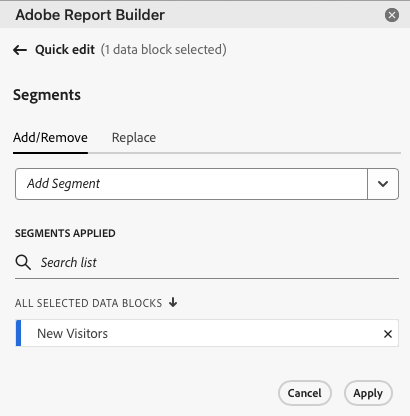

# セグメントの操作

セグメントを適用できるのは、新しいデータブロックを作成するとき、または **[!UICONTROL コマンド]** パネルから **[!UICONTROL データブロックの編集]** を選択するときです。

## データブロックへのセグメントの適用

データブロック全体にセグメントを適用するには、セグメントをダブルクリックするか、コンポーネントリストからテーブルの「セグメント」セクションにセグメントをドラッグ&amp;ドロップします。

## 個々の指標へのフィルターの適用

セグメントを使用して個々の指標にフィルターを適用するには：

* **[!UICONTROL セグメント]** から 1 つ以上のセグメントをテーブルの指標にドラッグ&amp;ドロップします。

* または：

   1.  ペインで特定の指標の **[!UICONTROL その他の小]** を選択し、**[!UICONTROL 指標をフィルター]** を選択します。

      {zoomable="yes"}

   1. **[!UICONTROL セグメント]** ドロップダウンメニューから 1 つ以上のセグメントを選択します。 セグメントが **[!UICONTROL 適用されたセグメント]** リストに追加されます。

      
   1. 「」を選択して、「**[!UICONTROL 適用されたセグメント]** リストからセグメントを削除します。 または、「**[!UICONTROL すべてクリア]**」を選択して、「適用されたセグメント **[!UICONTROL リストからすべてのセグメントを削除し]** す。
   1. 「**[!UICONTROL 適用]**」を選択します。

適用したフィルターを表示するには、テーブルウィンドウで指標の上にマウスポインターを置くか、指標を選択します。 セグメントが適用された指標にはセグメントアイコンが表示されます。

## セグメントのクイック編集

**[!UICONTROL クイック編集]** パネルを使用して、既存のデータブロックのセグメントを追加、削除、置換できます。

スプレッドシートでセルの範囲を選択すると、**[!UICONTROL クイック編集]** パネルの **[!UICONTROL セグメント]** リンクには、その選択範囲内のデータブロックで使用されるセグメントの概要リストが表示されます。

**[!UICONTROL クイック編集]** パネルを使用してセグメントを編集するには：

1. 1 つまたは複数のデータブロックからセルの範囲を選択します。

1. **[!UICONTROL セグメント]** リンクを選択して、**[!UICONTROL クイック編集]****[!UICONTROL セグメント]** パネルを起動します。

### セグメントの追加または削除

「追加と削除」オプションを使用して、セグメントを追加または削除できます。

1. **[!UICONTROL クイック編集]** セグメント **[!UICONTROL パネルの「]** 追加 **[!UICONTROL 削除]**」タブを選択します。

   1. **[!UICONTROL セグメント]** ドロップダウンメニューから 1 つ以上のセグメントを選択します。 セグメントが **[!UICONTROL 適用されたセグメント]** リストに追加されます。
   1. 「」を選択して、「**[!UICONTROL 適用されたセグメント]** リストからセグメントを削除します。
   1. 「**[!UICONTROL 適用]**」を選択します。

Report Builderに、適用されたセグメントの変更を確認するメッセージが表示されます。

### セグメントの置換

既存のセグメントを別のセグメントで置き換えて、データのセグメント化方法を変更できます。

1. **[!UICONTROL クイック編集]****[!UICONTROL セグメント パネルの]** 置換 **[!UICONTROL タブを選択し]** す。

1. **検索リスト** 検索フィールドを使用して、特定のセグメントを検索します。

1. 置換する 1 つ以上のセグメントを選択します。

1. 置換後の文字列ドロップダウンメニューで 1 つ以上のセグメントを検索して、そのセグメントを **[!UICONTROL 置換後の文字列]** リストに追加します。

1. 「**[!UICONTROL 適用]**」を選択します。

Report Builderは、置換を反映するようにセグメントのリストを更新します。

## セルからのデータブロックセグメントの定義

データブロックは、セルからセグメントを参照できます。 複数のデータブロックでセグメントの同じセルを参照できるので、セグメントを複数のデータブロックに一度に簡単に切り替えることができます。

セルからセグメントを適用するには：

1. [ 新しいデータブロックを作成 ](create-a-data-block.md#create-a-data-block) するか、既存のデータブロックを編集します。
1. 「**[!UICONTROL セグメント]**」タブを選択してセグメントを定義します。
1.  を選択します。

   {zoomable="yes"}

1. データブロックでセグメントを参照するセルを選択します。

1. ダブルクリックして、セルにセグメントを追加します。 または、1 つ以上のセグメントを「**[!UICONTROL 含まれるセグメント]** セクションにドラッグ&amp;ドロップします。

1. **[!UICONTROL 適用]** を選択して、参照セルを作成します。

1. **セグメント** タブから、新しく作成した参照セルセグメントをデータブロックに追加します。

   {zoomable="yes"}

1. 「**[!UICONTROL 完了]**」を選択します。

参照セルをセグメントとして他のデータブロックに適用するには、「**[!UICONTROL テーブル]**」タブの **[!UICONTROL セグメント]** リストでセル参照をセグメントの 1 つとして使用します。

### 参照セルを使用したデータブロックセグメントの変更

1. スプレッドシートで参照セルを選択します。

1. **[!UICONTROL クイック編集]** メニューの **[!UICONTROL セルからのセグメント]** の下のリンクを選択します。

   {zoomable="yes"}

1. ドロップダウンリストからセグメントを選択します。

1. 「**[!UICONTROL 適用]**」を選択します。

<!--
You can apply segments when you create a new data block or when you select the **Edit data block** option from the COMMANDS panel.

## Apply segments to a data block

To apply a segment to the entire data block, double-click a segment or drag and drop filters from the components list into the Segments section of the Table.

## Apply segments to individual metrics

To apply segments to individual metrics, drag and drop a segment onto a metric in the table. You can also click the **...** icon to the right of a metric in the Table pane and then select **[!UICONTROL Segment metric]**. To view applied segments, hover over or select a metric in the Table pane. Metrics with applied segments display a filter icon.

## Quick edit segments

You can use the Quick edit panel to add, remove, or replace segments for existing data blocks.

When you select a range of cells in the spreadsheet, the **[!UICONTROL Segments]** link in the Quick edit panel displays a summary list of the segments used by the data blocks in that selection.

To edit segments using the Quick edit panel

1. Select a range of cells from one or multiple data blocks.

    

1. Click the link underneath **[!UICONTROL Segments]** to launch the Quick edit - Filters panel.

    

### Add or remove a segment

You can add or remove segments using the Add/Remove options.

1. Select the **[!UICONTROL Add/Remove]** tab in the Quick edit-segments panel.

    All segments applied to the selected data blocks are listed in the Quick Edit-segments panel. Segments applied to all data blocks in the selection are listed under the **[!UICONTROL Applied to all selected data blocks]** heading. Segments applied to some but not all data blocks are listed under the **[!UICONTROL Applied to 1 or more selected data blocks]** heading.

    When multiple segments are present in the selected data blocks, you can search for specific segments using the **[!UICONTROL Add Filter]** search field.

    

1. Add segments by selecting segments from the **[!UICONTROL Add segment]** drop down menu.

    The list of searchable segments includes all segments accessible to the report suites that are present in one or more of the selected data blocks as well as all the segments that are available globally in the organization.

    Adding a segment applies the segment to all data blocks in the selection.

1. To remove segments, click the delete icon **x** to the right of segments in the **[!UICONTROL Segments applied]** list.

1. Click **[!UICONTROL Apply]** to save changes and return to the hub panel.

    Report Builder displays a message to confirm the applied segment changes.

### Replace a segment

You can replace an existing segment with another segment to change how the data is segmented.

1. Select the **[!UICONTROL Replace]** tab in the Quick edit-segment panel.

    

1. Use the **[!UICONTROL Search list]** search field to locate specific segments.

1. Choose one or more segments that you want to replace.

1. Search for one or more segments in the Replace with field.

    Selecting a filter adds it to the **[!UICONTROL Replace with]**... list.

1. Click **[!UICONTROL Apply]**.

    Report Builder updates the list of segments to reflect the replacement.

### Define data block segments from cell

Data blocks can reference segments from a cell. Multiple data blocks can reference the same cell for segments, allowing you to easily switch segments for multiple data blocks at a time.

To apply segments from a cell

1. Navigate to Step 2 in either the data block creation or editing process. See [Create a Data Block](./create-a-data-block.md).
1. Click the **[!UICONTROL Segments]** tab to define filters.
1. Click **[!UICONTROL Create segment from cell]**.

    

1. Select the cell from which you want the data blocks to reference a segment.
   
1. Add the segment choice you wish to add to the cell by either double clicking the segment, or by dragging and dropping it into the **[!UICONTROL Segments Included]** section. 
   
   Note: Only one choice may be selected for the given cell at one time.

    

1. Click **[!UICONTROL Apply]** to create the reference cell.

1. From the **[!UICONTROL Segments]** tab, add the newly created reference cell segments to your data block.

    

1. Click **[!UICONTROL Finish]**.

    Now this cell can be referenced by other data blocks in their segments. To apply the reference cell as a segment to other data blocks, simply add the cell reference to their segments from the Segments tab. 

#### Use the reference cell to change data block segments

1. Select the reference cell in your spreadsheet.

1. Click the link under **[!UICONTROL Segments from Cell]** in the Quick Edit menu.

    

1. Select your segment from the drop-down menu.

    

1. Click **[!UICONTROL Apply]**.
-->