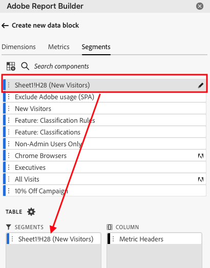

# Report Builderでのセグメントの操作

新しいデータブロックを作成するとき、またはコマンドパネルから「**データブロックの編集**」オプションを選択するとき、セグメントを適用できます。

## データブロックへのセグメントの適用

データブロック全体にセグメントを適用するには、セグメントをダブルクリックするか、コンポーネントリストからテーブルの「セグメント」セクションにフィルターをドラッグ&amp;ドロップします。

## 個々の指標へのセグメントの適用

個々の指標にセグメントを適用するには、セグメントをテーブルの指標にドラッグ&amp;ドロップします。 また、テーブルウィンドウで指標の右側にある「**...**」アイコンをクリックし、「**[!UICONTROL セグメント指標]**」を選択します。 適用されたセグメントを表示するには、テーブルウィンドウで指標の上にマウスポインターを置くか、指標を選択します。 セグメントが適用された指標にはフィルターアイコンが表示されます。

## セグメントのクイック編集

クイック編集パネルを使用して、既存のデータブロックのセグメントを追加、削除、置換できます。

スプレッドシートでセルの範囲を選択すると、クイック編集パネルの **[!UICONTROL セグメント]** リンクには、選択範囲内のデータブロックで使用されるセグメントの概要リストが表示されます。

クイック編集パネルを使用してセグメントを編集するには

1. 1 つまたは複数のデータブロックからセルの範囲を選択します。

   

1. **[!UICONTROL セグメント]** の下にあるリンクをクリックして、「クイック編集 – フィルター」パネルを起動します。

   

### セグメントの追加または削除

「追加と削除」オプションを使用して、セグメントを追加または削除できます。

1. クイック編集セグメントパネルの「**[!UICONTROL 追加・削除]**」タブを選択します。

   選択したデータブロックに適用されているすべてのセグメントが、クイック編集セグメント パネルに一覧表示されます。 選択範囲内のすべてのデータブロックに適用されたセグメントは、「**[!UICONTROL 選択したすべてのデータブロックに適用]** 見出しの下に一覧表示されます。 すべてのデータブロックではなく一部のデータブロックに適用されたセグメントは、「**[!UICONTROL 選択した 1 つ以上のデータブロックに適用]** 見出しの下に一覧表示されます。

   選択したデータブロックに複数のセグメントが存在する場合、**[!UICONTROL フィルターを追加]** 検索フィールドを使用して、特定のセグメントを検索できます。

   

1. **[!UICONTROL セグメントを追加]** ドロップダウンメニューからセグメントを選択して、セグメントを追加します。

   検索可能なセグメントのリストには、選択した 1 つ以上のデータブロックに存在するレポートスイートにアクセス可能なすべてのセグメントと、組織内でグローバルに使用可能なすべてのセグメントが含まれます。

   セグメントを追加すると、選択範囲内のすべてのデータブロックにセグメントが適用されます。

1. セグメントを削除するには、「**[!UICONTROL 適用されたセグメント**」リストのセグメントの右側にある削除アイコン ]**x** をクリックします。

1. 「**[!UICONTROL 適用]**」をクリックし、変更を保存してハブパネルに戻ります。

   Report Builderは、適用されたセグメントの変更を確認するメッセージを表示します。

### セグメントの置換

既存のセグメントを別のセグメントで置き換えて、データのセグメント化方法を変更できます。

1. クイック編集セグメントパネルの「**[!UICONTROL 置換]**」タブを選択します。

   

1. **[!UICONTROL 検索リスト]** 検索フィールドを使用して、特定のセグメントを検索します。

1. 置き換える 1 つ以上のセグメントを選択します。

1. 「置換文字列」フィールドで 1 つ以上のセグメントを検索します。

   フィルターを選択すると、そのフィルターが「**[!UICONTROL 置換文字列]**」リストに追加されます。

1. 「**[!UICONTROL 適用]**」をクリックします。

   Report Builderは、置換を反映するようにセグメントのリストを更新します。

### セルからのデータブロックセグメントの定義

データブロックは、セルからセグメントを参照できます。 複数のデータブロックでセグメントの同じセルを参照できるので、複数のデータブロックのセグメントを一度に簡単に切り替えることができます。

セルからセグメントを適用するには

1. データブロック作成または編集プロセスの手順 2 に移動します。 [ データブロックの作成 ](./create-a-data-block.md) を参照してください。
1. 「**[!UICONTROL セグメント]**」タブをクリックして、フィルターを定義します。
1. **[!UICONTROL セルからセグメントを作成]** をクリックします。

   

1. データブロックでセグメントを参照するセルを選択します。

1. セグメントをダブルクリックするか、「**[!UICONTROL 含まれるセグメント]**」セクションにドラッグ&amp;ドロップして、セルに追加するセグメントの選択肢を追加します。

   注意：特定のセルに対して選択できる選択肢は、一度に 1 つだけです。

   

1. **[!UICONTROL 適用]** をクリックして、参照セルを作成します。

1. **[!UICONTROL セグメント]** タブから、新しく作成した参照セルセグメントをデータブロックに追加します。

   

1. 「**[!UICONTROL 完了]**」をクリックします。

   これで、このセルがセグメント内の他のデータブロックによって参照できるようになります。 参照セルをセグメントとして他のデータブロックに適用するには、「セグメント」タブからセル参照をセグメントに追加します。

#### 参照セルを使用したデータブロックセグメントの変更

1. スプレッドシートで参照セルを選択します。

1. クイック編集メニューの **[!UICONTROL セルからのセグメント]** の下にあるリンクをクリックします。

   

1. ドロップダウンリストからセグメントを選択します。

   

1. 「**[!UICONTROL 適用]**」をクリックします。
