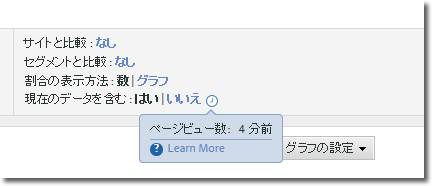
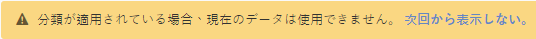

# 現在のデータ

Reports &amp; Analytics の「現在のデータを含む」オプションを使用すると、ほとんどの場合、データが完全に処理されてファイナライズされる前に最新の Analytics データを表示できます。現在のデータには、ほとんどの指標が数分以内で表示され、迅速な意思決定を可能にする実用的なデータが提供されます。

レポートの設定の一部として表示されます。

「現在のデータ」は、この機能をサポートするすべてのレポートで、デフォルトで有効です。データの完全処理後にすべての指標を表示する場合、いくつかのオプションがあります。

* 完全処理されたデータを使用するAnalysis Workspaceを使用します。
* 現在のデータレポート設定で「いいえ」をクリックすると、処理されたデータのみが使用されます。
* 管理者以外のユーザーがこのオプションを表示しないように、管理コンソールの製品プロファイルから「現在のデータ」権限項目を削除します。See [Analytics Tools permission items](../../admin/admin-console/permissions/analytics-tools.md) in the Admin user guide for more information.

データの可用性を優先するため、現在のデータはセグメント、分類、分類、パスおよび一部の指標では使用できません。これらの機能のいずれかが使用されている場合、現在のデータがレポート内で「いいえ」に強制され、現在のデータが使用できない理由を説明する黄色の通知が表示されます。

## 一般的な現在のデータの遅延

指標は、次の 3 つの時間枠のいずれかに表示されます。「現在のデータを含む」の横の時計アイコンをクリックすると、レポートの各指標の実際の遅延値が表示されます。

| 時間枠 | 指標 |
| --- | --- |
| 10分未満 | トラフィック変数のインスタンスとページビュー |
| 10 ～ 35 分 | コンバージョン変数、コンバージョン変数のインスタンスおよびページビュー |
| 45 ～ 120 分 | 訪問回数、個別訪問者数、パーティシペーションなど、その他すべてのデータ |

現在のデータ表示に表示されるデータの一部が完全に処理されていないので、現在のデータ表示とファイナライズされたビューでレポートされる値の差異が表示されます。通常、トレンドレポートでのデータの相違は 1% 以内です。

## 計算指標

計算指標は遅延が異なる指標を使用して作成できるため、現在のデータ表示の不完全なデータを使用して最新の値が計算されることがあります。

For example, you create the calculated metric 'Page Views per Visit using the formula `Page Views divided by Visits`. 通常、ページビューは10分以内に表示され、訪問回数は通常2時間以内に表示され、この待ち時間ウィンドウ内の計算指標は不完全な指標を使用して計算されます。2時間の期間に4,000件の異なる訪問から4,000件のヒットを取得する新しいページを投稿すると、これらの指標間の遅延の差によって不完全な計算が発生する可能性があります。

このデータの相違は、新しい値または短い期間のレポートを作成するときに最も表示されます。レポートでより長い日付範囲が使用されている場合、レポートの直近数時間に発生した遅延の差は、計算指標に目立った影響を及ぼすことはありません。

これらの違いによって影響を受ける可能性のある計算指標がある場合は、現在のデータをオフにするか、または同じ待ち時間枠で指標を使用します。

## ダウンロードしたレポート

現在のデータ表示が有効なレポートをダウンロードするとき、レポートは、キューに入れられた後、生成され、ブラウザーに返されます。レポートの生成中にデータが収集されると、そのデータがレポートに表示されます。この時間枠によって、ダウンロードされたレポートに若干のデータが表示される可能性があります。
