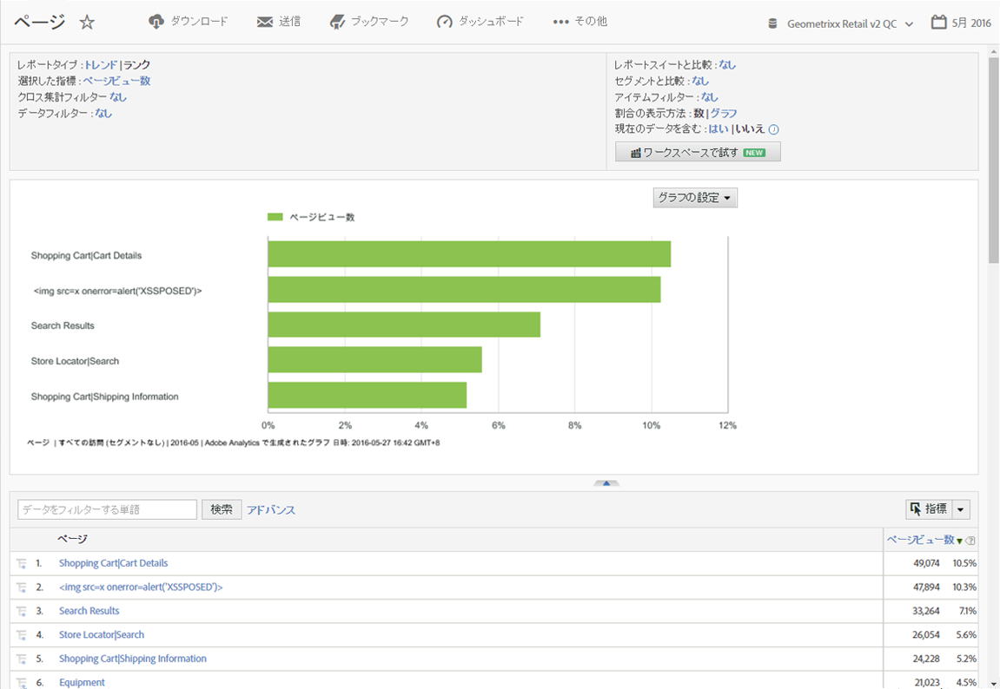

# Reports&amp; Analyticsの概要

Reports &amp; Analytics を使用する前に、Reports &amp; Analytics の基本的なログインやタスクの設定、およびアカウント情報へのアクセス方法について理解します。

## Getting started with Reports and Analytics {#concept_8C531D94965743BFBED7A87FE5473FF0}

Reports &amp; Analytics を使用する前に、Reports &amp; Analytics の基本的なログインやタスクの設定、およびアカウント情報へのアクセス方法について理解します。

レポートは、従来型の Web ベースのチャネルと、モバイルやビデオ、ソーシャルネットワークのような発展を続けるチャネルの両方に洞察を提供します。マーケティングレポートの例を以下に示します。

* サイトの訪問者数
* そのうちの個別訪問者数（1 回のみカウント）
* サイトへの来訪経路（リンクをたどって来訪したか、直接来訪したかなど）
* サイトのコンテンツを検索するために使用したキーワード
* 特定のページまたは全サイトでの滞在時間
* 訪問者がクリックしたリンク、およびサイトを離れた日時
* 売上高またはコンバージョンイベントを最も効果的に生み出しているマーケティングチャネル
* ビデオの視聴に費やした時間
* サイトの訪問に使用したブラウザーとデバイス

## Browser and system requirements {#concept_7E987A1E578940B1859D89CA14FAFF34}

Reports &amp; Analytics インターフェイスにログインするためのブラウザーと必要システム構成を示します。

<!-- 

requirements.xml

 -->

* ブラウザー:

   * 推奨：最新バージョンの Firefox、Chrome、Safari または Edge。
   * 最新バージョンの Microsoft Internet Explorer 11。

      >[!NOTE]
      >
      >アドビは Adobe Analytics での Internet Explorer 11 のサポートを 2018 年 11 月 13 日に終了しました。Microsoft Edge またはその他のサポート対象ブラウザーにお早めにお切り替えください。

* cookie と JavaScript を有効にする必要があります。
* 画面の解像度 1024 x 768、画面の色 16 ビット以上。

## Log in to Reports and Analytics {#concept_27B0A630D26D497E98F6A4AFA579BA9A}

インターフェイスにアクセスする前に、アカウントマネージャーまたはカスタマーケアと協力して会社のアカウントを設定してください。

## Log in using the Experience Cloud {#task_BDC7532F7CBF4689A2079BB2CCD64F01}

Adobe Experience Cloudを使用してログインする手順を説明します。

<!-- 

t_login_sso.xml

 -->

1. インターネットに接続されているコンピューターで、ブラウザーを起動します。
1. Go to [!DNL https://login.experiencecloud.adobe.com/].
1. [!UICONTROL サインイン] ページで、 **[!UICONTROL 「シングルサインオン]**」をクリックします。
1. Complete the following information, then click **[!UICONTROL Sign In]**.

   **[!UICONTROL 会社の設定]**：会社 ID（発行された半角英数字のカンパニー名）を入力します。

   **[!UICONTROL ユーザー名]**： アカウント ID を入力します。

   **[!UICONTROL パスワード]**： アカウントのパスワードを入力します。
1. From the Experience Cloud home page, go to **Analytics &gt; Reports**.

   無操作状態が 30 分間続くと自動的にログアウトされます。

## レポートの実行 {#task_C6772791AFD642CFB9C51ADB9E5932A5}

レポートを生成する手順を説明します。

<!-- 

t_running_report.xml

 -->

1. [!UICONTROL Reports &amp; Analytics] にログインします。

   The Reports menu displays, or a [dashboard](../../analyze/reports-analytics/dashboard.md#concept_8CD3ACA2830A4994A68A31D8773B57E0) displays, if you have set one up.

1. **[!UICONTROL サイトコンテンツ]** / **[!UICONTROL ページ]** （など）をクリックします。

   

   See [Report Features](../../analyze/reports-analytics/overview/report-overview.md#concept_AEA3BBC8167040198E0FECEAB2E0A677) for information about interface features of a report.

## ユーザーのアカウント設定の編集 {#concept_7FAF5B923B984426B7F64E026EA2DCAA}

ユーザーアカウントの編集、ユーザーパスワードのリセットおよび連絡先情報の編集に関する情報を示します。

<!-- 

t_acct_info.xml

 -->

連絡先情報を表示および編集したり、パスワードを指定したり、Web サービス情報を表示したり、データ収集からこのコンピューターを除外したりすることができます。

Click the Account icon  at the top right, then click the **[!UICONTROL Account Settings]** (wheel) icon next to your login name.

すべてのユーザーは、「[!UICONTROL アカウント情報]」ページにアクセスできます。次の情報を表示したり、編集したりできます。

<table id="table_58F5D292485F45F9902B372E4E1E3103"> 
 <thead> 
  <tr> 
   <th colname="col1" class="entry"> 情報のタイプ </th> 
   <th colname="col2" class="entry"> 定義 </th> 
  </tr> 
 </thead>
 <tbody> 
  <tr> 
   <td> 
連絡先 
 </td> 
   <td> 
 アカウントに次の個人情報を指定します。 
 
    <ul id="ul_7925E35904EB47E3AC648FA80A09EF91"> 
     <li id="li_CDD8D7B73A1D4C78A41FF02BD0E5E788">名前（必須） </li> 
     <li id="li_7255F50ABFFA4EE8A0A9D04F92BE432D">姓（必須） </li> 
     <li id="li_3DF6107291CC4D46AAA0E4A13D59128F">タイトル </li> 
     <li id="li_B5BE95E0FE594939A2D4C6680A6B8BDD">電子メールアドレス（必須） </li> 
     <li id="li_B764239241CE4F1CA74F77D796E7AB1D">電話番号 </li> 
    </ul> </td> 
  </tr> 
  <tr> 
   <td> 
 ログイン 
 </td> 
   <td> 
アカウントのユーザー名が表示され、アカウントのパスワードを変更できます。 
 
<a href="https://helpx.adobe.com/analytics/kb/How-to-Reset-Report-and-analytics-password.html" format="html" scope="external">Reports &amp; Analytics アカウントのパスワードのリセット方法</a>も参照してください。 
 </td> 
  </tr> 
  <tr> 
   <td> 
Web サービス 
 </td> 
   <td> 
この アカウントに関連付けられた Web サービスのユーザー名と共通の秘密が表示されます。Web サービス API から Experience Cloud にアクセスする場合、これらの資格情報を使用します。詳しくは、<a href="https://marketing.adobe.com/developer" scope="external" format="https">Developer Connection</a> を参照してください。 
 
 
注：この情報は、アカウントが Web サービスのユーザーとして認可されている場合にのみ表示されます。 
 
 </td> 
  </tr> 
  <tr> 
   <td> 
 このコンピューターを除外 
 </td> 
   <td> 
cookie を現在のコンピューターに適用し、データ収集から除外します。これはドメイン内のページビューおよび訪問者の数がオンラインアクティビティの影響を受けないようにする場合に役立ちます。 
 
 
注：この機能を使用するには、ブラウザーで cookie が有効になっている必要があります。コンピューターから cookie を削除した場合、除外 cookie を再び設定する必要があります。 
 
 </td> 
  </tr> 
 </tbody> 
</table>

## インターフェイスの言語の変更 {#task_E20F9C7713C444998C883CFF93DC848A}

インターフェイスの言語を変更する手順を説明します。選択した言語で Reports &amp; Analytics のインターフェイスを表示できます。

<!-- 

t_changing_language.xml

 -->

1. ログインします。
1. **表示言語**&#x200B;メニューをクリックし、言語をクリックします。

* 英語
* フランス語
* 繁体中国語
* 簡体中国語
* ドイツ語
* 日本語
* 韓国語
* スペイン語
* ポルトガル語

   通常、最新のドキュメントは英語版です。ドキュメントおよびホームページには Adobe Experience Cloud からアクセスできます。( **[!UICONTROL Help]** &gt; **[!UICONTROL Help Home]**.)
