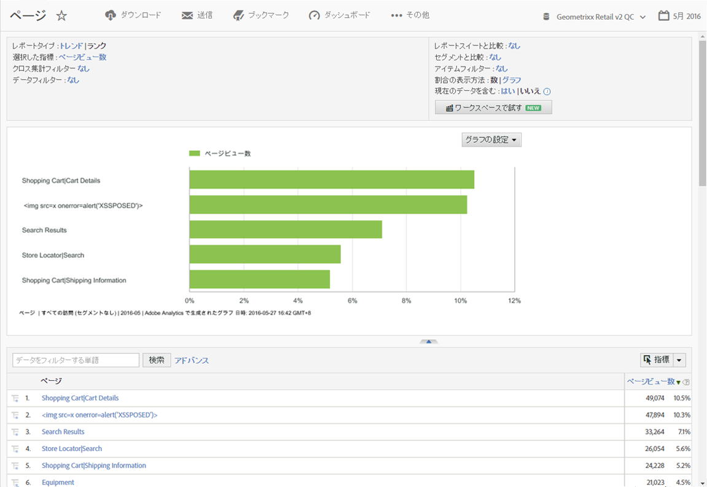
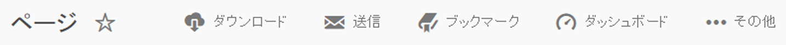
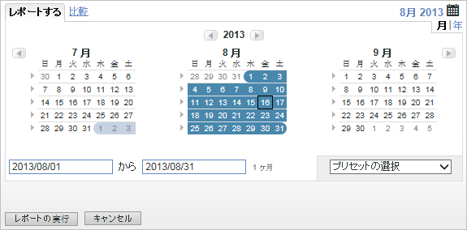
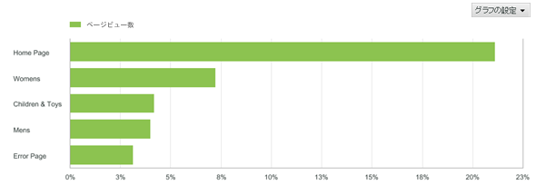
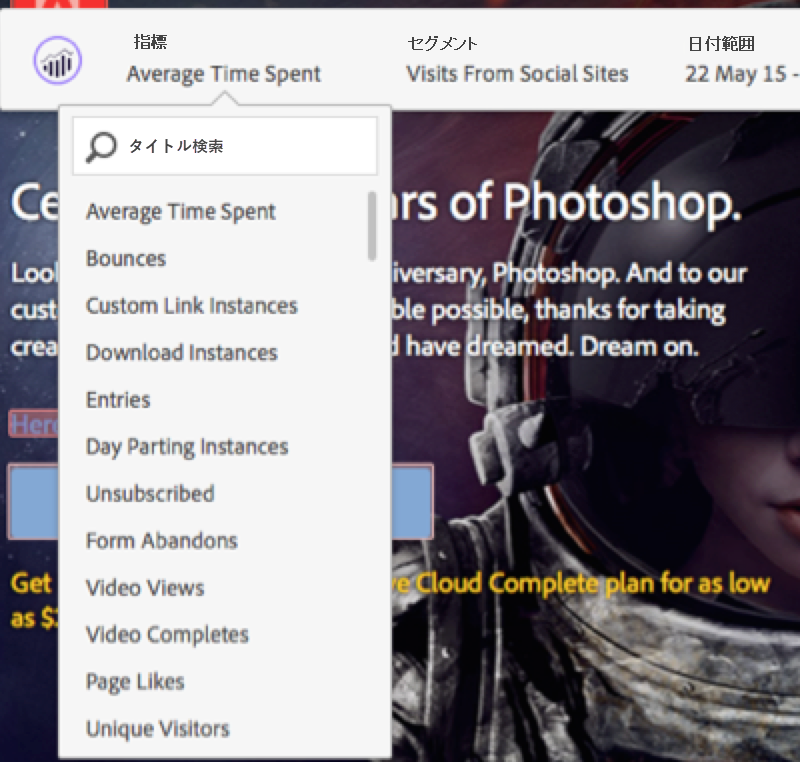

# レポートの各機能{#report-features}

ツールバー、カレンダー、詳細テーブルなど、レポートの機能について説明します。

この例では、[!UICONTROL ページレポート]を示しています。設定オプションは実行するレポートによって異なることがあります。例えば、[!UICONTROL サイトコンテンツ]レポートで、「トレンド」や「ランク」を選択するのではなく、[!UICONTROL サイト指標]レポートの精度やページ名を指定する場合があります。

## ページレポートの例 {#section_288CC85536684C2DB184141358481EF0}

An example of a Pages Report ( **[!UICONTROL Reports]** &gt; **[!UICONTROL Site Content]** &gt; **[!UICONTROL Pages Reports]** &gt; **[!UICONTROL Pages]**).

{width="672px"}

## レポートのツールバー {#section_0D674177AE6C4A71B07234DB25910ECD}

レポートデータを意思決定者と共有し、そのデータに基づいてサイトやマーケティング戦略を変更できるようにします。

{width="672px"}

Also refer to [Customizing a Report](../../../analyze/reports-analytics/reports-customize/customizing-reports-overview.md).

## レポートのヘッダーと設定 {#section_12A90FAE02EC43FB9F11F0E2CE8FAE8F}

レポートの設定を表示し、レポートの種類の構成、指標の選択などを行うことができます。このグループで使用可能なオプションは、実行するレポートによって変わります。

{width="672px"}

See [Customizing a Report](../../../analyze/reports-analytics/reports-customize/customizing-reports-overview.md) for more information.

## カレンダー {#section_8C6C4AD84D9043E8ABD53FF8F645AAB1}

カレンダーボタンをクリックして、日付範囲を選択して、日付を指定します。2 つの期間を選択して、パフォーマンスを比較することもできます。

{width="672px"}

See [Selecting a Date or Date Range](../../../analyze/reports-analytics/reports-customize/customizing-reports-overview.md#task_9BEF7D4D839A4748B76E8500D1406C34) and [Comparing Dates](../../../analyze/reports-analytics/reports-customize/customizing-reports-overview.md#task_95155C3700774B709F5FB81AE96B0824).

## グラフの種類 {#section_8B9CBA4096E64FC3B744E2E06EB83C19}

表示するグラフや表の種類を選択します。

詳しくは、 [レポートグラフの変更](../../../analyze/reports-analytics/reports-customize/t-reports-graphs.md#task_B290BF0B82124111AA19B3F3ACED500A).

## グラフの表示 {#section_4C78ADC82C234CC6841AC92C803636F4}

選択したグラフの種類によりますが、通常は詳細リストにある最初の数項目が表示されます。異なる期間を表示するトレンドグラフでは、全期間が表示されます。

詳しくは、 [レポートのカスタマイズ](../../../analyze/reports-analytics/reports-customize/customizing-reports-overview.md).

## 指標 {#section_8B8F9EC72B864E29B91039E7B7381EAD}

レポートに指標を追加します。管理者はレポートごとにデフォルトの指標を指定できます。

詳しくは、 [指標](../../../analyze/reports-analytics/metrics.md#concept_EB00207C07BD4481AB116E62EC24E686).

## 詳細テーブル {#section_449A5DC848744F65A10DA12E189B835D}

レポートデータの大部分は詳細データです。この場合はページのリストが表示され、ページビュー数（期間内に読み込まれた回数）が表示されます。

詳細テーブルで、データのフィルタリング、内訳の表示、指標の追加などを行うことができます。

See [Customizing Reports](../../../analyze/reports-analytics/reports-customize/customizing-reports-overview.md).
