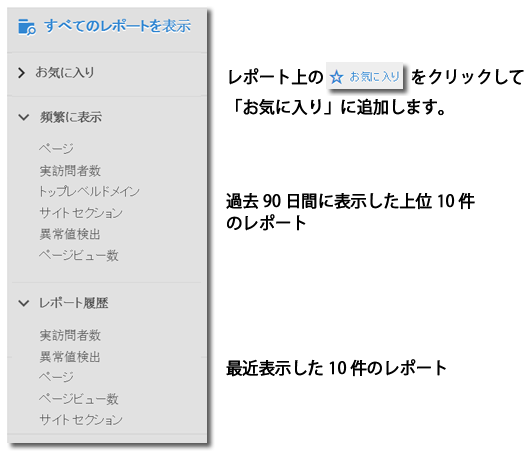
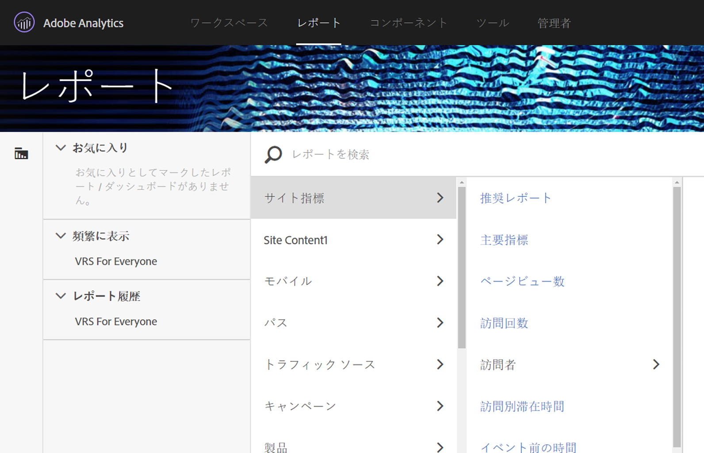
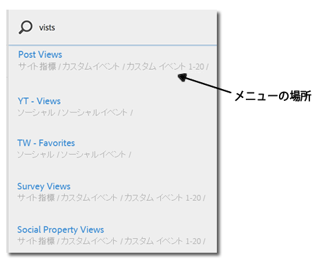

# レポートメニュー{#reports-menu}

Reports &amp; Analytics のレポートメニューの概要を示します。

レポートメニューでは、次の機能を提供します。

* 完全なレポートセットへのアクセス
* クイックアクセスのためのお気に入りレポートの設定
* 頻繁に表示するレポート
* 拡張検索

「お気に入り」、「頻繁に表示」、「レポート履歴」は、すべてレポートスイートに固有のものです。レポートスイートを変更すると、3 つのすべてのリストが更新されます。

レポート間を移動するには、階層的なメニューを使用します。Click **[!UICONTROL View All Reports]**, or press the Forward Slash key (/), and then press the Down Arrow key (?) to quickly display and navigate the menu using the Arrow keys. 現在のレポートを変更せずにメニューを閉じるには、Esc キーを押します。選択したレポートを読み込むには、Enter キーを押します。

{width="672px"}

個々のレポートについて詳しくは、[レポートの説明](https://marketing.adobe.com/resources/help/en_US/reference/index.html?f=reports_descriptions)を参照してください。

## レポートの検索 {#section_E5EF11E36CB9451AA7B079E585CA7DB6}

レポートメニューの検索対象は以前よりも拡張されました。Click **[!UICONTROL View All Reports]** , or press the Forward Slash key (/) , and then begin typing to quickly find a report. レポート検索は拡張されて、Analytics の左側のナビゲーション（管理者、コンポーネントなど）にあるすべてを対象として検索されるようになりました。

Tab キーまたは下向き矢印（↓）を押してレポートのリストを移動できます。現在のレポートを変更せずに検索を閉じるには、Esc キーを押します。選択したレポートを読み込むには、Enter キーを押します。

>[!NOTE]
>
>prop、eVarおよびイベント番号でレポートリストを検索することもできます。検索バーに prop、eVar またはイベント番号を入力してください。

## ナビゲーション概要 {#section_A6A0A369207149BABE504753B48A42D7}

<table id="table_3BA295966BBC4C94ABDC3718D1894698"> 
 <thead> 
  <tr> 
   <th colname="col1" class="entry"> メニュー項目 </th> 
   <th colname="col2" class="entry"> 説明 </th> 
  </tr>
 </thead>
 <tbody> 
  <tr> 
   <td colname="col1">Experience Cloud ソリューションメニュー </td> 
   <td colname="col2"> このアイコンをクリックすると、Experience Cloudメニューが展開し、他のMarketing Cloudソリューションにアクセスできます。 </td> 
  </tr> 
  <tr> 
   <td colname="col1">レポートメニューを切り替え  </td> 
   <td colname="col2"> このボタンをクリックしてレポートメニューを展開したり折りたたんだりすることで、ブラウザーウィンドウの幅をすべて使用してレポートを表示できます。 </td> 
  </tr> 
  <tr> 
   <td colname="col1">セグメント  </td> 
   <td colname="col2">セグメントを追加または管理できるセグメントパネルを表示します。このパネルから、<a href="https://marketing.adobe.com/resources/help/en_US/analytics/segment/seg_build_ui.html" format="http" scope="external">セグメントビルダー</a>および<a href="https://marketing.adobe.com/resources/help/en_US/analytics/segment/seg_manage.html" format="http" scope="external">セグメントマネージャー</a>のインターフェイスにもアクセスできます。 </td> 
  </tr> 
  <tr> 
   <td colname="col1">指標  </td> 
   <td colname="col2"> 指標と計算指標を追加または管理できる指標パネルを表示します。 </td> 
  </tr> 
  <tr> 
   <td colname="col1"> すべてのレポートを表示 </td> 
   <td colname="col2">すべてのレポートスイート固有のレポート、ダッシュボード、ブックマーク、計算指標およびターゲットは、すべてのレポートを表示セクションに含まれています。ここをクリックすることで、いつでも使用可能なすべてのレポートに移動できます。 </td> 
  </tr> 
  <tr> 
   <td colname="col1">「すべてのレポートを表示」内の検索バー </td> 
   <td colname="col2"> 
 必要なリソースを検索できます。いわゆる「ファジー」検索を使用しているので、目的の単語をすべて入力する必要はありません。検索結果は一列のリストで表示され、上向き、下向き、左右の矢印を使用して移動できます。検索結果上で Enter キーを押すと、そのレポートを直接表示できます。 
 </td> 
  </tr> 
  <tr> 
   <td colname="col1">お気に入り </td> 
   <td colname="col2">お気に入りに登録済みとしてマークしたレポートを、この領域から簡単に取得できます。ユーザーごとおよびレポートスイートごとに 10 個のお気に入りと、お気に入りが 11 個以上ある場合は「その他...」リンクが表示されます。 
お気に入りではレポートの名前を変更できますが、ダッシュボードの名前は変更できません。 
 
お気に入りはブックマークに似ていますが、ブックマークのようにフォルダーに保存したり<a href="../../../analyze/reports-analytics/bookmarks.md#concept_55B5E0DF20B14AAF8819CB8244464406" format="dita" scope="local">ブックマークマネージャー</a>で管理することはできません。 
 </td> 
  </tr> 
  <tr> 
   <td colname="col1"> 頻繁に表示 </td> 
   <td colname="col2"> Adobe Analytics は、過去 90 日間で最も頻繁に実行された 10 件のレポートを追跡して、実行頻度順に並べ替えて表示します。レポートスイートを 90 日を超えて使用していなかった場合は、10 件の一般的な最頻使用のレポートのリストが表示されます。 </td> 
  </tr> 
  <tr> 
   <td colname="col1"> レポート履歴 </td> 
   <td colname="col2"> ここには、過去 90 日間に最近アクセスした 10 件のレポートまたはダッシュボードが表示されます。分析およびレポートの前のステップに、簡単に戻ることができます。 </td> 
  </tr> 
  <tr> 
   <td colname="col1"> ダウンロード </td> 
   <td colname="col2">レポートを PDF、CSV、Excel および Word 形式でダウンロードできます </td> 
  </tr> 
  <tr> 
   <td colname="col1"> 送信 </td> 
   <td colname="col2">レポートを電子メールですぐに送信したり、1 回のみや定期的な電子メール送信をスケジュールできます。形式のオプションには PDF、CSV、Excel、HTML、Word およびモバイル（テキストのみ）があります</td> 
  </tr> 
  <tr> 
   <td colname="col1"> ブックマーク... </td> 
   <td colname="col2">Lets you <a href="../../../analyze/reports-analytics/bookmarks.md#concept_55B5E0DF20B14AAF8819CB8244464406" format="dita" scope="local"> bookmark</a> the report. </td> 
  </tr> 
  <tr> 
   <td colname="col1"> ダッシュボード... </td> 
   <td colname="col2">Lets you add the report to a <a href="../../../analyze/reports-analytics/dashboard.md#concept_8CD3ACA2830A4994A68A31D8773B57E0" format="dita" scope="local"> dashboard</a>. </td> 
  </tr> 
  <tr> 
   <td colname="col1">詳細情報... </td> 
   <td colname="col2"> 次の一部またはすべてのアクションを実行できます：印刷、データの抽出、アラートの追加、カスタムレポートの作成、グラフのコピー、このレポートへのリンクの設定、新規ウィンドウのオープン </td> 
  </tr> 
  <tr> 
   <td colname="col1">レポートスイートセレクター  </td> 
   <td colname="col2"><a href="https://marketing.adobe.com/resources/help/en_US/reference/report_suites_admin.html" format="https" scope="external">基本レポートスイート</a>または<a href="https://marketing.adobe.com/resources/help/en_US/reference/virtual-report-suites.html" format="https" scope="external">仮想レポートスイート</a>を選択できます。 </td> 
  </tr> 
  <tr> 
   <td colname="col1">カレンダー  </td> 
   <td colname="col2">レポート期間を指定できるように<a href="../../../analyze/reports-analytics/overview/report-overview.md#section_8C6C4AD84D9043E8ABD53FF8F645AAB1" format="dita" scope="local">カレンダー</a>を表示します。 </td> 
  </tr> 
 </tbody> 
</table>

## すべてのレポートメニューのカスタマイズ {#section_7E47312747564FBE8A55EE5726B7DFF4}

管理者はレポートメニューに含まれるレポートを変更することができます。管理ヘルプの「[メニューのカスタマイズ](https://marketing.adobe.com/resources/help/en_US/reference/index.html?f=customize_menus)」を参照してください。
