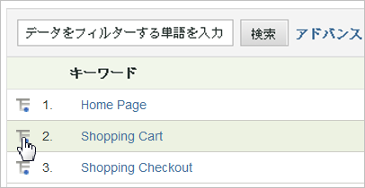

# 分類

レポートの項目またはセグメントと他のレポートとの関連付けについて詳しく知りたい場合には、内訳を使用します。これは、別のレポートによるレポートの「内訳」と呼ばれます。

例としては、オンラインアンケートにより訪問者の年齢を収集した「年齢層」と名付けたカスタムトラフィックレポートの内訳が挙げられます。このレポートでは、サイトトラフィックの最大部分を占めているのはどの年齢層かを見ることができます。ただし、訪問者の年齢まで取り込んだのであれば、ページビューだけでなくより掘り下げたくなるでしょう。そのために、訪問者がどの検索エンジンを使用したか、どのキーワードを使用したか、地理的場所などに関する分類レポートを生成できます。年齢層と検索エンジンの相関関係を設定します。

レポートを *`Referrer Type`*, you might see a data point for *`Inside Your Site`*. この値は、内部 URL フィルターリスト上のリファーラページを示します。管理リファレンスの[内部 URL フィルター](https://marketing.adobe.com/resources/help/en_US/reference/internal_URL_filter.html)を参照してください。

どの Analytics 変数（eVar または prop）も他の任意の変数別に分類できます。レポート表の&#x200B;**[!UICONTROL 分類基準]メニューは、標準 Analytics レポートメニューに一致しており、選択項目が同じになっています。**

## 内訳レポートの実行 {#task_F685624830E64C829C8BE6435A107F69}

内訳レポートを実行する方法について手順を説明します。

<!-- 

t_reports_breakdown.xml

 -->

1. Open report, such as **[!UICONTROL Analytics]** &gt; **[!UICONTROL Reports]** &gt; **[!UICONTROL Site Content]** &gt; **[!UICONTROL Pages]**.
1.  レポート表で「**分類基準**」アイコンをクリックします。

   **[!UICONTROL 分類基準]アイコンが表示されていない場合は、この機能を使用できないか、または有効になっていません。**

   

   **[!UICONTROL 分類基準]メニューには、現在のレポートに使用できる分類オプションがすべて表示されます。**
