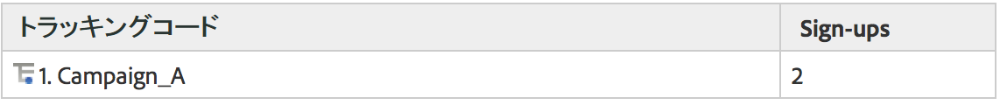
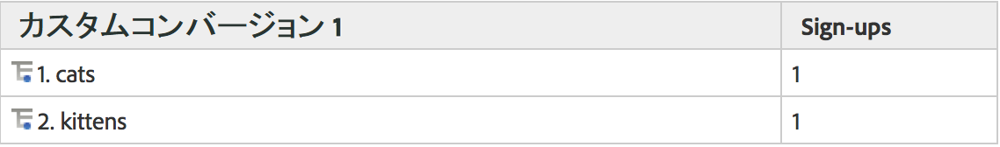
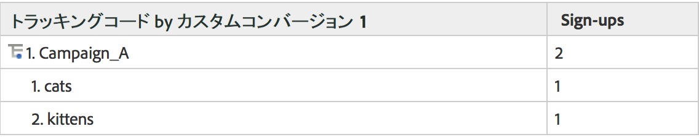
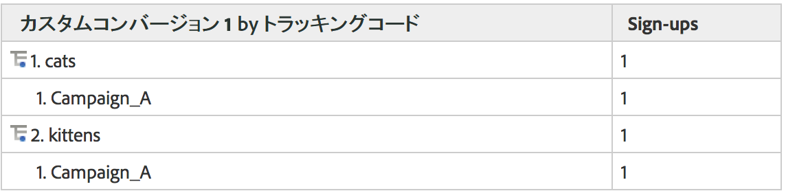

# 下位関係

完全な下位関係は、すべてのコンバージョンレポートで有効であるため、eVar を別の eVar によって分類できます。レポート表の分類基準メニューは、標準 Analytics レポートメニューに一致し、選択の整合性を維持しています。

## 下位関係の仕組み {#section_5BD862BB74FE411B96B59204520E4631}

下位関係の仕組みを理解するために、次の例を考えてみましょう。

1. あるユーザーが、Campaign_A を介してサイトを訪問し、ホームページにアクセスします。
1. このユーザーは「cats」を検索し、検索結果が表示されます。内部検索用語は eVar1 で追跡されます。
1. このユーザーがメーリングリストに登録します。このメーリングリストは event1 を使用して追跡されます。
1. 別のユーザーが、Campaign_A を介してサイトを訪問し、ホームページにアクセスします。
1. このユーザーは「kittens」を検索し、検索結果（eVar1）が表示されます。さらに、メーリングリスト（event1）にも登録します。

トラッキングコードレポートを取得すると、次のように表示されます。

eVar1 レポートを取得すると、次のように表示されます。

キャンペーンレポートを eVar1 によって下位関連付けすると、次のように表示されます。

eVar1 レポートを Campaign によって下位関連付けすると、次のように表示されます。

コンバージョン変数には永続性があるので、eVar 値の保存には 2 つのデータ列が使用されます（1 つは発生する値、もう 1 つは永続化する値を保存）。この例の生データのエクスポートを見てみると、次のようになります（この例では簡略化しています）。

バックエンド処理によって、post_campaign と post_evar1 は campaign と evar1 に定義された値を永続化できます。下位関係レポートは、特に成功イベントを含むヒット数のみを調べます（薄い黄色で示す行）。その後、永続化された値（この例では、明るい黄色で示す post_campaign および post_evar1 セル）に基づいて、下位関係レポートにデータを入力します。

基本的に、下位関係は、次の手順に従ってレポートにデータを入力します。

* そのレポート内で表示している成功イベントを含むイメージリクエストを切り離します。
* 下位関係で使用されている各コンバージョン変数から、永続化された値を返します。
* 返された値を、下位関係の順序に基づいて整理します。変数に永続化された値がない場合（eVar が定義されていない、有効期限が切れている場合など）、変数は「なし」にグループ化されます。

