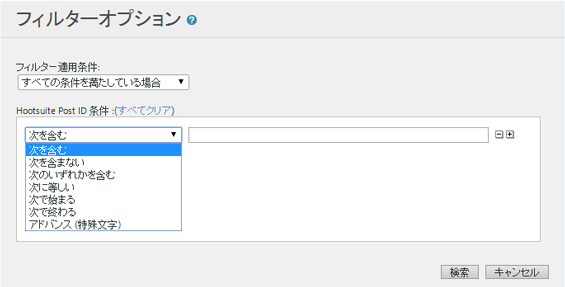

# Filter Report Data {#concept_09DC5B986A644738B12204DAC76A90E1}

フィルターを使用すると、フィルターに一致する行項目をレポートに含めたりレポートから除外したりできます。

## シンプルフィルター {#section_5C4DE873F8D5484BB77F38A4AEB57B4A}


このシンプルフィルターは大部分のレポートに表示され、特定の行項目をすばやく探し出すために役立ちます。Simple filters do not use any special characters, so `-, ", ', +` and other special characters match the literal value in the report. 複数の単語を含む行項目を検索するときは、単語間をスペースで区切ります。

次に例を示します。

```
help search
```

この条件は、次のページに一致します。

```
help:Search
help:Paid Search Detection
help:Configure paid search detection
help:Search Keywords Report
help:Internal Search Term
```

## アドバンスフィルター {#section_E016626C084640E8A066B2FDA5B932BF}

アドバンスフィルターでは、複数のフィルターを使用して検索範囲を制御できます。すべてのフィルターに一致することを条件とするか、いずれかのフィルターに一致することを条件とするかは選択できます。



**次を含む**

行項目のどこかに指定の単語が含まれる場合に一致します。これはシンプルフィルターと同じ機能になります。

>[!NOTE]
>
>スペースは検索時に区切り文字となるので、フィルターではスペースを使用できません

**次を含まない**

指定の単語が行項目のどこにも含まれない場合に一致します。You can filter "unspecified", "none", "keyword unavailable" and other [special values](https://marketing.adobe.com/resources/help/en_US/reference/none-unspecified-unknown-other.html) from reports using "does not contain".

次を含まない: `none`

より正確なフィルタリングを行うには、アドバンス（特殊文字）フィルターを使用できます。

* アドバンス（特殊文字）: `-^none$`
* Advanced (Special Character): `-"keyword unavailable"`

例えば次の行項目は、前述の「次を含まない」の条件では除外されますが、前述の「アドバンス（特殊文字）」の条件では除外されません。

```
help:Rename the None classification key
```

**次のいずれかを含む**

スペースで区切られたいずれかの単語が行項目に含まれている場合に一致します。次のフィルターでは、「mens」または「sale」を含むすべてのページが表示されます。

次のいずれかを含む: `mens sale`

この条件は、次のページに一致します。

```
Womens
Mens
Mens:Desk & TravelJewelry & Accessories:Accessories:Hats:Mens
Sale & Values
```

**次に等しい**

行項目全体（スペースとその他の文字を含む）が指定のフレーズと等しい場合に一致します。

次に等しい: `mens:desk & travel`

`Mens:Desk & Travel`

**次で始まる**

行項目（スペースとその他の文字を含む）が指定のフレーズで始まる場合に一致します。

次で始まる: `mens`

この条件は、次のページに一致します。

```
Mens
Mens:Desk & Travel
Mens:Apparel
Mens Perfume Spray
Mens Hemp/Bamboo Flip Flops
```

**次で終わる**

行項目（スペースとその他の文字を含む）が指定のフレーズで終わる場合に一致します。

次で終わる: `jean`

この条件は、次のページに一致します。

```
Bell Bottom Jean
Velvet Dream Skinny Leg Jean
Dark Slimmer Jean
Bling Belt High Waist Jean
Ocean Blue Jean
```

## Advanced (Special Character) {#section_83DA3B6C23EB4C119DB6D74062DB501D}

アドバンスフィルターでは、ワイルドカード検索やその他の複雑な検索を実行できます。

| アドバンス（特殊文字） | 説明 |
|--- |--- |
| `" "` | 指定したフレーズと正確に等しい場合に一致します。 |
| `*` | ワイルドカード、最長一致の検索ができます。<br>例えば、"Registration Signup" `r*p` と一致します。 |
| `^` | 次の語句で始まる. <br>この特殊文字と検索フレーズの間にスペースを入れてはなりません。 |
| `$` | 次の語句で終わる. <br>この特殊文字と検索フレーズの間にスペースを入れてはなりません。 |
| `-` | NOT. <br>この特殊文字と検索フレーズの間にスペースを入れてはなりません。 |
| `|` | Or<br>Note:  you must include a space on each side of the pipe character, `" | "`. |

## レポート固有のフィルターの作成 {#task_DEBB0632411D4CA8AA0B3BA267A5B35F}

各種レポート用のフィルターを作成する手順を説明します。

<!-- 

t_reports_filter_specific.xml

 -->

レポートによっては、そのレポートに固有のフィルターを持つものがあります。例えば、購入コンバージョンファネルレポートでは Web ページでデータをフィルターできます。[!UICONTROL 地理特性レポート]では、地域によってデータをフィルターできます。各レポートに固有なその他のフィルターを持つレポートもあります。

これらのフィルターにアクセスすると、そのリストに指定された項目のレポート指標が表示されます。

**レポート固有フィルターを作成するには**

1. [!UICONTROL 購入レポートなどのレポートを生成します] （ **[!UICONTROL サイト指標]** / **[!UICONTROL 購入]** / **[!UICONTROL 購入コンバージョンファネル]**）。
1.  レポートのヘッダーで、**フィルター**&#x200B;リンクをクリックします。
1. [!UICONTROL フィルターセレクター]**で「[!UICONTROL フィルターの適用]**」をクリックし、フィルタータイプを指定します。
1.  項目を検索するには、**検索**&#x200B;フィールドに文字列を入力します。
1. Click **[!UICONTROL OK]**.

## クロス集計フィルターの追加 {#task_065042E384DA4BF3864C58AF2B88D6E2}

クロス集計フィルターを追加する手順を説明します。

<!-- 

t_reports_correlation_filter.xml

 -->

一部のレポートでは、カスタムのクロス集計フィルターを追加できます。例えば、女性用ページと相関関係があるサイトセクションを持つレポートスイートの[!UICONTROL ページレポート]を表示している場合、サイトセクションが女性用ページである場合に最も好評なページを表示するレポートを生成するフィルターを作成することができます。

使用可能な任意のクロス集計を使って、クロス集計レポートに表示するデータをフィルターできます。ここの例では、検索エンジンのクロス集計フィルターを追加します。

**クロス集計フィルターを追加するには**

1. クロス集計をサポートするレポートを実行します(See [Running a Breakdown Report](../../../analyze/reports-analytics/reports-customize/breakdowns.md#task_F685624830E64C829C8BE6435A107F69).)
1.  レポートのヘッダーで、**クロス集計フィルター**&#x200B;リンクをクリックします。
1. 「[!UICONTROL フィルター規則クリエイター]」で、アイテムのクロス集計カテゴリを選択します。
1. Click **[!UICONTROL OK.]**
