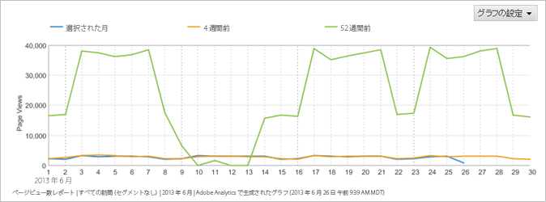
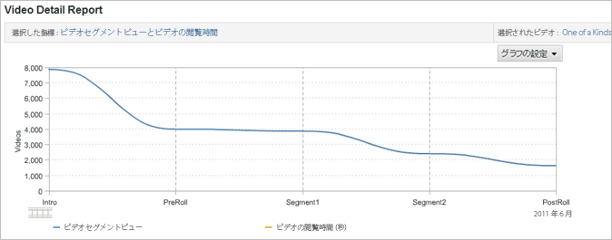
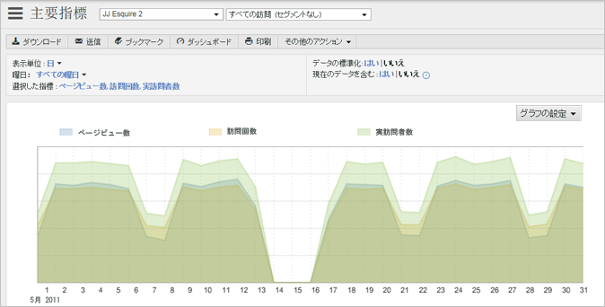
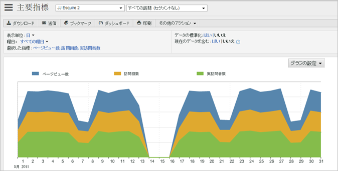
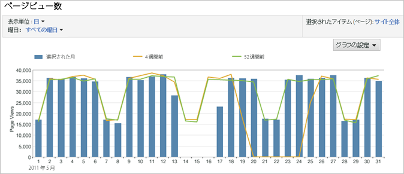
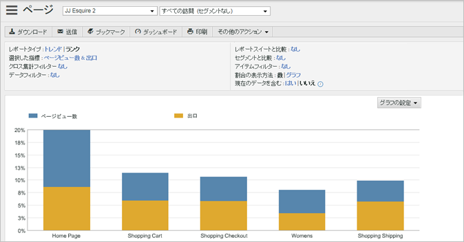
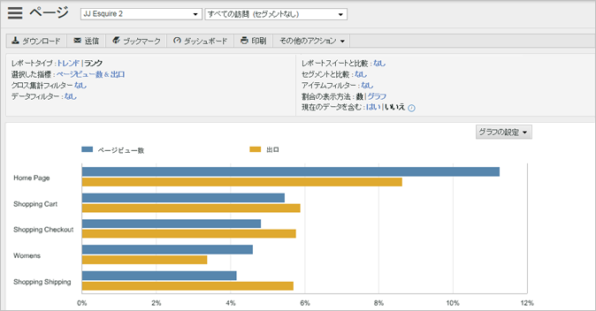
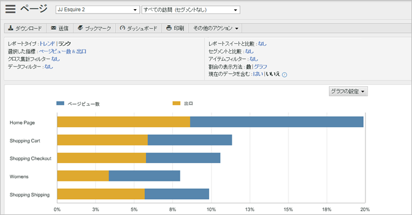
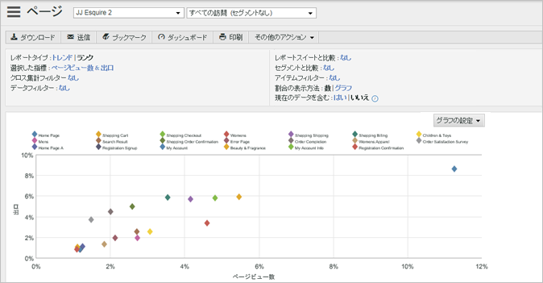
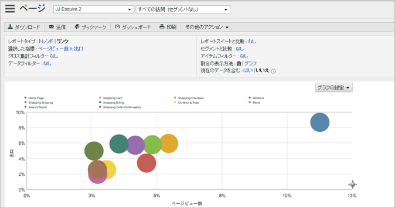

# レポートのグラフの変更

対象者にとって最も有用になるようにグラフをカスタマイズする手順を説明します。

使用できるグラフの種類は、実行するレポートの種類によって異なります。例えば、トレンドレポートではトレンドライングラフが使用されますが、トレンドラインに加えて縦棒グラフを使用することで日単位、週単位、月単位のトレンドを明確に示すことができます。また、閲覧されたページの割合を円グラフを使用して表示することもできます。

**レポートグラフを変更するには**

1. レポートの実行.
1. Click **[!UICONTROL Configure Graph]**.
1.  グラフタイプを選択します。

   **[!UICONTROL トレンドライン]**：トレンドラインは、レポート指標の毎日のトレンドを示し、それぞれ 1 つの指標を示す各ラインを追うことでその指標の経時的なトレンドを見ることができます。

   

   **[!UICONTROL スムージンググラフ]**：このグラフタイプは[!UICONTROL ビデオ詳細レポート]で使用します。ビデオの指定セグメントの閲覧回数または閲覧率示します。ビデオの特定セグメントの視聴回数が増加している場合、視聴者がビデオのその部分を巻き戻して複数回視聴していることを示しています。閲覧率を使用した場合、グラフに示された率は閲覧された全セグメントに対する割合を示します。そのセグメントを閲覧した訪問者の割合ではありません。例えば、グラフにすべてのレポートセグメントの合計視聴回数が 39 回と表示されているとします。0 ～ 10 秒のセグメントの視聴回数が 10 回である場合、このセグメントが視聴された割合は約 26 パーセントとなります。

   

   **[!UICONTROL 面グラフ]**：面グラフはトレンドライングラフに似ていますが、線より下の部分が塗りつぶされます。面グラフを表示するには、トレンドレポートでなければなりません。

   

   **[!UICONTROL 積み重ね面グラフ]**：積み重ね面グラフは、複数の製品やキャンペーンのトレンドを一定の期間記録する場合に便利です。例えば、トップ 5 の製品の売上を示すトレンドを表示すると、一定期間内にこれらの製品がもたらす総売上高を一目で見ることができます。検索フィルターを使って特定の製品を含めたり除外すると、この表示のデータをさらに絞り込むことができます。

   

   **[!UICONTROL 縦棒グラフ]**：縦棒グラフでは、レポート指標の相対的割合が表示されます。

   

   **[!UICONTROL 積み重ね縦棒グラフ]**：同様のアイテムを積み重ねることにより、項目が与える全体的な影響を簡単に把握できます。例えば、[!UICONTROL キャンペーンレポート]では、類似した成功指標を積み重ねてどのキャンペーンが最大の全面的な成功をもたらしているかを知ることができます。積み重ねることにより、個々の指標ではあまり実績がよくなくても、複数の指標を組み合わせて総合すると実績が最高となるキャンペーンが一目でわかるようになります。

   

   **[!UICONTROL 横棒グラフ]**：横棒グラフは縦棒グラフに似ていますが、コラムが水平に表示されます。

   

   **[!UICONTROL 積み重ね横棒グラフ]**：積み重ね横棒グラフは縦棒グラフに似ていますが、コラムが水平に表示されます。

   

   **[!UICONTROL 円グラフ]**：円グラフでは、相対的に高い割合の指標値、および選択した指標の割合が全体を基準にして表示されます。円グラフは、ランクレポートで表示できます。

   

   **[!UICONTROL 散布図]**：散布グラフでは、選択指標の相対的なデータが散布図で表示されます。散布グラフではデータを 2 次元表示できるので、異常値を識別できます。

   

   **[!UICONTROL バブルチャート]**：バブルチャートでは、選択指標の相対的なデータがバブルで表示されます。バブルの位置により横軸と縦軸のそれぞれの指標間の関係が、バブルのサイズによりメインレポート指標が表されます。バブルグラフではデータを 2 次元表示できるので、異常値を識別できます。

   

