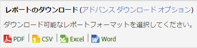
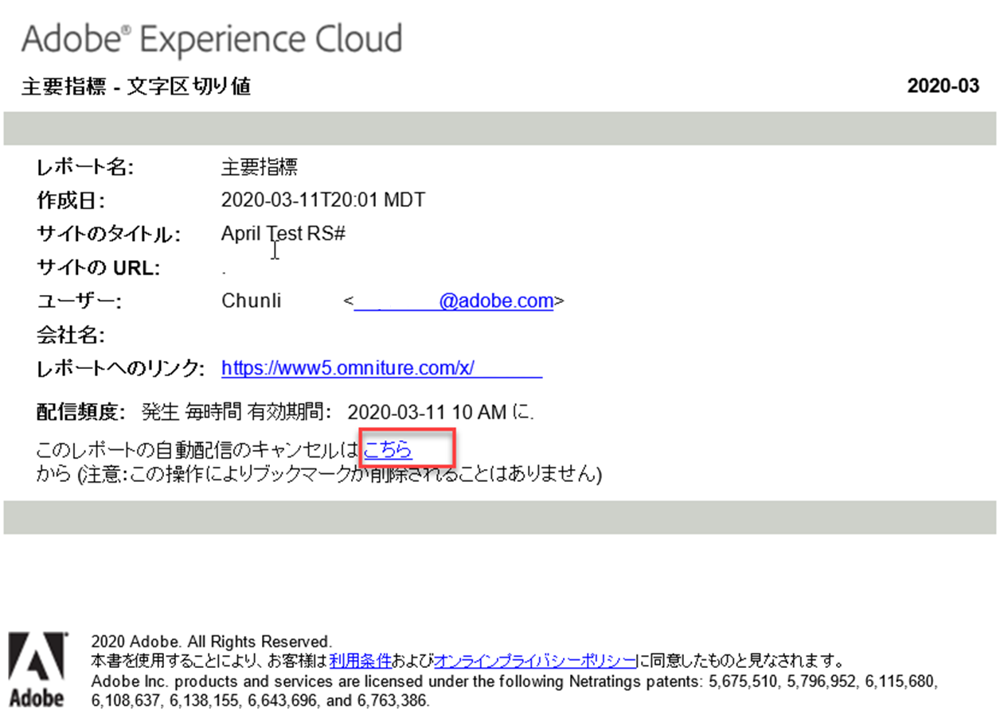

# レポートのスケジュールと配信

レポートのスケジュール、ダウンロードおよび配信に関する情報を示します。

## Report schedule and distribution {#concept_4EA333DFC7FD4E9CA086385A3DA10BE9}

レポートのスケジュール、ダウンロードおよび配信に関する情報を示します。

Adobe Analytics アプリケーションでレポートの配信予定日時をスケジュールするときに、スケジュールツールと配信ツールを使用して、自動的に送信されたファイルを表示したり、配信を変更または停止したりできます。

処理の仕組みやプラットフォームの違いにより、Adobe Analytics で使用できる様々なダウンロード可能なレポートと予定レポートには、単一のリクエストで処理できる最大行数について、それぞれ異なる制限があります。具体的な制限を以下に示します。

* Word、CSV、Excel、HTML、PDF：レポートに表示可能な行数は同じです。デフォルトの上限は 50 行ですが、最大 200 行まで増やすことができます。分類レポートは 50 行に固定されています。
* データ抽出：50,000 行。
* Data Warehouse：無制限。

これらの制限は、個々の予定レポートとダウンロードされたレポートに適用されます。ダッシュボードの場合は、レポートレット内で使用可能な領域に制限されます。

## レポートの送信 {#task_27642CD33D484FD0BF59EBD159EEF52C}

様々なフォーマットでレポートをダウンロードし、メールで送信する手順と、レポートを配信するスケジュールを設定する手順について説明します。

<!-- 

t_send_report.xml

 -->

1. Run a report, then click **[!UICONTROL More]** &gt; **[!UICONTROL Send]**.
1.  配信オプションを指定します。 

   | オプション | 説明 |
   |--- |--- |
   | 形式 | PDF または HTML を選択する。 |
   | 送信先 | レポートを受信する電子メールアドレスを指定する。 |
   | 件名 | 電子メールの件名。 |
   | スケジュール | レポートをすぐに送信するか、別の間隔で送信するかを選択する。 |

1. Click **[!UICONTROL Advanced Delivery Options]** to specify a delivery schedule.

   <table id="choicetable_2934E54FEE6E4D33B07EAC21F6DF628E"> 
   <thead class="chhead sthead"> 
   <th class="choptionhd"> オプション </th> 
   <th class="chdeschd"> 説明 </th> 
   </thead> 
   <tr class="chrow strow"> 
   <td class="choption"><strong>レポートファイル名</strong></td> 
   <td class="chdesc stentry"> 
レポートの名前を指定します。デフォルトの形式は <code>&lt;report name&gt; for &lt;suite&gt; - &lt;report date range&gt;</code> です。 
 
カスタム名を指定するには、「カスタム」を選択します。 
 </td> 
   </tr> 
   <tr class="chrow strow"> 
   <td class="choption"><strong>レポートの形式</strong></td> 
   <td class="chdesc stentry"> 
配信に、PDF、CSV、Excel、HTML、Word、またはモバイル形式を指定できます。CSV を選択した場合、CSV のエンコーディングも指定できます。 
 
 
      <ul id="ul_4A2EB8D9512246589994052CF482BFD7"> 
      <li id="li_A4FC4D795A9D4F92AAB187ACDFBA180D"> 
 Shift-JIS：日本語文字エンコーディング。 
 </li> 
      <li id="li_405C7EC97F994D649A50F84466FADA3D"> 
 EUC-JP：拡張 UNIX コード、主に日本語、韓国語、簡体字中国語用。 
 </li> 
      </ul> 
 </td> 
   </tr> 
   <tr class="chrow strow"> 
   <td class="choption"><strong>レポート内容</strong></td> 
   <td class="chdesc stentry"> 
 表の行数：送信するレポートの表に表示させる行数を指定します。 
 
 ヘッダーとフッターの言語：ヘッダーとフッターの言語を指定します。 
 
 コメント：レポートの先頭に表示するテキストを指定します。 
 </td> 
   </tr> 
   <tr class="chrow strow"> 
   <td class="choption"><strong>デジタル署名ファイルの送信</strong></td> 
   <td class="chdesc stentry"> 
ブックマーク付きレポートや Data Warehouse の要求など、レポートを要求する場合は、データ署名を要求できます。アドビのデジタル署名はデータにアクセスできるユーザーを制限しませんが、デジタル署名ファイル（.sig）の目的は配信されたレポートファイルの有効性を検証することです。デジタル署名を使用すると、レポートの受取人はファイルがアドビから送信されたものであり、変更されていないことを検証できます。 
 </td> 
   </tr> 
   <tr class="chrow strow"> 
   <td class="choption"><strong>レポートの送信先</strong></td> 
   <td class="chdesc stentry"> 
 電子メール：電子メール アドレス、件名、メモを設定できます。 
 
 FTP：ホスト、ポート、ディレクトリ、ユーザー名、パスワードなど FTP の設定を指定できます。 
 </td> 
   </tr> 
   </table>

1. **[!UICONTROL [スケジュールオプション]**]をクリックします。

   <table id="choicetable_589A39087F4C497D8913364FFF0125B7"> 
   <thead class="chhead sthead"> 
   <th class="choptionhd"> オプション </th> 
   <th class="chdeschd"> 説明 </th> 
   </thead> 
   <tr class="chrow strow"> 
   <td class="choption"><strong>レポートを今すぐ送信</strong></td> 
   <td class="chdesc stentry"> 
レポートをすぐに送信します。 
 </td> 
   </tr> 
   <tr class="chrow strow"> 
   <td class="choption"><strong>後で送信するようにスケジュールする</strong></td> 
   <td class="chdesc stentry"> 
期間と配信オプションを指定するためのオプションを表示します。 
 </td> 
   </tr> 
   <tr class="chrow strow"> 
   <td class="choption"><strong>レポート期間</strong></td> 
   <td class="chdesc stentry"> 
 特定日：時間が経過しても日付が変わらないようにします。 
 
 周期的：経時的に日付を進めます。考慮事項を以下に示します。 
 
 
      <ul id="ul_5CDCCBEFEB364800A428614183A0E6A1"> 
      <li id="li_37B8F32A9E3B4979B5239A58F0C5A71C"> 
開始日と終了日を共に「経時変化」と指定して、毎日前日のレポートを作成することを選択した場合、毎日前日のレポートを電子メールで受信することになります。 
 </li> 
      <li id="li_83FFD2400C6A453783CDD9BB3B9BA3F9"> 
開始日として「固定」を選択し、終了日として「経時変化」を選択した場合は、最初の日にその前日のレポートを受信します。2 日目にはその前 2 日分のレポートを受信し、3 日目にはその前 3 日分のレポートを受信することになります。 
 </li> 
      <li id="li_28F8552D699841BC942058247D39DBB9"> 
開始日と終了日の両方に「特定日」を選択した場合は、指定した日数分のレポートを毎日受信します。 
 </li> 
      <li id="li_A594A6E2A4044ED6AC0A80F88EB203B3"> 
開始日に「周期的」を選択した場合、終了日に「特定日」を選択することはできません。 
 </li> 
      </ul> 
 </td> 
   </tr> 
   <tr class="chrow strow"> 
   <td class="choption"><strong>配信頻度</strong></td> 
   <td class="chdesc stentry"> 
 1 時間ごと：電子メールの配信頻度を 1 時間ごと、2 時間ごとなど、時間単位で指定します。 
 
 毎日：電子メールの配信頻度を毎日、1 日おき、3 日に 1 度など、日単位で指定します。営業日に毎日送信することもできます。 
 
 毎週：電子メールの配信頻度を毎週、1 週おき、3 週に 1 度など、週単位で指定します。送信する曜日を指定することも可能です。 
 
 毎月：何か月ごとに配信するかを指定します。月の何日に配信するか、または何週目の何曜日に配信するかを指定することもできます。 
 
 年別：毎年何月何日にレポートを配信するか、または何週目の何曜日に配信するかを指定します。 
 
 開始時刻：選択したレポートスイートで使用されているタイムゾーンに適用されます。 
 </td> 
   </tr> 
   <tr class="chrow strow"> 
   <td class="choption"><strong>配信終了オプション</strong></td> 
   <td class="chdesc stentry"> 
 終了しない：配信を終了しないように指定します。 
 
 &lt;value&gt; 回後に終了する：何回配信された後に終了するかを指定します。 
 
 終了日：配信を終了する日付を指定します。 
 
レポートデータと同日にデータを処理する場合、レポートにはそのレポートの送信時刻までに データベースに入力されたデータのみが含まれます。1 日のデータを完全に処理するには 24 時間かかることがあるので、レポート送信時に完全なデータを収集できない場合があります。完全なデータを入手するには、必ず処理時刻をレポート期間終了日の 24 時間以降に設定してください。 
 </td> 
   </tr> 
   </table>

## レポートの印刷 {#task_0F7CF6D6ED54462CAE4A793E271AF7E5}

レポートを印刷する手順を説明します。

<!-- 

t_reports_print.xml

 -->

1. レポートの実行.
1. **[!UICONTROL その他]** / **[!UICONTROL 印刷]**&#x200B;をクリックします。 

## 基本オプションを使用したレポートのダウンロード {#task_43660107A1C9485D92981CD75B562577}

特定のレポートに関する詳細な情報を PDF、CSV、Excel または生データのエクスポート形式でダウンロードします。

<!-- 

t_download-report.xml

 -->

1. **Analytics**／**[!UICONTROL レポート]**&#x200B;で、表示するレポートを選択します。
1. Click **[!UICONTROL Download]**.

   

1. レポートの目的の形式を以下から選択します。

   * **[!UICONTROL PDF]**：レポートを Adobe PDF 形式でダウンロードするように指定します。受信者が実行しているコンピューターシステムにかかわらず、他のユーザーとレポートを共有できます。
   * **[!UICONTROL CSV]**:レポートをダウンロードするように指定 [!DNL .csv] します（コンマ区切り値形式）。
   * **[!UICONTROL Excel]**：レポートを Microsoft Excel 形式でダウンロードするように指定します。スプレッドシートプログラムを使用できる他のユーザーとレポートを共有できます。
   * **[!UICONTROL Word]**：レポートを Microsoft Word 形式でダウンロードするように指定します。
   >[!NOTE]
   >
   >いずれかの生のエクスポート形式を使用してレポートをダウンロードし、ページ名が空白の場合、Adobe Analyticsはデータを処理するのに十分な時間がない可能性があります。しばらくしてからレポートをダウンロードしてください。

## スケジュールされたレポートの管理 {#task_C17677C543454FF2B06D10EA5652DFBC}

スケジュールされたレポートの管理についての情報を示します。

<!-- 

t_schedule_manage.xml

 -->

[!UICONTROL スケジュールレポートマネージャー]を使用すると、定期的なレポート配信を編集および削除できます。レポートを電子メールで指定のアドレスに送信したり、FTP 経由で送信する配信予定日時を設定できます。配信予定日時は、ある期間中のみまたは永久的に、レポートを指定の間隔で自動送信する場合や反復レポートの配信を停止する場合に設定します。

[!UICONTROL 予定レポートマネージャ]には、特定のユーザーが作成したアイテムが表示されます。ユーザーアカウントがアプリケーションで無効になっている場合、予定されたすべての配信が停止されます。

1. To access the manager, click **[!UICONTROL Analytics]** &gt; **[!UICONTROL Components]** &gt; **[!UICONTROL Scheduled Reports]**.

## レポートリンクの共有 {#task_9711DDE9E140451B8C914EC5513E21EC}

他のユーザーに送信するレポートリンク（URL）を生成することによって レポートを共有する手順を説明します。

<!-- 

t_reports_share_link.xml

 -->

受信者がリンクをクリックすると、ログイン資格情報が求められます（会社名、ユーザー名、パスワード）。ログインした後、受信者は元のユーザーが生成したレポートを閲覧できます。標準的な権限制限が適用されます。

**レポートリンクを共有するには**

1. レポートの実行.
1. **[!UICONTROL その他]** /このレポートへ **[!UICONTROL のリンクをクリック]**&#x200B;します。

## 定期レポートを登録解除 {#concept_6B48360F935740B6851BA85D32DEF637}

定期レポートを登録解除できます。登録を解除した後、定期レポートにユーザー名が再度追加されても、レポートを受け取ることはありません。

<!-- 

t_schedule_unsubscribe.xml

 -->

>[!IMPORTANT]
>
>レポートを再度受信するには、新しいスケジュールを作成する必要があります。

定期レポートを登録解除するには：

1. 登録を解除するレポートへのリンクを含む電子メールを開きます。

   

1. Click the **[!UICONTROL click here]** link next to **[!UICONTROL To cancel automatic delivery of this report]**.

1. レポート配信のキャンセルを確定します。

   >[!NOTE]
   >
   >このワークフローは、レポートの受信者またはレポートの受信者と同じです。

レポートを登録解除しても、定期レポートはキャンセルされません。

定期レポートをキャンセルするには、予定レポートマネージャーに移動し、レポート名の横にある赤の X をクリックします。[詳細情報...](../../analyze/reports-analytics/scheduling.md#task_C17677C543454FF2B06D10EA5652DFBC)
