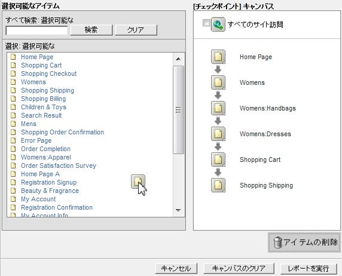
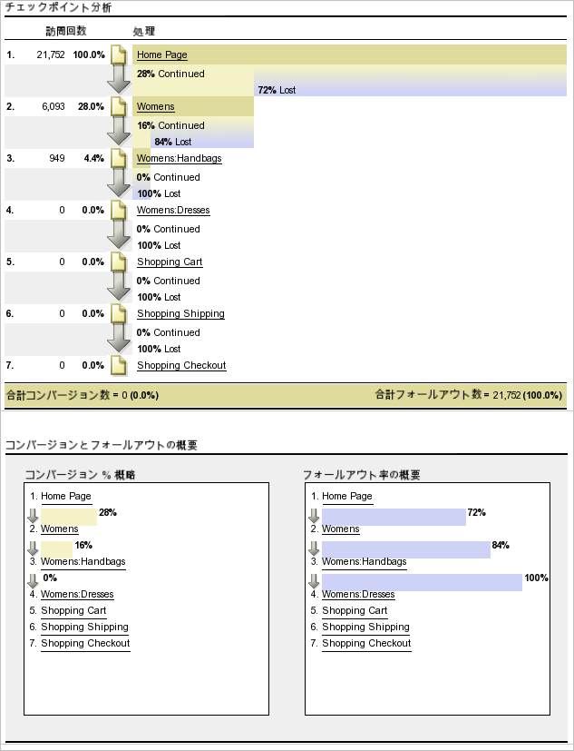
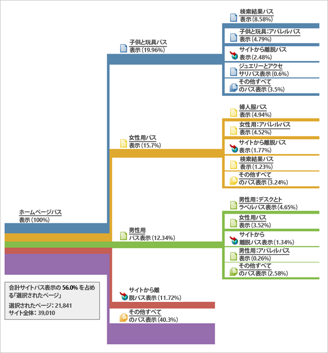
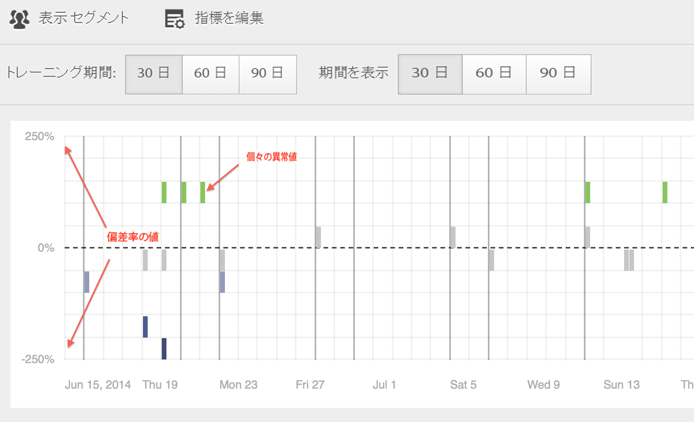
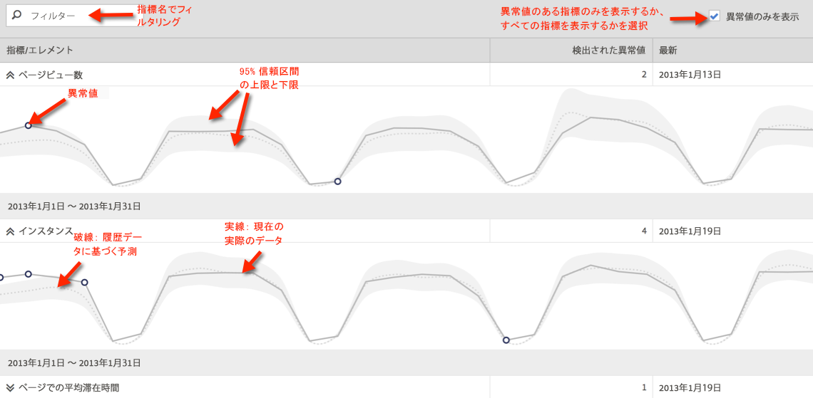
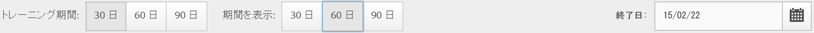
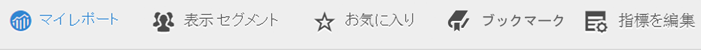
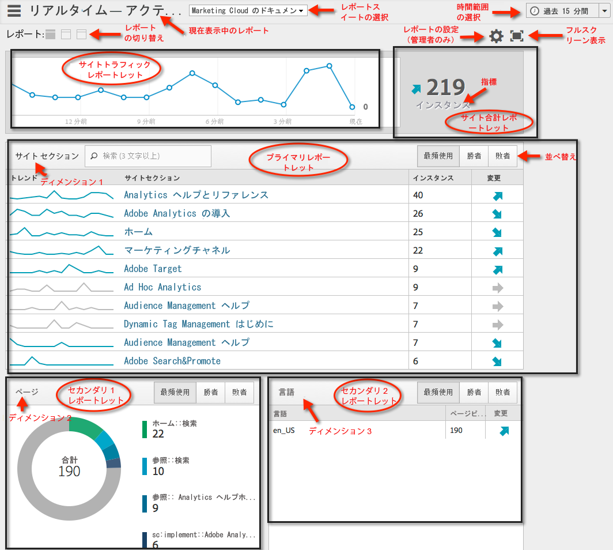
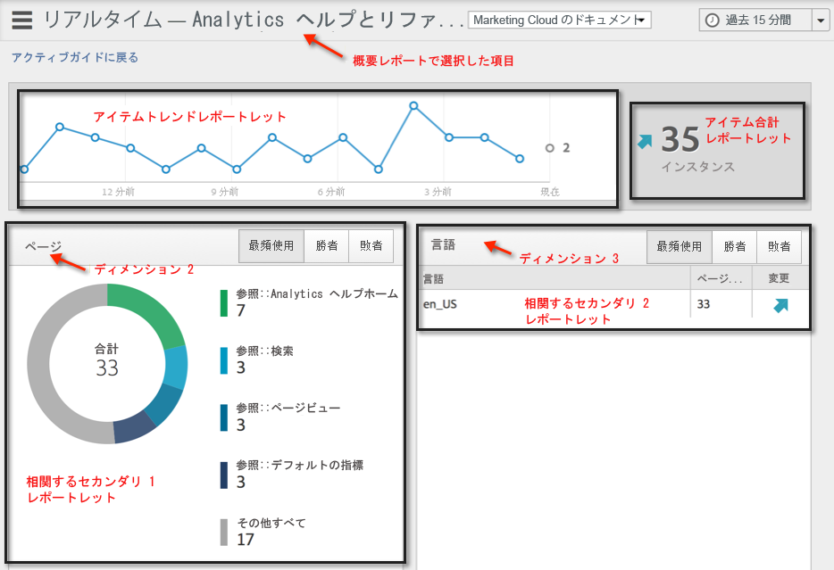

# 異なるレポートタイプの実行

様々なレポートタイプの実行手順です。

## ランクレポートの実行 {#task_C570BA4A213F4F2EB7B30E012934BE7D}

ランクレポートでは、指標の大小で並べ替えられた項目がテーブルに表示されます。ランクレポートでは、1 つのレポートに複数の指標を表示できます。

<!-- 

t_reports_ranked.xml

 -->

1. [!UICONTROL ページレポートなどのレポートを生成します] （ **[!UICONTROL レポート]** / **[!UICONTROL サイトコンテンツ]** / **[!UICONTROL ページ]**）。
1. レポートタイプで「**[!UICONTROL ランク]」をクリックします。**
1.  レポートのランクを設定するには、テーブルの列ヘッダーをクリックします。

   ランクレポートには、表に 200 個までの行項目（製品、カテゴリ、Web ページなど）と 10 個までの指標（売上高、注文件数、表示回数など）を含めることができます。

## トレンドレポートの実行 {#task_F03B4E760B9E4EA29FC3F654E6316887}

トレンドレポートには、時系列で指標が表示されます。このレポートタイプは、指定した期間における指定の増減を表示するために使用します。

<!-- 

t_reports_trended.xml

 -->

ほとんどのコンバージョンとトラフィックレポートではトレンドを表示できます。[!UICONTROL カレンダー]を使用すると、月内の日、年内の週、四半期内の週、月など、どの期間ごとのパフォーマンスの改善も見ることができます。トレンドレポートは、最大 5 つまでの項目（製品、カテゴリ、Web ページなど）に対して1 つの指標（売上高、注文、表示回数など）のトレンドを表示できます。

**トレンドレポートを実行するには**

1. **[!UICONTROL レポート]** / **[!UICONTROL サイトコンテンツ]** / **[!UICONTROL ページなどのコンバージョンまたはトラフィックレポートを実行]**&#x200B;します。
1. **[!UICONTROL [レポートタイプ]**]で[トレンド]をクリック **[!UICONTROL します。]**

## コンバージョンファネルレポートの実行 {#task_B926A74AA6A641138C2986C1635120CB}

コンバージョンファネルレポートには、一連のイベントを経て望ましい行動をとるに至った訪問者の割合が表示されます。例えば、Web サイトの訪問者のうち何人が買い物かごにアイテムを追加し、購入に至ったかを知ることができます。途中で離脱した人数も表示されます。

<!-- 

t_reports_conversion_funnel.xml

 -->

To run this report, select a report, such as a Pages report ( **[!UICONTROL Reports]** &gt; **[!UICONTROL Campaigns]** &gt; **[!UICONTROL Tracking Code]** &gt; **[!UICONTROL Campaign Conversion Funnel]**).

詳しくは、[コンバージョンレポート](https://marketing.adobe.com/resources/help/en_US/reference/index.html?f=reports_conversion)を参照してください。

## フォールアウトレポートの実行 {#task_8FD97C8260464F9DA731A93DB8F80184}

[!UICONTROL フォールアウトレポート]には、事前に指定されたページ順に訪問した訪問者の数が表示されます。ステップ間のコンバージョン率とフォールアウト率も示します。

<!-- 

t_reports_fallout.xml

 -->

Analysis Workspace の新しい[フォールアウト分析](https://marketing.adobe.com/resources/help/en_US/analytics/analysis-workspace/fallout_flow.html)パネルを調べます。

1. [!UICONTROL Adobe Analytics]で **[!UICONTROL 、レポート]** / **[!UICONTROL パス]** / **[!UICONTROL ページ]** / **[!UICONTROL フォールアウト]**&#x200B;をクリックします。
1. [!UICONTROL フォールアウトレポート] ページで、「フォールアウトレポートビルダー **[!UICONTROL を起動」をクリック]**&#x200B;します。

   

1. [!UICONTROL チェックポイントの定義ページで]、レポートに使用するチェックポイントを指定します。
1. Click **[!UICONTROL Run Report]**.

   

>[!MORE_LIKE_THIS]
>
>* [フォールアウトレポートの説明](https://marketing.adobe.com/resources/help/en_US/reference/index.html?f=reports_fallout)

## ページフローレポートの実行 {#task_133E8B87C3F04DA0A42D10CBA499305B}

ページフローレポートには、訪問者がページにアクセスした順序と使用したナビゲーション方法が表示されます。このレポートは問題を解決するのに役立ちます。

<!-- 

t_reports_page_flow.xml

 -->

Analysis Workspace の新しい[フロービジュアライゼーション](https://marketing.adobe.com/resources/help/en_US/analytics/analysis-workspace/flow.html)を調べます。

[パス](https://marketing.adobe.com/resources/help/en_US/reference/index.html?f=reports_paths)レポートを実行します。

For example, click **[!UICONTROL Reports]** &gt; **[!UICONTROL Paths]** &gt; **[!UICONTROL Pages]** &gt; **[!UICONTROL Next Page Flow]**.

このレポートは、選択されたページから始まり、左から右へ読みます。選択したページの後に閲覧された各ページが、右側に分岐として表示されます。

続く各ページが閲覧された割合が、そのページ名の横に表示されます。次の各ページとを結ぶラインの幅により、そのパスのトラフィックの相対的な量が示されます。

**[!UICONTROL パスビュー数]**：表示されたパスをたどって、あるページが閲覧された回数を示します。

例えば、プライバシーポリシーページの総ページビュー数は 10,000 であっても、ホームページを見た直後にこのページを閲覧したのはそのうち 500 のみだったとすると、この場合のパスビュー数は500になります。パスビューという用語はこのように使用されます。

ラインの幅によってトラフィックの相対的な量が表されます。このレポートには、デフォルトで 5 本の 2 次レベルの分岐と 5 本の 3 次レベルの分岐が表示されています。2 次レベルの分岐は 10 本まで、3 次レベルの分岐は 5 本まで拡張できます。拡張すると、レポートの高さは高くなり、このグラフ全体を閲覧するにはスクロールすることが必要になります。

## ファネルレポートの実行 {#task_2BBF6FACD48F479E8B2EE458919941CB}

成功イベントを選択し、[!UICONTROL 購入コンバージョンファネル]レポートまたは[!UICONTROL 製品コンバージョンファネル]レポートに追加できます。

<!-- 

t_reports_funnel.xml

 -->

1. **[!UICONTROL レポート]** / **[!UICONTROL 製品]** / [製品コンバージョンファネル](https://marketing.adobe.com/resources/help/en_US/reference/index.html?f=reports_conversion_funnel)をクリックします。

## マーケティングチャネルレポートの実行 {#task_64ADED5CC75248319E06E3E029B47F78}

マーケティングチャネルレポートには、ファーストタッチチャネルおよびラストタッチチャネルの配分の概要、および注文件数、売上高、コストなどの標準のレポート指標が表示されます。これらのレポートでは各チャネルが生み出す売上高を調べることができます。

<!-- 

t_reports_marketing_channel.xml

 -->

詳細については、[マーケティングチャネル](https://marketing.adobe.com/resources/help/en_US/mchannel/index.html)のヘルプシステムを参照してください。

## 異常値検出レポートの実行 {#task_4808C96327354D789C075823F5C3A049}

異常値検出レポートに表示される概要グラフと個別の指標グラフの見方を説明します。

<!-- 

t_anomaly_view.xml

 -->

Analysis Workspace の新しい[異常値検出と貢献度分析](https://marketing.adobe.com/resources/help/en_US/analytics/analysis-workspace/anomaly_detection.html)機能を調べます。

**[!UICONTROL レポート]** / **[!UICONTROL サイト指標]** / **[!UICONTROL 異常値検出]**

>[!NOTE]
>
>Analysis Workspaceプロジェクト内から異常値検出を実行することもできます。[詳細情報...](https://marketing.adobe.com/resources/help/en_US/analytics/analysis-workspace/anomaly_detection.html)

異常値検出の設定については、[リファレンスガイド](https://marketing.adobe.com/resources/help/en_US/sc/user/index.html#Setting_up_Anomaly_Detection)を参照してください。

異常値検出では、2 種類のグラフが表示されます（概要グラフと個別の指標グラフ）。個別の指標グラフは、その指標に関して 1 つ以上の異常値が検出された場合にのみ表示されます。

<table id="table_88163CD8FC164342855D90D01F9C581A"> 
 <thead> 
  <tr> 
   <th colname="col1" class="entry"> 
グラフのタイプ 
 </th> 
   <th colname="col2" class="entry"> 
説明 
 </th> 
  </tr> 
 </thead>
 <tbody> 
  <tr> 
   <td colname="col1"> 
概要グラフ 
 
 
 </td> 
   <td colname="col2"> 
 
     <ul id="ul_D26DA3024CD7468291369F549557B28A"> 
      <li id="li_1C22B6E02FFB479FB71EFAD89EB37A4E">各ボックスは、下の指標に関して 1 日に追跡された 1 つの異常値を表します。 </li> 
      <li id="li_8FC587D3FF4E452D83263CC7A10B6675">緑はトレンドラインよりも上にある異常値、青はトレンドラインよりも下にある異常値を表します。 </li> 
      <li id="li_25135AB691BF443599AF2A3A60E2E71A">異常が大きいほど、データポイントの色が濃くなり、トレンドラインからの距離が遠くなります。 </li> 
      <li id="li_0C42AFA8897D420D8AB1A5D0F65B3B3A">各異常値をクリックすると、その異常の個別の指標グラフが上部（概要グラフの下部）に表示されます。 </li> 
      <li id="li_85C0F426952547B5A75D6BD31DE19CA5">偏差率の値（グラフの左側）は、次のようにして計算されます。 
       <ul id="ul_BEC0A88BFFAC4CF78BC9885FEB749694"> 
        <li id="li_1BAB2F50482745B69937DFAF1E09982E">上限値と期待値が等しい場合は、偏差率は 100% になります。 </li> 
        <li id="li_CA48064F5788448C8646CCE196161237">それ以外の場合は、偏差率は（（実際の値-上限値）/（上限値-期待値））*100です </li> 
        <li id="li_4090357A0D214BC7B1C3DE0615875554">下限値と期待値が同じ場合、偏差率は-100%です </li> 
        <li id="li_EF694E1A4E874ECD94E1E8F7302E494F">それ以外の場合は、偏差率は（（下限値-実際値）/（期待値-下限値））*-100です </li> 
       </ul> </li> 
      <li id="li_5C05EF7023484CC993E96D63E842B65C">「表示セグメント」をクリックすると、異常値検出レポートにセグメントを適用するためのセグメントパネルが表示されます。セグメントについての<a href="https://marketing.adobe.com/resources/help/en_US/analytics/segment/" format="http" scope="external">詳細</a>を参照してください。 </li> 
      <li id="li_1B41CABF13D1407886C68EE3BC201E60">「指標を編集」をクリックすると、異常値を検出する指標の選択および選択解除が行えます。 </li> 
     </ul> 
 </td> 
  </tr> 
  <tr> 
   <td colname="col1"> 
個別の指標グラフ 
 
 
 </td> 
   <td colname="col2"> 
 
     <ul id="ul_739C5687013743A29B63089FDA763F45"> 
      <li id="li_456A0BDA4D4E46CE9CC1C3DBAA1E2220">個々のトレンド指標（計算指標を含む）の異常値のデータポイントをドットで示します。 </li> 
      <li id="li_89FD847C65F04F48BCA7CD38D0EC51CD">異常値の数ごとに、第 1 位と第 2 位の最新の異常値を表示します。 </li> 
      <li id="li_98B97A9706DE4455B8D8850904CBDE03">実線は、現在収集中の実際のデータを表します。これをエラーの予測や許容範囲と比較して、データポイントが異常であるかどうかを判断します。 </li> 
      <li id="li_0EEA38DDDC344BF3879430E67D74EB72">破線は、履歴データ（つまりトレーニング期間）に基づく予想を表します。 </li> 
      <li id="li_035BD2725D004AEDB630BF8DFF4DA4F3">灰色の領域は、95% 信頼区間の上限と下限を表します。 </li> 
      <li id="li_021A3D1F2EDB4319B9B39620EF1C038A">指標名の横にある上向きまたは下向きの二重矢印をクリックすると、個別のレポートを折りたたんだり展開したりできます。 </li> 
      <li id="li_722E4B9FC21047AC96D7B143197E293D">概要レポート（前述）でドリルダウンを行うと、それに応答して指標グラフの表示順序が変化します。 </li> 
      <li id="li_A2441169B185475AA68A64F81E6E40B8">単語による検索でグラフをフィルタリングできます。例えば「ページ」という単語で検索してページ関連の指標のみを表示できます。 </li> 
      <li id="li_F1BBBFCA8E2A43C29658E4FCAA36C904">定義したすべての指標を表示することも、異常値のある指標のみを表示することもできます。 </li> 
     </ul> 
 </td> 
  </tr> 
 </tbody> 
</table>

## 異常値検出の設定 {#task_AF347B34F56E44A6AE70E019B6EB2F08}

異常値検出のレポートスイート、指標、トレーニング期間、表示期間を選択する手順を説明します。

<!-- 

t_anomaly_config.xml

 -->

異常値検出は、レポートスイートごとに個別に設定します。

1. **[!UICONTROL Analytics／レポート／サイト指標／異常値検出]**&#x200B;に移動します。
1. 異常値検出を毎日追跡したいレポートスイートを選択します。レポートスイートのリストを表示するには、レポートスイートセレクターのドロップダウンメニューをクリックします。
1. To select the metrics and/or define filtered metrics, click **[!UICONTROL Edit Metrics]**at the top right of the screen:  .

   全指標のリスト（計算指標を含む）または追跡指標のリストから、必要な指標を選択できます。特定の条件に基づいてフィルターし、リストを絞り込むこともできます。1. Once the report has been generated, define the **[!UICONTROL Training Period]**and the **[!UICONTROL View Period]** for anomaly detection. （トレーニング期間は、このアルゴリズムの「学習期間」と考えてください）。

   

   次の点に注意してください。

* トレーニング期間は表示期間が始まる直前に終了します。
* デフォルトはどちらも 30 日間で、60 日間または 90 日間に延長できます。
* トレーニング期間を延長するとデータのコンテキストが大きくなり、異常値のサイズが減少することがあります。

   異常値検出レポートは、これらのパラメーターを変更するたびに更新されます。
1. (Optional) Apply segments to the report by clicking **[!UICONTROL Show Segments]** and selecting one or more existing segments or creating a new segment and applying it.

   

   セグメントの作成と管理について詳しくは、[Analytics セグメント化ガイド](https://marketing.adobe.com/resources/help/en_US/analytics/segment/)を参照してください。1. （オプション）レポートをお気に入りにするか、ブックマークします。
1. （オプション）表示期間の終了日を変更します。デフォルトは昨日です。
1. これで、レポートを表示できるようになります。[異常値検出グラフ](../../analyze/reports-analytics/t-running-report-types.md#task_4808C96327354D789C075823F5C3A049)の表示

## リアルタイムレポートの実行 {#task_5D25929C918E40B18965222FA94176B0}

リアルタイムレポートの表示方法と見方を説明します。

<!-- 

reports_realtime.xml

 -->

**[!UICONTROL レポート／サイト指標／リアルタイム]**

リアルタイムレポートには、概要レポートと詳細レポートという 2 つのメインレポートがあります。それぞれは複数のレポートレットから構成されています。

リアルタイムレポートの設定については、[Analytics リファレンスガイド](https://marketing.adobe.com/resources/help/en_US/reference/index.html#RealTime_Reports_Configuration)を参照してください。

1. **[!UICONTROL 概要]** レポートとそのコンポーネントを確認します。 

   <table id="choicetable_8586BECF55E843B2B5CD41205567EA32"> 
   <thead class="chhead sthead"> 
   <th class="choptionhd"> UI コンポーネント </th> 
   <th class="chdeschd"> 説明 </th> 
   </thead> 
   <tr class="chrow strow"> 
   <td class="choption"><strong>レポートスイートの選択</strong></td> 
   <td class="chdesc stentry"> このリアルタイムレポートに表示するレポートスイートを選択します。レポートスイートを変更する方法については、<a href="https://marketing.adobe.com/resources/help/en_US/reference/?f=t_realtime_admin" format="http" scope="external">リアルタイムレポートの設定</a>を参照してください。 </td> 
   </tr> 
   <tr class="chrow strow"> 
   <td class="choption"><strong>レポートの切り替え</strong></td> 
   <td class="chdesc stentry"> 設定済みのレポート（最大 3 つ）を切り替えることができます。 </td> 
   </tr> 
   <tr class="chrow strow"> 
   <td class="choption"><strong>時間範囲の選択</strong></td> 
   <td class="chdesc stentry"> このレポート内のすべてのレポートレットで使用する全体的な時間範囲を選択します。 </td> 
   </tr> 
   <tr class="chrow strow"> 
   <td class="choption"><strong>レポートの設定</strong></td> 
   <td class="chdesc stentry"> この歯車アイコンは、ユーザーが管理者権限を持つ場合にのみ表示されます。このアイコンをクリックすると、管理ツール／レポートスイート／設定を編集／リアルタイムの下にある Report Suite Manager が表示されます。 </td> 
   </tr> 
   <tr class="chrow strow"> 
   <td class="choption"><strong>フルスクリーン表示</strong></td> 
   <td class="chdesc stentry"> フルスクリーン表示アイコンは、モニターの縦横比が 16:9 または 16:10 であり、かつ、ブラウザーがフルスクリーン表示をサポートしている場合にのみ表示されます。フルスクリーン表示モードの間は操作ができないことに注意してください（元の表示に戻るには Esc キーを押します）。フルスクリーン表示モードにタイムアウトはありません。 </td> 
   </tr> 
   <tr class="chrow strow"> 
   <td class="choption"><strong>サイトトラフィックレポートレット</strong></td> 
   <td class="chdesc stentry"> 青いトレンドラインデータは、サイト全体のトラフィックの合計を表します。X 軸ではリテラルラベル（15 分前、10 分前など）を使用しますが、現在値はリアルタイムのエクスプレッションとして表示されます。 </td> 
   </tr> 
   <tr class="chrow strow"> 
   <td class="choption"><strong>サイト合計レポートレット</strong></td> 
   <td class="chdesc stentry"> このリアルタイムレポートで選択されている指標の、過去 N 分間のサイト合計の数を表示します。N の数値は時間範囲セレクターで設定できます。 
矢印の色と向きは、次のアルゴリズムに基づいて決定されます。 
      <ul id="ul_9F40CEA33798467393CB1266BB36D500"> 
      <li id="li_CCD01A44F912487DA5681EA50113643C">大きく上昇（上向き矢印）：100% 超 </li> 
      <li id="li_7402491A9A614851B7F2AE0C77BD9A97">上昇（右上向き矢印）：5% ～ 100% </li> 
      <li id="li_BCA79C08B5714D4B9315068112C66107"> 横ばい（右向き矢印）：5% ～ -5% </li> 
      <li id="li_234ECBD7D83A4AE680E4A70BF288681F"> 下降（右下向き矢印）：-5% ～ -100% </li> 
      <li id="li_10C5EA8803604C1CA714D3DB27478B31"> 大きく下降（下向き矢印）：-100% 未満 </li> 
      </ul> 
 
サイト合計が「インスタンス」単位でレポートされる場合は、このインスタンス数はプライマリレポートレット内のディメンションを反映しています。インスタンス固有の名前（「ページビュー数」など）が存在している場合は、その名前がサイト合計に表示されます。 
 </td> 
   </tr> 
   <tr class="chrow strow"> 
   <td class="choption"><strong>プライマリレポートレット</strong></td> 
   <td class="chdesc stentry"> このリアルタイムレポートのプライマリディメンションとその指標に関するレポートです。選択されている時間範囲での各要素のトレンドラインを表示します。指標合計は、トレンドライン全体の合計を表します。矢印は各項目の増減を表します（大きく上昇、上昇、横ばい、下降、大きく下降）。 </td> 
   </tr> 
   <tr class="chrow strow"> 
   <td class="choption"><strong>検索ダイアログ</strong></td> 
   <td class="chdesc stentry"> この検索結果はすべてのレポートレットに影響を与えます。検索結果は、レポートを表示している間は維持されます。 </td> 
   </tr> 
   <tr class="chrow strow"> 
   <td class="choption"><strong>並べ替え... 最頻使用/勝者/敗者</strong></td> 
   <td class="chdesc stentry"> 最頻使用（デフォルト）、勝者（最も大きく上昇したディメンション）、敗者（最も大きく下降したディメンション）の順で並べ替えることができます。 
リアルタイムレポートで勝者または敗者を判定する際には、最古のサンプルと最新より 1 つ前のサンプルが参照され、単純な変化率の計算が行われます。したがって、「過去 15 分間」を選択していて、n が現在の分を表す場合には、n-1 と n-15 を比較することになります。リアルタイムレポートは、現時点では重み付けを行いません。現在の分が無視されるのは、その分がまだ完了していないため、誤った変化率が導かれる可能性があるからです。 
 
この計算方法は、リアルタイムレポートで使用されるすべての指標に適用されます。 
 </td> 
   </tr> 
   <tr class="chrow strow"> 
   <td class="choption"><strong>セカンダリ 1 レポートレット</strong></td> 
   <td class="chdesc stentry"> プロビジョニングされた 2 番目のレポートのディメンションと指標に関するリアルタイムレポートを表示します。 
セカンダリ 1 レポートレットには上位 4 カテゴリが表示され、残るすべての値を集計したものが 5 番目のカテゴリとして表示されます。各カテゴリについて、そのカテゴリの生の合計ビューが表示されます。さらに、全カテゴリの合計が中央に表示されます。 
 
 いずれかのセクションにカーソルを重ねると、関連するカテゴリが強調表示され、そのカテゴリのトレンドラインがドーナツグラフの下に表示されます。 
 
 行項目にカーソルを重ねると、その行項目と関連するセクションが強調表示され、カテゴリのトレンドラインがドーナツグラフの下に表示されます。 
 </td> 
   </tr> 
   <tr class="chrow strow"> 
   <td class="choption"><strong>セカンダリ 2 レポートレット</strong></td> 
   <td class="chdesc stentry"> プロビジョニングされた 3 番目のレポートのディメンションと指標に関するリアルタイムレポートを表示します。行ラベルにカーソルを重ねると、行ラベルが右にスライドし、その項目のトレンドラインが表示されます。 </td> 
   </tr> 
   </table>

1. Click a list item in the Primary Reportlet to launch the **[!UICONTROL Details]** view for that list item:  

   | **アイテムトレンドレポートレット** | 概要レポートで選択した項目の、過去 N 分間のトレンドラインを表示します。N の数値は時間範囲セレクターで設定できます。 |
   |---|---|
   | **アイテム合計レポートレット** | 概要レポートで選択した項目の、過去 N 分間の指標カウントの合計を表示します。N の数値は時間範囲セレクターで設定できます。 |
   | **相関するセカンダリ 1 レポートレット** | このレポートレットはセカンダリ 1 レポートレットによく似ています。両者の違いは、使用されるデータソースだけです。この例では、このレポートレットは特定のページ（概要レポートのプライマリレポートレットで選択したページ）と表示されたインスタンスとの相関を示します。 |
   | **相関するセカンダリ 2 レポートレット** | このレポートレットはセカンダリ 2 レポートレットによく似ています。両者の違いは、使用されるデータソースだけです。この例では、このレポートレットは特定のページ（概要レポートのプライマリレポートレットで選択したページ）と言語ディメンションとの相関を示します。 |
