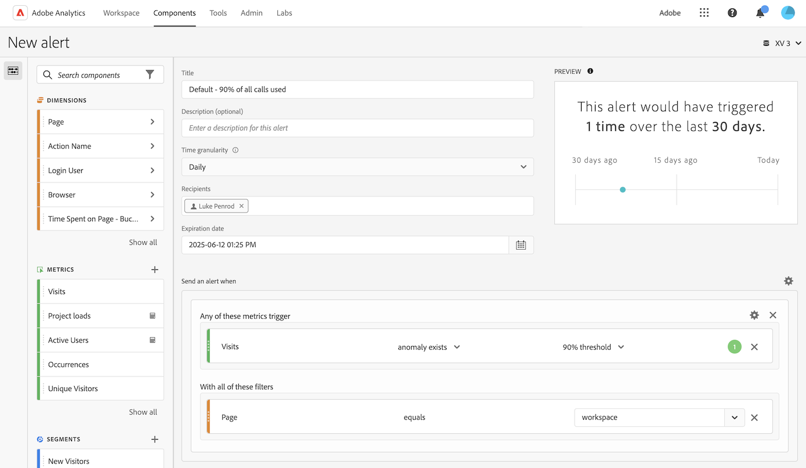

# アラートの作成 {#create-alerts}

<!-- markdownlint-disable MD034 -->

>[!CONTEXTUALHELP]
>id="components_alerts_timegranularity"
>title="時間の精度"
>abstract="時間の精度は、アラートのチェック頻度を指定します。"

<!-- markdownlint-enable MD034 -->

>[!NOTE]
>
>異常値検出を使用したアラート（_インテリジェントアラート_&#x200B;とも呼ばれる）の使用は、Adobe Analytics Prime または Ultimate パッケージを使用している組織でのみ使用できます。

Adobe Analytics のアラートを使用すると、変更された割合や特定のデータポイントに基づいて通知を受信できます。 また、Adobe Analytics パッケージに応じて、異常しきい値に基づいてトリガーされるアラートを使用することもできます。 サーバーコールの使用状況アラートは、Analytics 管理者のみが使用できる別の種類のアラートです。 これらのアラートは、サーバーコールの消費量とコミットメントデータの超過のリスクや発生件数を通知します。 詳しくは、[サーバーコールの使用状況アラート](/help/admin/tools/server-call-usage/scu-alerts.md)を参照してください。

アラートについて詳しくは、[アラートの概要](alerts-overview.md)を参照してください。

アラートを作成するには：

1. 次のいずれかの方法を使用して、アラートを作成します。

   * Analysis Workspace でプロジェクトを開き、**[!UICONTROL コンポーネント]**／**[!UICONTROL アラートを作成]**&#x200B;を選択します。
   * Analysis Workspace でプロジェクトを開き、***Cmd + Shift + A*** ショートカットキー（macOS）または ***Ctrl + Shift + A*** ショートカットキー（Windows）を使用します。
   * Analysis Workspace でプロジェクトを開き、フリーフォームテーブルで 1 つ以上の行項目を選択して右クリックし、「**[!UICONTROL 選択からアラートを作成]**」を選択します。 このアクションにより、即座に[アラートビルダー](alert-builder.md)に事前入力され、正しい指標とフィルターを含むアラートが作成されます。
   * [アラートマネージャーから](/help/components/alerts/alert-manager.md#create-alerts)アラートを作成します。

   アラートビルダーが表示されます。 このインターフェイスは、Analytics でセグメントや計算指標を作成するインターフェイスとしてよく知られています。

## アラートビルダー

アラートビルダーインターフェイスは、Customer Journey Analytics でセグメントまたは計算指標を作成するのに使用するインターフェイスに類似しています。

アラートのアラートビルダーで次の詳細を指定します。

| 要素 | 説明 |
|---------|----------|
| **[!UICONTROL タイトル]** | アラートの名前を指定します。 アラート名には、レポートの名前や指標のしきい値が含まれている場合があります。 |
| **[!UICONTROL 説明（オプション）]** | アラートの説明を指定します。 |
| **[!UICONTROL 時間の精度]** | 指標を確認する頻度を日単位、週単位、または月単位で選択します。
 |
| **[!UICONTROL 受信者]** | アラートの送信先を指定します。 アラートは、Analytics ユーザー、Analytics グループ、未加工の電子メールアドレス、または電話番号に送信できます。
<b>重要</b>：電話番号には、先頭に `+` と[国コード](https://countrycode.org/)を付ける必要があります。

ユーザーが受信するメールの例：

 |
| **[!UICONTROL 有効期限]** | アラートの有効期限が切れる日時を設定します。 |
| **[!UICONTROL 遅延]** | データが完了し、Customer Journey Analytics でレポートできるようになるまでに必要な時間は組織によって異なりますが、通常はデータイベント時間から 3～9 時間です。 アラートを正確にするには、特定のイベント範囲のイベントデータを完全にする必要があります。つまり、アドビでは指定されたイベント範囲のイベントデータを受信しなくなります。
この取り込み時間の遅延を考慮して、アラートを送信する前にデフォルトで 9 時間の遅延が設定されます。

デフォルトの 9 時間の遅延を 0～24 時間の間で調整できます。 ただし、遅延を 9 時間未満に短縮すると、不完全なデータをレポートすることになり、アラート情報が不正確になる場合があります。

遅延時間を短縮する際は、次の点を考慮します。
<ul><li>**データの可用性とデータの完全性について**：すべてのバッチデータは 3～9 時間後にのみ Platform データセットに取り込まれます。 アラートを正確にするには、データの取り込みが完了し、データセット内のすべてのバッチデータが使用可能になっている必要があります。</li><li>**データが完了してデータセットで使用できるようになるまでにかかる時間を判断**：データの取り込み時間は組織によって異なります。 アラート配信に選択する遅延時間は、バッチデータが Platform データセットで使用可能になるまでの時間と同じか、それよりも少ない頻度であることを確認します<!--add link? -->。</li>
**ヒント：**&#x200B;すべてのバッチデータが完了し、Platform データセットに取り込まれるまでに必要な時間を把握する最も正確な方法は、組織のデータエンジニアに相談することです。

または、組織内のバッチ配信が Experience Platform データセットで使用できるようになるまでにかかる時間を大まかに把握できます。 Analysis Workspace で次のフリーフォームテーブルを作成します。
<ol><li>Analysis Workspace のフリーフォームテーブルに、[!UICONTROL **イベント**]&#x200B;指標と&#x200B;[!UICONTROL **日**]&#x200B;ディメンションを追加します。</li><li>[!UICONTROL **時間**]&#x200B;ディメンションを使用して&#x200B;[!UICONTROL **日**]&#x200B;ディメンションを分類します。
データがない時間は 0 として表示されます。
</li></ol><li>**計算のエラーを考慮**：デフォルトの遅延時間を短縮する場合は、組織でのデータ取り込みの完了にかかる時間よりも1 時間以上長く遅延を設定します。 例えば、データ取り込みの完了までに 3 時間の遅延がある場合は、遅延を 4 時間に設定する必要があります。</li> |
| **[!UICONTROL 次の場合にアラートを送信]** | [!UICONTROL **これらの指標のいずれかがトリガー**]: <ol><li>指標（計算指標を含む）をドラッグ&amp;ドロップして、アラートのトリガーを作成します。
アラート内のすべての指標、ディメンションまたはセグメントが、現在選択されているレポートスイートと互換性がない場合、*互換性のないコンポーネント*&#x200B;のメッセージが表示されます。

アラートを設定する前に、指標が値（上記の場合、以下の場合、等しいまたはパーセンテージの変更）を超える必要があるしきい値（異常値の場合）を決定します。</li><li>次のいずれかの条件を選択します。<ul><li>異常値が存在する</li><li>異常値が予測より上</li><li>異常値が予測より下</li><li>以上</li><li>以下</li><li>変更者</li></ul></li><li>基準値を選択するか、値を入力します。</li></ol>[!UICONTROL **これらすべてのフィルターを使用**]：セグメントまたはディメンションをドラッグ＆ドロップして、アラートにフィルターを追加します。 例えば、*モバイルデバイスのみ*&#x200B;セグメントを追加すると、ルールはモバイルデバイスに対してのみトリガーされます。 AND ステートメントを使用して、その他のフィルターを追加できます。 ギアアイコンをクリックして、AND または OR ルールを追加できます。

ユースケースの例について詳しくは、[アラート - ユースケース](alerts-use-cases.md)を参照してください。
 |
| **[!UICONTROL プレビュー]** | インタラクティブアラートプレビューは、過去の経験に基づいて、アラートが実行されるおよその頻度を表示します。
例えば、時間の精度を毎日に設定すると、プレビューにより、最近の 30 または 31 日間で、特定の指標に対してアラートが何回トリガーされたかがわかります。

トリガーされているアラートが多すぎる場合は、[アラートの管理](alert-manager.md)でしきい値を調整できます。

{width="50%"}
 |
