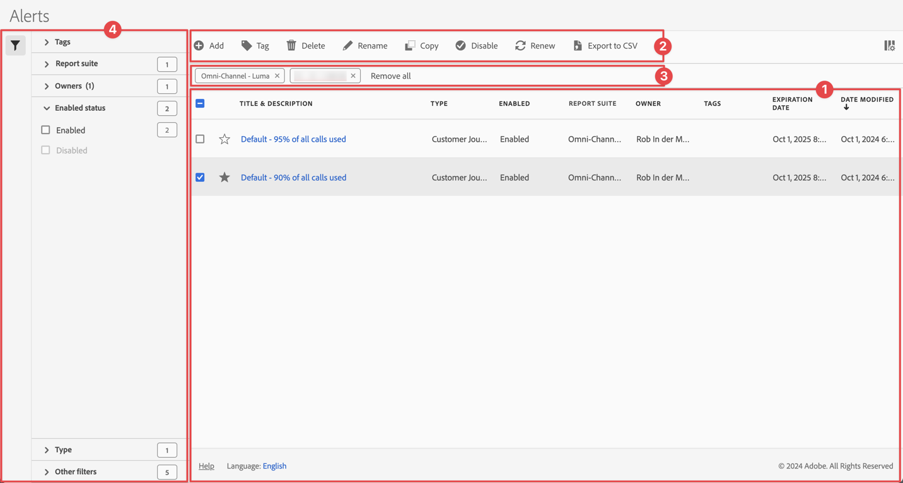
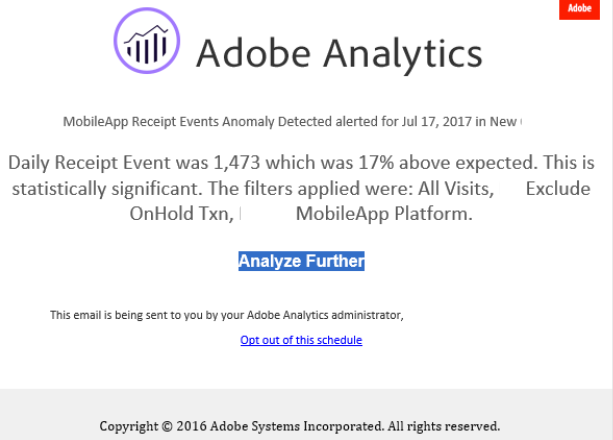
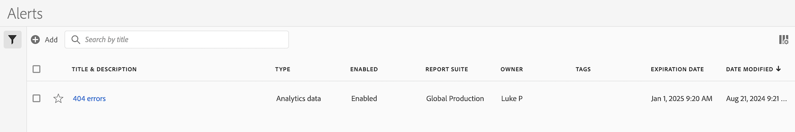
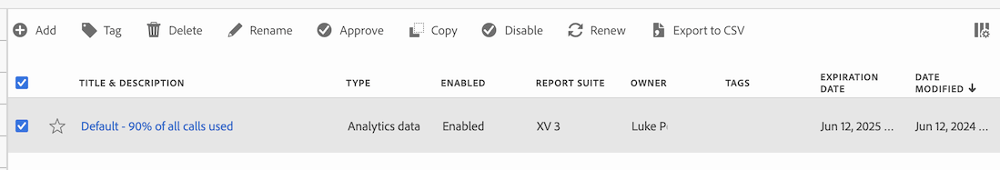

# アラートの管理

中央の[!UICONTROL  アラート ]管理インターフェイスからアラートをフィルタリング、タグ付け、削除、名前の変更、コピー、有効、無効、更新、エクスポートできます。 アラートを管理するには：

* メインインターフェイスで「**[!UICONTROL コンポーネント]**」を選択し、「**[!UICONTROL アラート]**」を選択します。

アラートマネージャーは、[ セグメントマネージャー](/help/components/segmentation/segmentation-workflow/seg-manage.md)と[計算指標マネージャー](/help/components/calculated-metrics/workflow/cm-manager.md)のような構造になっています。

## アラートマネージャー

アラートマネージャーには、次のインターフェイス要素があります。

### アラートリスト

アラート リスト ➊には、所有しているすべてのアラート、すべてのプロジェクトに対してスコープ付けされたアラート、および共有されたアラートが表示されます。 リストには、次の列があります。

| 列 | 説明 |
|---|---|
|  | を優先するか、をアラートから除外するかを選択します。 |
| **[!UICONTROL タイトルと説明]** | アラートを編集するには、タイトルリンクを選択します。これにより、[ アラートビルダー](alert-builder.md#alert-builder)が開きます。 |
| **[!UICONTROL タイプ]** | アラートの種類：Adobe Analytics データアラートまたはServer呼び出し使用状況アラート。 |
| **[!UICONTROL 有効]** | アラートは有効または無効です。 |
| **[!UICONTROL レポートスイート]** | このアラートが適用されるレポートスイート。 |
| **[!UICONTROL 所有者]** | アラートの所有者。 管理者以外のユーザーには、自分が所有するアラートまたは自分と共有されているアラートのみが表示されます。 |
| **[!UICONTROL タグ]** | このアラートのタグ。 |
| **[!UICONTROL 有効期限]** | アラートの有効期限が切れるように設定されている日時。 |
| **[!UICONTROL 変更日時]** | アラートが最後に変更された日時。 |

<!-- 

When "Last used" column is added, add this information as the description: Shows the date when the alert was last used. 
This information can help you determine whether a component is valuable to users in your organization, where it is used, and if it needs to be deleted or modified.

Consider the following when viewing this column:
<ul><li>This information does not include usage from the API, Report Builder, or Data Warehouse.</li><li>For some components, this column might not contain data if the component was last used prior to September 2023.</li></ul>

-->

 を使用して、表示する列を指定します。

### アクションバー

アクション バー➋を使用して、アラートに対してアクションを実行できます。 アクションバーには、次のアクションが含まれます。

| アイコン | アクション | 説明 |
|:---:|---|---|
|  | **[!UICONTROL 追加]** | [ アラートビルダー](alert-builder.md#alert-builder)を使用して、別のアラートを追加します。 |
|  | [!UICONTROL *タイトルで検索*] | リストでアラートが選択されていない場合は、この検索フィールドを使用してアラートを検索します。 |
|  | **[!UICONTROL タグ]** | 選択したアラートにタグを付けます。 **[!UICONTROL タグのアラート]** ダイアログで、選択したアラートのタグを選択または選択解除します。 選択したアラートのタグを保存するには、**[!UICONTROL 保存]**&#x200B;を選択します。 |
|  | **[!UICONTROL 削除]** | 選択したアラートを削除します。 確認メッセージが表示されます。 |
|  | **[!UICONTROL 名前変更]** | 選択した1つのアラートの名前を変更します。 選択すると、アラートの名前をインラインで変更できます。 |
|  | **[!UICONTROL コピー]** | 選択したアラートをコピーします。 新しいアラートが、同じ名前とサフィックス `(Copy)`で作成されます。 |
|  | **[!UICONTROL 有効]**&#x200B;または&#x200B;**[!UICONTROL 無効]** | 選択したアラートを有効または無効にします。 |
|  | **[!UICONTROL 更新]** | アラートの有効期限日を更新します。 有効期限は、元の有効期限に関係なく、このオプションを選択した日から1年間延長されます。 |
|  | **[!UICONTROL CSV に書き出し]** | アラートを`Alerts List.csv` ファイルにエクスポートします。 |

### アクティブなフィルターバー

フィルターバー➌には、フィルターパネルからアラートのリスト（存在する場合）に適用されたアクティブなフィルターが表示されます。  を使用すると、フィルターをすばやく削除できます。 複数のフィルターを指定した場合は、「**[!UICONTROL すべて削除]**」を使用すると、すべてのフィルターを削除できます。

### フィルターパネル

 **[!UICONTROL フィルター]**&#x200B;左側のパネル ➍を使用して、アラートのリストをフィルターできます。 フィルターパネルには、フィルターのタイプと、特定のフィルターを適用するアラートの数が表示されます。

1. 「」を選択して、フィルターパネルを開きます。 アラートリストの空き容量が必要な場合は、をもう一度選択してパネルを閉じることができます。
1. 使用可能なフィルターセクションからフィルターを選択します。

#### タグフィルターセクション

{{tagfiltersection}}

#### レポートスイートフィルターセクション

{{reportsuitefiltersection}}

#### 所有者フィルターセクション

{{ownerfiltersection}}

#### 有効ステータスのフィルターセクション

{{enabledstatusfiltersection}}

#### タイプのフィルターセクション

{{typefiltersection}}

#### その他のフィルターのフィルターセクション

{{otherfiltersfiltersection}}

## アラートを編集

アラートは

* [[!UICONTROL  アラート ] リスト ](#alerts-list)で、アラートのタイトルを選択します。

[ アラートビルダー](alert-builder.md#alert-builder)を使用して、アラートを編集します。

## アラートのトラブルシューティング

アラートに関する問題のトラブルシューティングを行う場合は、JID （Job Instance ID）番号をAdobe サポートに提供します。 JID番号は、受信したアラートメール通知の下部にあります。

<!--

# Manage alerts

You can manage existing alerts in the Alerts manager. You can perform various management tasks on alerts, such as tagging, renaming, deleting, and more.

The Alerts manager is structured very much like the [Segment Manager](/help/components/segmentation/segmentation-workflow/seg-manage.md) and the [Calculated Metric Manager](/help/components/calculated-metrics/calcmetric-workflow/cm-manager.md).

 

## Create alerts

To create alerts from the Alerts manager:

1. Select **[!UICONTROL Components]** > **[!UICONTROL Alerts]** to access the Alerts manager in Adobe Analytics.

   

1. Select [!UICONTROL **Add**] (or [!UICONTROL **Create new alert**] if you don't have any existing alerts).

1. Select the alert type that corresponds to the alert that you want to create:

   * [!UICONTROL **Analytics data alert**]: An alert to notify you when abnormal events occur in your data. 

     If you select this option, continue with [Create alerts](/help/components/alerts/alert-builder.md) for more details about creating alerts.

   * [!UICONTROL **Server call usage alert**]: An alert to notify you of the risk or occurrence of an overage in your server call consumption and commitment data. 

     If you select this option, continue with [Server call usage alerts](/help/admin/tools/server-call-usage/scu-alerts.md).

     >[!NOTE]
     >
     >You must be an Analytics administrator or a user with the Server call usage permission in order to have access to server call usage. 

## Manage existing alerts

You can perform various actions on existing alerts, such as tagging, renaming, deleting, and so forth.

To manage existing alerts in the Alerts manager:

1. Select **[!UICONTROL Components]** > **[!UICONTROL Alerts]** to access the Alerts manager in Adobe Analytics.

   

1. Select one or more alerts that you want to manage.

   

1. In the action bar, select any of the following options:

   | Action | Function |
   |---------|----------|
   | [!UICONTROL **Tag**] | Apply a tag to an alert. This helps you to organize alerts for ease of use. |
   | [!UICONTROL **Delete**] | Deletes the alert. |
   | [!UICONTROL **Rename**] | Renames the alert. |
   | [!UICONTROL **Approve**] | Mark the alert as Approved. |
   | [!UICONTROL **Copy**] | Creates a copy (duplicate) of the alert. |
   | [!UICONTROL **Disable**] | Disables an alert that is currently enabled. |
   | [!UICONTROL **Enable**] | Enables an alert that is currently disabled. |
   | [!UICONTROL **Renew**] | Renews the alert expiration date. This extends the  expiration date to be 1 year from the day you selected this option, regardless of the original expiration date. |
   | [!UICONTROL **Export to CSV**] | Exports the alert to a .CSV file. |

## Edit an alert

To edit an existing alert:

1. Select **[!UICONTROL Components]** > **[!UICONTROL Alerts]** to access the Alerts manager in Adobe Analytics.

   

1. Select the alert name in the [!UICONTROL **Title and description**] column.

1. Edit the alert as desired. 

   Following are some of the things you can do when editing an alert:

   * Add alerts to other report suites
   * Add or modify the description
   * Modify the time granularity
   * Modify the recipients 
   * Modify the expiration date
   * Modify the metrics and filters

1. Select [!UICONTROL **Save**].

## Configure columns 

You can configure the information displayed for each alert in the Alerts manager by configuring the columns that are displayed.

To configure the visible columns in the Alerts manager:

1. In Adobe Analytics, select the **[!UICONTROL Components]** tab, then select **[!UICONTROL Alerts]**. 

1. In the Alert manager, select the **Customize columns** icon , then select the columns that you want to be displayed in the Alerts manager.

   The following columns are available:

   | Column title  | Description |
   |---|---|
   | Title and description | These values are provided in the Alert builder. To edit the title and description, select the title link to open the Alert builder.  |
   | Favorites  | Displays star icons next to each alert, allowing you to mark alerts as favorites. |
   | Type | Shows whether the alert is an Analytics data alert or a Server call usage alert. |
   | Enabled | Shows whether the alert is currently enabled or disabled. |
   | Report suite | Indicates in which report suite the alert was last saved.  |
   | Owner | Indicates who owns the alert. As a non-admin, you can see only alerts you own or those that were shared with you.  |
   | Tags | Shows tags that were applied to the alert, either by you or by people who shared the alert with you.  |
   | Expiration date | Shows the date and time when the alert is set to expire. |
   | Date modified | Indicates the date when the alert was last modified.  |

   {style="table-layout:auto"}
   
   
    When "Last used" column is added, add this information as the description: Shows the date when the alert was last used. 
This information can help you determine whether a component is valuable to users in your organization, where it is used, and if it needs to be deleted or modified.

Consider the following when viewing this column:
<ul><li>This information does not include usage from the API, Report Builder, or Data Warehouse.</li><li>For some components, this column might not contain data if the component was last used prior to September 2023.</li></ul> 
   
-->

