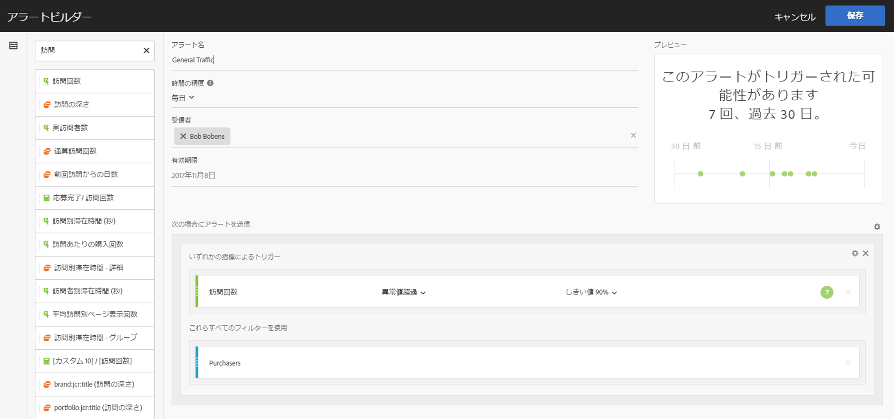
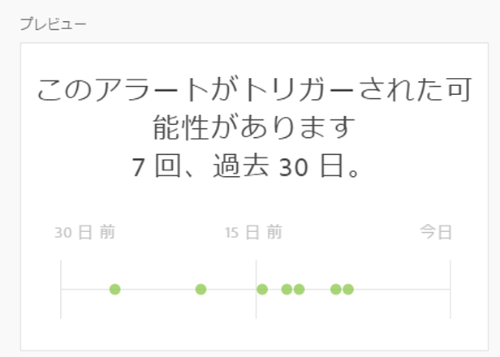

# アラートビルダー

>[!IMPORTANT]
>
>Intelligent Alerts are available to Adobe [!DNL Analytics] Prime and Adobe [!DNL Analytics] Ultimate customers only.

アラートビルダーには、以下の 4 つのうちいずれかの方法でアクセスします。

* Analysis Workspace で以下のショートカットを使用する。

   `ctrl (or cmd) + shift + a`
* **[!UICONTROL ワークスペース]** / **[!UICONTROL コンポーネント]** / **[!UICONTROL 新しいアラート]**&#x200B;に移動します。
* By selecting one or more freeform table line items, right-clicking and selecting **[!UICONTROL Create Alert from Selection]**.
* [!UICONTROL Reports&amp; Analytics] レポート内から **[!UICONTROL 、その他]** /アラート **[!UICONTROL の追加に移動]**&#x200B;します。

The Alert Builder interface is familiar to those who have built segments or calculated metrics in [!DNL Analytics]:

**アラート名**

アラート名を指定します。アラート名には、レポート名または指標のしきい値を含めることができます。

**時間の精度**

いつ指標がチェックされるかを、1 時間ごと、毎日、毎週または毎月から指定します。

>[!NOTE]
>
>カスタムカレンダーのレポートスイートでは、アラートビルダーの毎月の精度はサポートされません。

**受信者**

アラートの送信先を指定します。An alert can be sent to an [!DNL Analytics] user, an [!DNL Analytics] group, a raw email address, or to a phone number.

>[!IMPORTANT]
>
>The phone number must be preceded by a "+" and a [country code](https://countrycode.org/).

**有効期限**

アラートの有効期限を設定します。

**次の場合にアラートを送信...**

*... いずれかの指標によるトリガー*

* トリガーを追加するキャンバスに指標をドラッグ＆ドロップします。

   Note that an **"incompatible components”** message will appear if not all the components (metrics/dimensions/segments) in the alert are compatible with the currently selected report suite.

* アラートが設定される前に指標が超過している必要があるしきい値を指定します。この値をしきい値に設定し、以下のいずれかの条件にすることができます。

   * 異常値が存在する
   * 異常値が予測より上
   * 異常値が予測より下
   * 異常値超過
   * 以上
   * 以下
   * 変更（％）

* 異常値超過は、既存の（静的な）しきい値を超える新しい条件です。トリガーを動的に定義する異常値検出アルゴリズムをプルします。90％、95％、99％、99.75％、99.9％ のしきい値を設定できます。
* 毎時の精度は 99.75％、毎日の精度は 99％ のしきい値で設定されます。
* 計算指標も使用できることに注意してください。

*... これらすべてのフィルターを使用*

セグメントまたはディメンションをここにドラッグ＆ドロップしてフィルターを追加します。例えば、「モバイルデバイスのみ」セグメントの追加は、ルールがモバイルデバイスに対してのみトリガーするということを意味します。

追加のフィルターは、AND ステートメントを使用して追加されます。

**ルールを追加**

ギアアイコンをクリックして、AND または OR ルールを追加できます。

## アラートプレビュー {#section_10D75BA7B77E4C5FAF58A719C082E070}

インタラクティブアラートプレビューは、過去の経験に基づいて、アラートが実行されるおよその頻度を表示します。

例えば、時間の精度を毎日に設定すると、プレビューにより、最近の 30 または 31 日間で、特定の指標に対してアラートが何回トリガーされたかがわかります。

トリガーされているアラートが多すぎる場合は、[アラートマネージャー](/help/components/c-alerts/alert-manager.md)でしきい値を調整できます。

