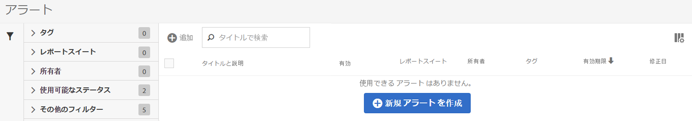
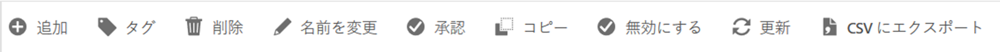

# アラートマネージャー

アラートマネージャー（**[!UICONTROL Analytics]**／**[!UICONTROL コンポーネント]**／**[!UICONTROL アラート]**）は、[セグメントマネージャー](https://docs.adobe.com/content/help/ja-JP/analytics/components/segmentation/segmentation-workflow/seg-manage.html)および[計算指標マネージャー](https://docs.adobe.com/content/help/ja-JP/analytics/components/calculated-metrics/calcmetric-workflow/cm-manager.html)と非常によく似た構造で、次の操作をおこなえます。

* 「**[!UICONTROL + 追加]**」をクリックすると、アラートビルダーにアクセスします。
* アラートのタグ付け。これにより、アラートを使いやすく整理できます。
* アラートの削除。
* アラートの名前の変更。
* アラートの承認。
* アラートのコピー。
* アラートの有効化／無効化。
* アラートの有効期限の&#x200B;**更新**。1 つまたは複数のアラートが選択されている場合、「**[!UICONTROL 更新]**」をクリックすることで更新できます。これにより、元の有効期限にかかわらず、「**[!UICONTROL 更新]**」がクリックされた日から 1 年先に有効期限が延長されます。
* アラートの .CSV ファイルへの書き出し。
* アラートタイトルのダブルクリックによるアラートの編集。
* アラートの検索。
* 他のレポートスイートへのアラートの追加。
* アラートの所有者の指定／変更。
* 他のフィルターの追加。
* アラートの&#x200B;**有効期限**&#x200B;の定義。

