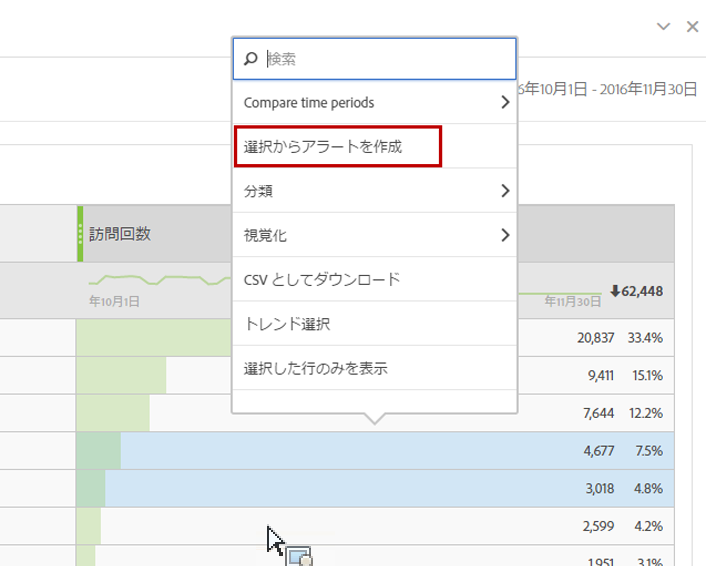
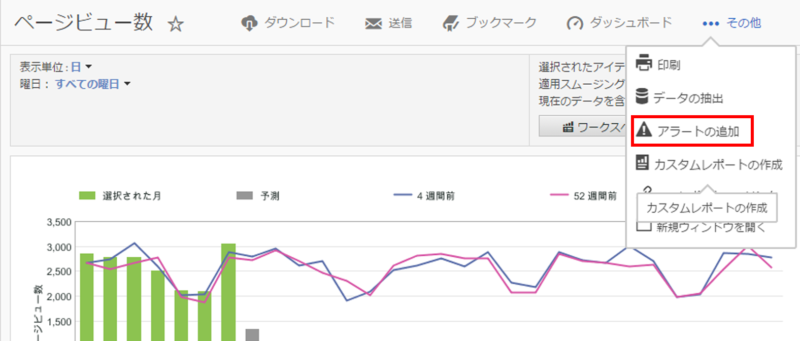

# インテリジェントアラート

新しいインテリジェントアラートシステムでは、アラートをより詳細に制御でき、異常値検出とアラートシステムが統合されます。

## 概要 {#section_6AC8CA81DEA94E99B0F192B60D0FDF03}

>[!IMPORTANT]
>
>インテリジェントアラートは、Adobe [!DNL Analytics] Prime および Adobe [!DNL Analytics] Ultimate のお客様のみご利用いただけます。

新しいアラートビルダーとアラートマネージャーは、Adobe [!DNL Analytics] の既存のアラート機能を置き換えます。インテリジェントアラートを使用すると、次のことができます。

* 異常値（90％、95％、99％、99.75％、99.9％のしきい値、変化率、超過／未満）に基づいてアラートを構築。
* アラートがトリガーされる頻度のプレビュー。
* 自動生成される Analysis Workspace プロジェクトへのリンクが記載された電子メールまたは SMS によるアラートの送信。
* 1 つのアラートで複数の指標を示す「積み重ね」アラートの作成。

新しいアラートシステムのコンポーネントには、アラートビルダー、アラートマネージャー、アラートプレビュー、アラート作成への優れたコンテキスト内アクセスが含まれます。古いアラートシステムユーザーインターフェイスは、使用できなくなりますが、アラートは移行されます。一部のレガシーアラート機能は、[使用できなくなります](https://experienceleague.adobe.com/docs/analytics/analyze/reports-analytics/alerts.html)。

アラートビルダーにアクセスするには、次の 4 つの方法があります。

* Analysis Workspace で以下のショートカットを使用する。

   `ctrl (or cmd) + shift + a`
* **[!UICONTROL Workspace]**／**[!UICONTROL コンポーネント]**／**[!UICONTROL 新しいアラート]**&#x200B;でアラートビルダーに直接アクセスする。
* 1 つまたは複数のフリーフォームテーブル行項目を選択し、右クリックして、「**[!UICONTROL 選択からアラートを作成]**」を選択する。これにより、アラートビルダーが開き、テーブルから適用された適切な指標およびフィルターでビルダーを事前設定します。これで、必要に応じて、アラートを編集できます。

   

* [!UICONTROL Reports &amp; Analytics] レポートから、**[!UICONTROL その他]**／**[!UICONTROL アラートの追加]**&#x200B;に移動する。これにより、新しいアラートビルダーが開き、レポートから適用された適切な指標およびフィルターでビルダーを事前設定します。これで、必要に応じて、アラートを編集できます。

   

## FAQ：アラートが計算およびトリガーされる仕組み {#section_1F3B1DAF21784306953B49AAD4C3DCAB}

% しきい値は標準偏差です。例えば、95% = 2 標準偏差と 99% = 3 標準偏差です。選択した時間の精度に応じて、[異なるモデル](/help/analyze/analysis-workspace/virtual-analyst/c-anomaly-detection/statistics-anomaly-detection.md)が使用され、各データポイントが標準からどれくらい離れているか（標準偏差からの乖離）が計算されます。低いしきい値（90％など）を設定すると、高いしきい値（99％など）を設定した場合よりも多くの異常値が取得されます。99.75％と 99.99％のしきい値は、時間単位の精度用に、多数の異常値がトリガーされないようにするために導入されました。

<table id="table_B3AA85E1DE3543DCA34966A52E3CE4AB"> 
 <thead> 
  <tr> 
   <th colname="col1" class="entry"> 質問 </th> 
   <th colname="col2" class="entry"> 回答 </th> 
  </tr> 
 </thead>
 <tbody> 
  <tr> 
   <td colname="col1"> 
<b>質問：アラートの異常値検出はデータの異常値を判別するためにどれくらい過去に遡りますか。</b> 
 </td> 
   <td colname="col2"> 
トレーニング期間は選択した精度によって異なります詳しくは、<a href="/help/analyze/analysis-workspace/virtual-analyst/c-anomaly-detection/statistics-anomaly-detection.md">異常値検出</a>で使用される統計的手法を参照してください。要約を次に示します。 
 
    <ul id="ul_4F8C2A41F06C498DBF5E7AE5DE803773"> 
     <li id="li_E246091A3F1E484C8444AF4052FCA784">月単位 = 15 ヶ月 + 前年の同じ時間範囲 </li> 
     <li id="li_CC014FB38AE1492B9647E990C29BFB3C">週単位 = 15 週 + 前年の同じ時間範囲 </li> 
     <li id="li_2517EE2097534324BE9C1B54CD181A62">日単位 = 35 日 + 前年の同じ時間範囲 </li> 
     <li id="li_710BC8B009354542AA4962A59A646099">時間単位 = 336 時間 </li> 
    </ul> </td> 
  </tr> 
  <tr> 
   <td colname="col1"> 
<b>質問：行動が減少または急増したときにのみアラートを受け取りたい場合、異常値機能を使用できますか。または絶対値を使用する必要がありますか。</b> 
 </td> 
   <td colname="col2"> 
絶対値を使用した場合でも、減少および急増でアラートがトリガーされます。減少または急増のみにアラートを分離することはできません。 
 </td> 
  </tr> 
  <tr> 
   <td colname="col1"> 
<b>質問：1 日の特定の時間内（営業時間内、営業時間外など）にのみトリガーされるようにアラートを設定できますか。</b> 
 </td> 
   <td colname="col2"> 
現在はできません。 
 </td> 
  </tr> 
  <tr> 
   <td colname="col1"> 
<b>質問：「予期された値」のテーブル（点線またはそれらの値の意味の出力で構成される）を入手できますか。</b> 
 </td> 
   <td colname="col2"> 
Workspace ではできませんが、Report Builder では取得できます（<a href="https://experienceleague.adobe.com/docs/analytics-learn/tutorials/exporting/report-builder/anomaly-detection-in-report-builder.html"  >Report Builder での異常値検出</a>を参照）。 
 
Report Builder では、低レベルの異常値検出方法が使用されることに留意してください。固定の 30 日間のトレーニング期間、固定の 95% 間隔を使用します。 
 </td> 
  </tr> 
 </tbody> 
</table>
