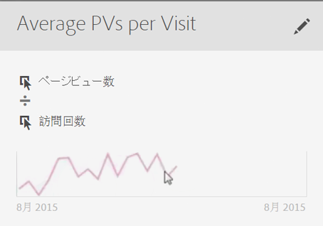

# 指標の作成

計算指標ビルダーは、ディメンション、指標、セグメントおよび関数をドラッグ＆ドロップし、コンテナ階層ロジック、ルール、演算子に基づいてカスタム指標を作成するためのキャンバスです。この統合開発ツールでは、シンプルな計算指標または複雑で高度な計算指標を作成および保存できます。

計算指標ビルダーにアクセスする方法はいくつかあります。

* In Analysis Workspace, open a project and click  **[!UICONTROL + New]** &gt; **[!UICONTROL Create Metric]** .
* In [!DNL Analytics], go to **[!UICONTROL Components]** &gt; **[!UICONTROL Calculated Metrics]**.

* Click **[!UICONTROL + Add]** at the top of the [Calculated Metric Manager](../../../../../components/c-calcmetrics/c-workflow/cm-workflow/cm-manager.md#concept_BA6815CB06D842D5825766396B691653), or

* **[!UICONTROL Analytics]** / **[!UICONTROL レポートに移動]**&#x200B;し、任意のレポートを開き、指標アイコン  をクリックして指標レールを表示し、 **[!UICONTROL 「追加]**」をクリックします。

## UI コンポーネント {#section_9382AEEBA4244DD6A9F6C1DD3F6D076B}

<table id="table_60A82936321047D1A335331BF83B0972"> 
 <thead> 
  <tr> 
   <th colname="col2" class="entry"> フィールド </th> 
   <th colname="col3" class="entry"> 説明 </th> 
  </tr> 
 </thead>
 <tbody> 
  <tr> 
   <td colname="col2">  タイトル  </td> 
   <td colname="col3"> 
指標には必ず名前を付ける必要があります。名前を付けていない指標は保存できません。 
 </td> 
  </tr> 
  <tr> 
   <td colname="col2">  説明  </td> 
   <td colname="col3"> 
指標の用途を示し、類似した指標と区別するための、ユーザーにわかりやすい説明を入力します。 
 
この説明はレポート内にも表示されます。説明には数式を記述しないことをお勧めします。その代わりに、この指標を使うべき状況と使ってはいけない状況について記述してください（数式は、指標の作成時に「概要」という見出しの下に生成されます。そのため、この説明に数式を追加する必要はありません）。 
 </td> 
  </tr> 
  <tr> 
   <td colname="col2">  形式  </td> 
   <td colname="col3"> 
小数、時間、割合、通貨から選択できます。 
 </td> 
  </tr> 
  <tr> 
   <td colname="col2">  小数点以下の桁数  </td> 
   <td colname="col3"> 
レポートに表示する小数点以下の桁数を示します。指定可能な小数点以下の桁数の最大値は 10 です。 
 </td> 
  </tr> 
  <tr> 
   <td colname="col2"> 上昇傾向を次の形式で表示 </td> 
   <td colname="col3"> 
この指標の両極性設定で[!DNL Analytics]は、指標の上昇傾向を良い（緑）または悪い（赤）と見なす必要があります。そのため、レポートのグラフは、上昇傾向の場合に緑または赤で表示されます。 
 </td> 
  </tr> 
  <tr> 
   <td colname="col2">  タグ  </td> 
   <td colname="col3"> 
タグ付けは、指標を管理するための便利な方法です。すべてのユーザーがタグを付けることができます。指標には 1 つ以上のタグを適用できます。ただし、自分が所有しているまたは自分が共有していたセグメントに対するタグのみを表示できます。どのような種類のタグを作成する必要がありますか。次に、便利なタグのいくつかを示します。 
     <ul id="ul_9A6CE5F179424687A39F2D5C1A953258"> 
      <li id="li_A8815F2D8D284874AD701A7B103D82A3">ソーシャルマーケティング、モバイルマーケティングなど、<b>チーム名</b>に基づくタグ。 </li> 
      <li id="li_A51A4515A541488E9D90296A955E9F4F"><b>プロジェクト</b>タグ（分析タグ）：入口ページ分析など。 </li> 
      <li id="li_B4605470A7094026AC168420B64BBCC3"><b>カテゴリ</b>タグ：メンズ、地域。 </li> 
      <li id="li_B6EAB0F2A96C41209C4EC97B9E64390B"><b>ワークフロー</b>タグ：承認済み、（特定のビジネスユニット向けの）キュレーション。 </li> 
     </ul> 
 </td> 
  </tr> 
  <tr> 
   <td colname="col2">  概要  </td> 
   <td colname="col3"> 
「概要」の数式は、指標の定義を変更すると更新されます。この数式は、左側の指標レールで、指標の上にカーソルを移動して  アイコンをクリックした場合にも表示されます。 
 </td> 
  </tr> 
  <tr> 
   <td colname="col2">  定義  </td> 
   <td colname="col3"> 
ここで、指標／計算指標、セグメントまたは関数をドラッグして、計算指標を作成します。 
 
 
     <ul id="ul_B13401A266354DC594C6176025DB61CB"> 
      <li id="li_01776C32C7C5440AA1F847096CBED92B">計算指標をドラッグすると、指標の定義が自動的に展開します。 </li> 
      <li id="li_A483D352522E4572AB43042473053359">コンテナを使用して定義をネストできます。ただし、セグメントコンテナとは異なり、これらのコンテナは数式のように機能し、演算の順序を指定します。 </li> 
     </ul> 
 </td> 
  </tr> 
  <tr> 
   <td colname="col2">  演算子  </td> 
   <td colname="col3"> 
除算（）はデフォルトの演算子です。他にも、+、- および x があります。 
 </td> 
  </tr> 
  <tr> 
   <td colname="col2">  プレビュー  </td> 
   <td colname="col3"> 
可能性のあるエラーについて簡単に確認できます。プレビューには過去 90 日の情報が表示されます。これは、指標に適したコンポーネントを選択したかどうかを最初に判断するための手段です。予期しない結果が生じた場合は、指標の定義を見直す必要があります。 
 </td> 
  </tr> 
  <tr> 
   <td colname="col2">  製品の互換性  </td> 
   <td colname="col3"> 
「製品の互換性」は、指標が「<a href="https://marketing.adobe.com/resources/help/en_US/reference/data_latency.html" format="https" scope="external">現在のデータ</a>」、「処理済みのデータ」またはマーケティングチャネルレポートのみ（ファーストタッチ配分）のいずれと互換性があるかを示します。 
注意：「現在のデータ」はすべての指標をサポートしているわけではありません。セグメントまたは関数を含む指標は「現在のデータ」との互換性がありません。<a href="../../../../../components/c-calcmetrics/cm-compatibility.md#concept_906480DEBEEC4D279BBBBD4CE7DFE70C" format="dita" scope="local">詳細情報...</a> 
 
 </td> 
  </tr> 
  <tr> 
   <td colname="col2">  追加  </td> 
   <td colname="col3"> 
すべてのタイプの計算指標の場合、コンテナおよび静的な数値を定義に追加できます。高度な計算指標の場合、セグメントおよび関数も追加できます。 
 
 
     <ul id="ul_607C1B303F334062BC620317667DE490"> 
      <li id="li_53462789B8AF4F1AA9B45565D37CF22B">コンテナは数式のように機能し、演算の順序を指定します。そのため、コンテナ内の項目は、次の演算の前に処理されます。 </li> 
      <li id="li_401A9E0D8B3B468990289DBF66A06F63">コンテナにセグメントをドラッグすると、そのコンテナ内のすべての項目がセグメント化されます。（高度な計算指標のみ） </li> 
      <li id="li_F191B200D7A944F9ADC0573A9A82A6DA">コンテナでは複数のセグメントを積み重ねることができます。 </li> 
     </ul> 
 </td> 
  </tr> 
  <tr> 
   <td colname="col2"> 歯車アイコン（指標タイプ、アトリビューション） </td> 
   <td colname="col3"> 
Selecting the gear icon next to a metric lets you specify the <a href="../../../../../components/c-calcmetrics/c-workflow/cm-workflow/c-build-metrics/m-metric-type-alloc.md#concept_B7A1FCFEFA9D4C4883208ACE8C9C8E5E" format="dita" scope="local"> metric type and attribution models </a>. 
 </td> 
  </tr> 
  <tr> 
   <td colname="col2">  + 新規  </td> 
   <td colname="col3"> 
新しいセグメントなど新しいコンポーネントを作成できます（新しいセグメントを作成する場合は、<a href="https://marketing.adobe.com/resources/help/en_US/analytics/segment/seg_build_ui.html" format="https" scope="external">セグメントビルダー</a>が表示されます）。 
 </td> 
  </tr> 
  <tr> 
   <td colname="col2"> 
コンポーネントを検索 
 </td> 
   <td colname="col3"> 
この検索バーを使用して、ディメンション、指標、セグメント（高度な計算指標のみ）および関数（高度な計算指標のみ）を検索できます。 
 </td> 
  </tr> 
  <tr> 
   <td colname="col2"> 
ディメンションリスト 
 </td> 
   <td colname="col3"> 
（セグメントビルダーで）シンプルなセグメント（例：「Page = Homepage」）を作成するときに、計算指標ビルダーから離れずに、直接ディメンション（例：Page）をドラッグしてアイテム（例：Homepage）を選択できます。 
 
これにより、セグメントを利用する計算指標の作成が容易になります。 
 </td> 
  </tr> 
  <tr> 
   <td colname="col2"> 
指標リスト 
 </td> 
   <td colname="col3"> 
指標は次の 3 つのカテゴリに分かれています。 
 
    <ul id="ul_7BF50F4964EF45858FBA1634FBFA45CF"> 
     <li id="li_90F2312927A6499CA1CE04F8FFC912CF">標準指標（） </li> 
     <li id="li_A3F59083E79B4AC780D6F8CEDFFD20C9">計算指標（） </li> 
     <li id="li_8735E76637ED4C3F983731A66E04C93E">指標テンプレート（） - リストの一番下 </li> 
    </ul> 
指標の上にカーソルを移動すると、右側に情報アイコンが表示されます。このアイコンをクリックすると、次の情報が表示されます。 
 
    <ul id="ul_DF35DDB9FBFA40C8A93FA0F2286A0BBE"> 
     <li id="li_4215AA9BF93F4C8B941002A7A4D2F50B">指標の計算を行うための数式 </li> 
     <li id="li_6A8E39EB6DCE4377B0B594B6D4FC0294">指標の傾向のプレビュー </li> 
     <li id="li_44C1595E4BE64ED69D1DB3BB6655ED55">右上の編集（鉛筆）アイコンをクリックすると、計算指標を編集するための計算指標ビルダーが表示されます。 </li> 
    </ul> 
 
 </td> 
  </tr> 
  <tr> 
   <td colname="col2"> 
セグメントリスト 
 </td> 
   <td colname="col3"> 
（高度な計算指標のみ）管理者の場合は、ログイン会社で作成されたすべてのセグメントがこのリストに表示されます。管理者以外のユーザーの場合は、自分が所有するセグメントおよび共有しているセグメントがこのリストに表示されます。<a href="https://marketing.adobe.com/resources/help/en_US/analytics/segment/seg_rights.html" format="https" scope="external">詳細情報...</a> 
 </td> 
  </tr> 
  <tr> 
   <td colname="col2"> 
関数リスト 
 </td> 
   <td colname="col3"> 
（高度な計算指標のみ）関数が 2 つのリストに分けて表示されます。<a href="../../../../../components/c-calcmetrics/cm-reference/cm-functions.md#concept_E3022D5EEEE145B69A23438BAF7016B2" format="dita" scope="local"> 基本（ </a> 最も頻繁に使用される）および <a href="../../../../../components/c-calcmetrics/cm-reference/cm-adv-functions.md#concept_A5FB9127D70F4E1AA02D1ACBF4F54174" format="dita" scope="local"> Advanced </a>。 
 </td> 
  </tr> 
  <tr> 
   <td colname="col2"> 
レポートスイートの選択 
 </td> 
   <td colname="col3"> 
別のレポートスイートに切り替えることができます。 
 </td> 
  </tr> 
 </tbody> 
</table>

