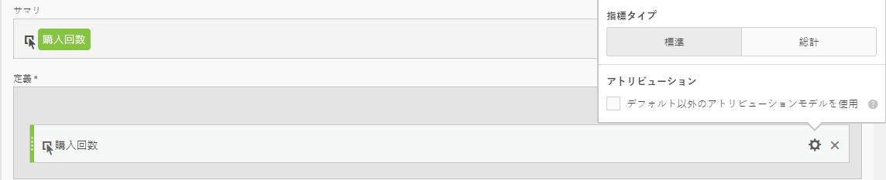
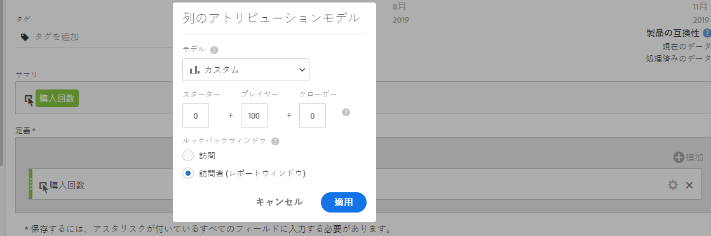
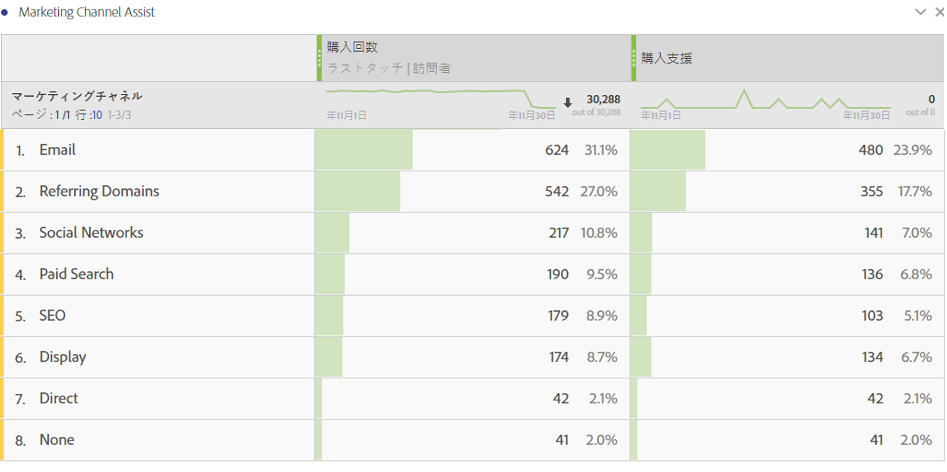

# 注文支援指標

注文の促進を支援するマーケティングチャネルを示す指標の作成方法について説明します。これは、任意のディメンションや興味の成功イベントに適応させることができます。

1. 計算指標ビルダーで、指標に「注文支援」という名前を付けます。
1. 「定義」キャンバスで、注文件数指標をドラッグします。次に、設定の歯車アイコンの「**[!UICONTROL デフォルト以外のアトリビューションモデルを使用]」チェックボックスを選択して、アトリビューションモデルを調整します。**

   

1. アトリビューションモデルとして、「**[!UICONTROL カスタム]」を選択します。**&#x200B;重みを 0（スターター）、100（プレイヤー）、0（クローザー）に変更します。

   

1. 指標を保存します。
1. Analysis Workspace で、マーケティングチャネルディメンション、注文件数および新しい注文支援指標を使用してフリーフォームテーブルを作成します。

   

これで、どのマーケティングチャネルが注文の促進を支援したかを簡単に示すことができます。または、フリーフォームテーブルで指標を右クリックして、テーブルから直接アトリビューションモデルを調整できます。
