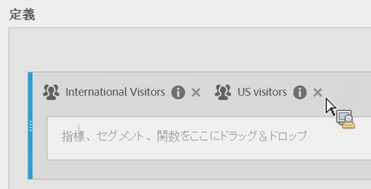
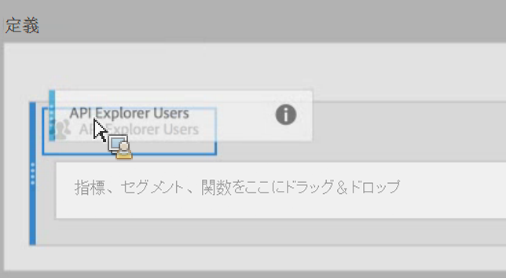

# セグメントのスタックと置換

計算指標ビルダー内でのセグメントの積み重ねと置き換えの方法を示します。

## セグメントの積み重ね {#section_3FC1118FEE2B40B7BB90F29C8521AF53}

「定義」キャンバスで、既存のセグメントの横に新しいセグメントをドロップします。

## セグメントの置き換え {#section_3DA899DF522A44D7A583C5DC8C0A033E}

「定義」キャンバスで、既存のセグメントの上に新しいセグメントをドロップします。

