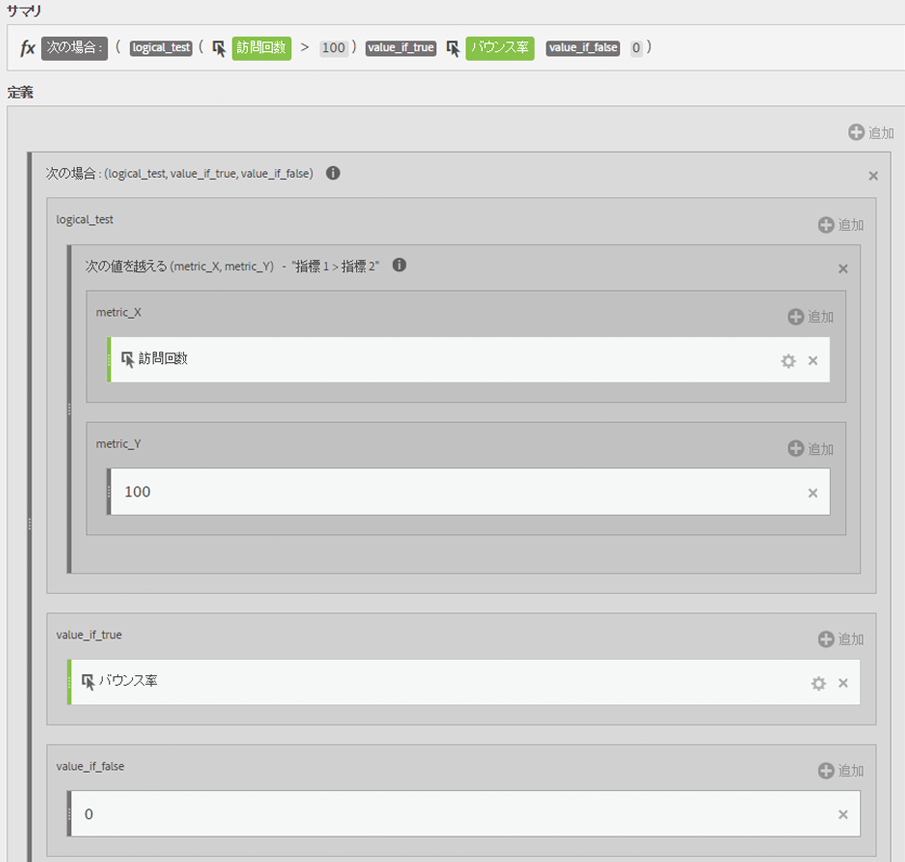
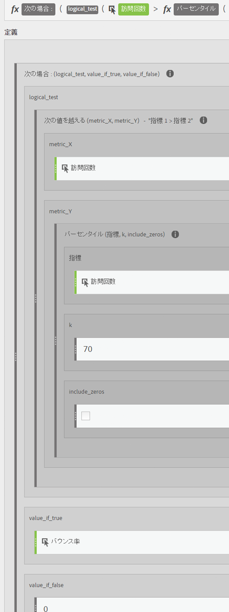

# フィルター適用済み指標と重み付け指標

フィルター適用済み指標と重み付け指標の例を示します。

## フィルター適用済みのバウンス率 {#section_D42F2452E4464948934063EB6F2DAAB4}

このシンプルなフィルター適用済み指標は、訪問回数が 100 回を超えているページのみのバウンス率を示します。

この数式は、一貫した時間の範囲に依存することに注意してください。レポートを 1 日だけ実行する場合は、訪問回数が 20 回を超えるページも対象とした方がよいでしょう。レポートを 1 か月間実行する場合は、訪問回数がさらに多い場合に対応したフィルターが必要になる可能性があります。

## フィルター適用済みのバウンス率（パーセンタイルを使用） {#section_4F3E6D33A1FD438A932FA662B3510552}

このフィルターは、訪問回数で並べ替えた場合の上位 30％のページのバウンス率を示します。

## 重み付け指標 {#section_F2D16B14569948289CF1310F9E6E3FC2}

バウンス率で並べ替えをおこない、訪問回数が多いページがリストの上位に来るようにする必要があるとします。そのためには、次のような重みを付けたバウンス率を作成します。

