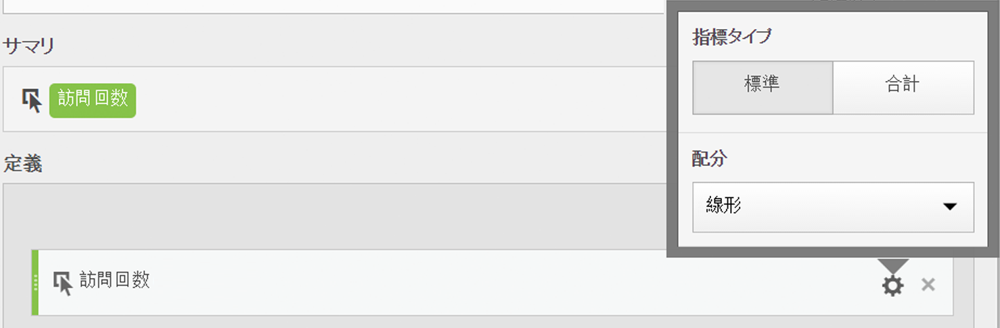

# 指標タイプとアトリビューション

指標の横にある歯車アイコンをクリックすると、指標タイプとアトリビューションモデルを指定できます。

## 指標タイプ

| 指標タイプ | 定義 |
|---|---|
| 標準 | これらの指標は、標準の [!DNL Analytics] レポートで使用される指標と同じです。1 つの標準指標で構成される数式は、その標準指標に対応する計算指標以外の指標と同じデータを表示します。標準指標は、個々の行項目に固有の計算指標を作成する場合に役立ちます。例えば、[購入回数]／[訪問回数]の場合、特定の行項目の購入回数を特定の行項目の訪問回数で割ります。 |
| 合計 | 各行項目のレポート期間の合計を使用します。1 つの合計指標で構成される数式は、各行項目で同じ合計数を表示します。合計指標は、サイト合計データと比較する計算指標を作成する場合に役立ちます。例えば、[購入回数]／[合計訪問回数]は、特定の行項目への訪問回数だけでなく、サイトへのすべての訪問回数に対する購入回数の割合を示します。 |

## 列のアトリビューションモデル

>[!IMPORTANT]
>
>2018 年 7 月に、計算指標における配分モデルの評価方法を変える [Attribution IQ](https://docs.adobe.com/content/help/ja-JP/analytics/analyze/analysis-workspace/attribution/models.html) が [!DNL Analytics] に導入されました。この変更の一環として、デフォルト以外の配分モデルを使用する計算指標は、新しく改善されたアトリビューションモデルに移行されました。
>
>* デフォルト以外のアトリビューションモデルの完全なリストとサポートされるルックバックウィンドウについては、[Attribution IQ](https://docs.adobe.com/content/help/en/analytics/analyze/analysis-workspace/panels/attribution/attribution.html) のドキュメントを参照してください。
>* 「マーケティングチャネルラストタッチ」と「マーケティングチャネルファーストタッチ」配分モデルはそれぞれ、新しい「ラストタッチ」と「ファーストタッチ」アトリビューションモデルに移行されます（注意：「マーケティングチャネル」は廃止されません。計算指標で表示される 2 つの配分モデルのみが廃止されます）。
>* さらに、線形配分の計算方法が修正されます。顧客が線形配分モデルで計算指標を使用する場合、修正された新しいアトリビューションモデルを反映してレポートが若干変わる可能性があります。計算指標に対するこの変更は、Analysis Workspace、Reports &amp; Analytics、レポートAPIおよびReport Builderに反映されます。 詳しくは、以下の「**線形配分の適用方法（2018 年 7 月 19 日）**」を参照してください。

>

## 線形配分の適用方法（2018 年 7 月 19 日）

2018 年 7 月に、Adobe での計算指標に関する線形配分のレポート方法が変更されました。この変更は、Analysis Workspace、Reports &amp; Analytics、Report Builder、Activity Map およびレポート API に影響します。主に影響が及ぶのは、eVar と永続性のあるその他のディメンションです。なお、これらの変更がされるのは計算指標のみで、線形配分を使用する他のレポート（Reports &amp; Analytics のページレポートなど）には影響しません。線形配分を使用する他のレポートについては、引き続き、既存の線形配分手法が利用されます。

次の例で、線形配分での計算指標のレポート時における変更内容について示します。

|  | ヒット 1 | ヒット 2 | ヒット 3 | ヒット 4 | ヒット 5 | ヒット 6 | ヒット 7 |
|--- |--- |--- |--- |--- |--- |--- |--- |
| 送信データ | PROMO A | - | プロモーションA | PROMO B | - | PROMO C | $10 |
| ラストタッチ eVar | プロモーションA | プロモーションA | プロモーションA | プロモーションB | プロモーションB | PROMO C | $10 |
| ファーストタッチ eVar | プロモーションA | プロモーションA | プロモーションA | プロモーションA | プロモーションA | プロモーションA | $10 |
| prop 例 | プロモーションA | - | プロモーションA | プロモーションB | - | PROMO C | $10 |

この例では、ヒット 7 で $10 の購入が行われる前に、値 A、B、C がヒット 1、3、4、6 の変数に送信されました。2 番目の行では、ラストタッチでの訪問がベースとなり、ヒット全体に値が持続されています。3 番目の行では、ファーストタッチでの訪問が持続されていることがわかります。最後の行には、持続性のない prop に記録されるデータの内容が示されています。

## Reports &amp; Analytics と Workspace での線形配分の動作の違い

この 2 つのツール間での線形アトリビューションの動作には、いくつかの違いがあります。

* Reports &amp; Analytics では、（処理された）線形アトリビューションは常に訪問ベースですが、Workspace では訪問ベースまたは訪問者ベースになります。
* Reports &amp; Analytics では、訪問の最初のヒットで値が渡されなかった場合、（初期）値は以前の訪問から保持されます。Workspace（Attribution IQ）では、このような状況にはなりません。訪問の最初のヒットで値が渡されない場合、「なし」が初期値になります。

## 2018 年 7 月より前の線形配分の適用方法

2018 年 7 月 19 日以前は、線形アトリビューションは、ファーストタッチまたはラストタッチの持続性が生じた後に計算されました。つまり、上のラストタッチの eVar の場合、$10 は、A = 10 *（3/6） = $5、B = 10 *（2/6） = $3.33、C = 10 *（1/6） = $1.67 のように配分されていました。

上のファーストタッチの eVar の場合であれば、$10 はすべて A に与えられていました。prop の場合は、A = 10 *（2/4） = $5、B = 10 *（1/4） = $2.50、C = 10 *（1/4） = $2.50 のようになりました。以前の線形配分の適用方法をまとめると、次のようになります。

| values | 現在のラストタッチの eVar | 現在のファーストタッチの eVar | 現在の Prop |
|---|---|---|---|
| プロモーションA | $5.00 | $10.00 | $5.00 |
| プロモーションB | $3.33 | $0 | $2.50 |
| PROMO C | $1.67 | $0 | $2.50 |
| 合計 | $10.00 | $10.00 | $10.00 |

**2018 年 7 月 19 日以降の線形配分の適用方法の概要**

7 月 19 日以降、計算指標でのこの動作は修正されました。ラストタッチまたはファーストタッチに基づいた持続的な値を使用する代わりに、[!DNL Analytics] では渡された値のみを使用します（上の表の最初の列）。そうすることで、ディメンションの配分設定が線形配分の計算内容に影響しなくなります（つまり、prop と eVar が同じように扱われます）。また、ファーストタッチまたはラストタッチの持続的な値ではなく、当初に渡された値が結果に反映されます。したがって、3 つのケースすべてで次のようになります：A = 10 * (2/4) = $5、B = 10 * (1/4) = $2.50、C = 10 * (1/4) = $2.50

| values | 新しいラストタッチの eVar | 新しいファーストタッチの eVar | 新しい Prop |
|---|---|---|---|
| プロモーションA | $5.00 | $5.00 | $5.00 |
| プロモーションB | $2.50 | $2.50 | $2.50 |
| PROMO C | $2.50 | $2.50 | $2.50 |
| 合計 | $10.00 | $10.00 | $10.00 |

