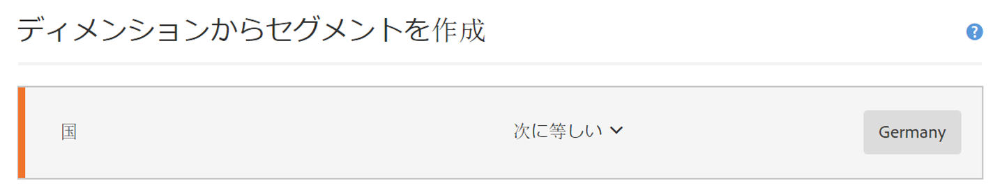
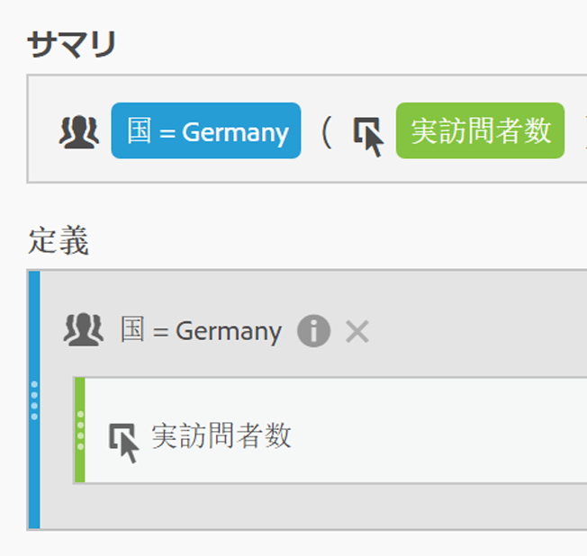
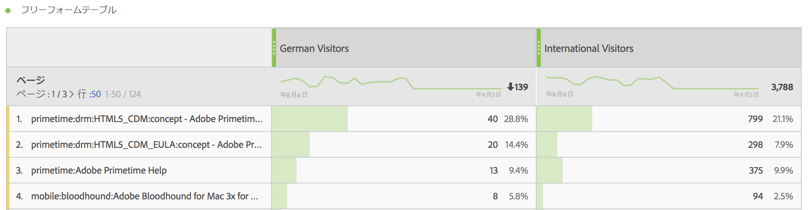
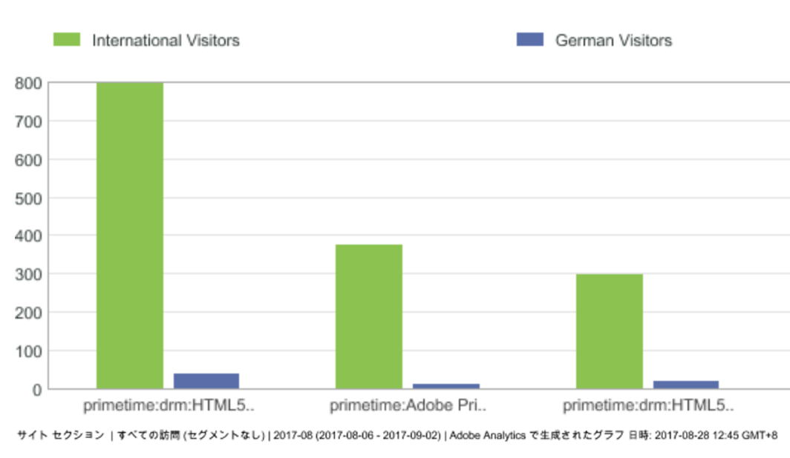
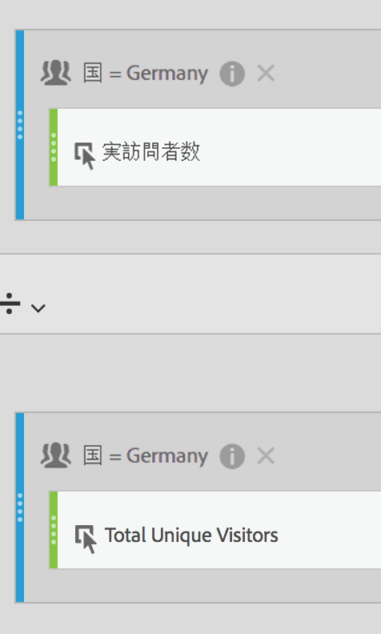
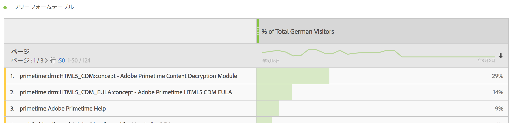
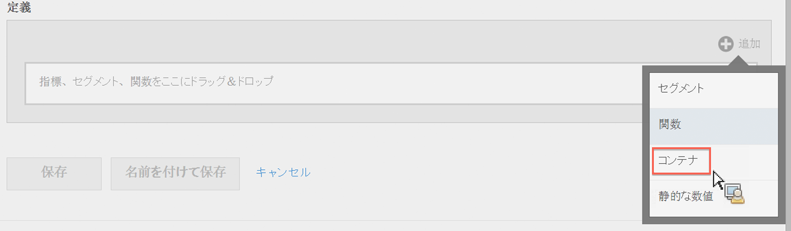
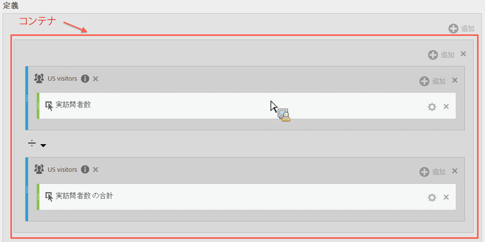
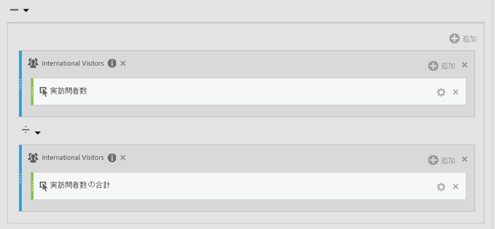
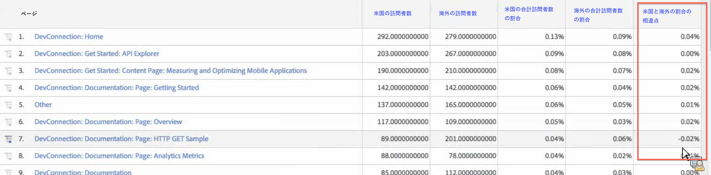

# セグメント化された指標

個々の指標でセグメント化をおこなうと、同じレポート内の指標を比較できます。（派生指標のみ）

## セグメントの比較 {#section_29A6E0070F084BFDB6228FA9CE106F48}

「米国の訪問者」セグメントと「海外の訪問者」セグメントの様々な要素を比較するとします。次のようなインサイトを提供する指標を作成できます。

* 2 つのグループ間でコンテンツの閲覧行動をどのように比較しますか？（もう 1 つの例：2 つのセグメント間でコンバージョン率をどのように比較しますか？）
* 合計訪問者数の割合として、何人の米国の訪問者が特定のページを閲覧しましたか？ それに対して、何人の海外の訪問者が特定のページを閲覧しましたか？
* この 2 つの異なるセグメントからアクセスされたコンテンツに関して、最も大きな違いはどこにありますか？

最初の質問「2 つのグループ間でコンテンツの閲覧行動をどのように比較しますか？」について確認してみましょう。

1. 同等のセグメントがない場合は、計算指標ビルダーで「ドイツの訪問者」という名前の内部セグメントを作成します。この場合、「国」を「Germany」に設定します。国ディメンションを「定義」キャンバスにドラッグし、値として「Germany」を選択するだけです。

   

   >[!NOTE]
   >
   >[また、セグメントビルダー](https://marketing.adobe.com/resources/help/en_US/analytics/segment/seg_build.html)でもこれを行うことができますが、計算指標ビルダーでディメンションを利用できるようにしてワークフローを簡素化しました。

   >[!NOTE]
   >
   >"Internal" means that the segment is not visible in the **[!UICONTROL Segments]** list in the left rail. You can however, make it public by hovering over the "i" icon next to it and clicking **[!UICONTROL Make public]**.

1. 同等のセグメントがない場合は、「海外の訪問者」という名前のセグメントを作成します。この場合、「国」を「Germany」に設定しません。
1. 「ドイツの訪問者」という名前の指標を作成して保存します。そのためには、ドイツの訪問者セグメントを「定義」キャンバスにドラッグして、そのセグメント内に実訪問者数指標をドラッグします。

   

1. 海外の訪問者セグメントと実訪問者数指標を使用して手順 3 を繰り返し、海外の訪問者指標を作成します。
1. Analysis Workspace で、**[!UICONTROL Page]ディメンションを自由形式の表にドラッグし、2 つの新しい計算指標を一番上に並べてドラッグします。**

   

1. [!UICONTROL また、Reports&amp; Analytics]で [!UICONTROL ページ] レポートを開き、 **[!UICONTROL «指標を表示»をクリック]**&#x200B;して、新しい«米国の訪問者»セグメント化指標と«海外の訪問者»セグメント化指標を適用して、コンテンツの閲覧行動の比較方法を確認します。

   

## 合計の割合の比較 {#section_846CB89725F04388AE0352DB20189EE8}

訪問者の閲覧行動を正規化された割合で比較することで、別のレベルの調査を導入できます。そのためには、2 つの新しい指標「ドイツの合計訪問者数の割合」と「海外の合計訪問者数の割合」を作成します。

1. 「ドイツ（または海外）の訪問者」セグメントをキャンバスにドロップします。
1. もう 1 つの「ドイツ（または海外）の訪問者」セグメントをその下にドロップします。ただし今回は、設定（歯車）アイコンをクリックして、「指標タイプ」として「合計」を選択します。「形式」は「割合」にします。演算子は「除算」にします。この指標の定義は次のようになります。

   

1. この指標をプロジェクトに適用します。

   

## Compare Differences in Percentages (using Containers) {#section_13D6353259B74C09B37BA6378A501938}

米国と海外の閲覧行動の最も大きな違いを簡単に確認する場合は、それぞれから割合を引くもう 1 つの指標を作成できます。そのためには、2 つの指標セットを囲む丸括弧として、コンテナ機能を使用できます。

1. [!UICONTROL 定義] キャンバスで **[!UICONTROL 、追加]** / **[!UICONTROL コンテナ]**&#x200B;をクリックします。

   

1. 前の手順で作成した「米国の合計訪問者数の割合」指標を最初のコンテナにドロップします。これで、定義全体が表示されます。

   

1. もう 1 つのコンテナを下に作成し、「海外の合計訪問者数の割合」指標をその中にドロップします。
1. 2 つのコンテナ間の演算子をマイナス（-）に変更します。

   

1. 指標を保存します（「米国と海外の割合の相違点」などの名前を指標に付けてください）。
1. 指標をレポートに適用すると、割合の最も大きな違いを簡単に確認できます。また、その違いを基にレポートを並べ替えることができます。

   

