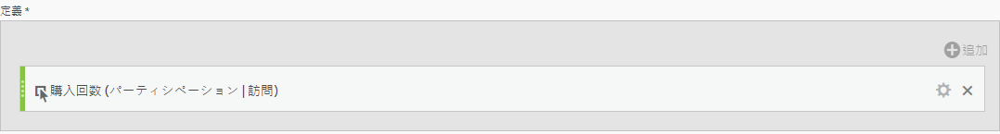
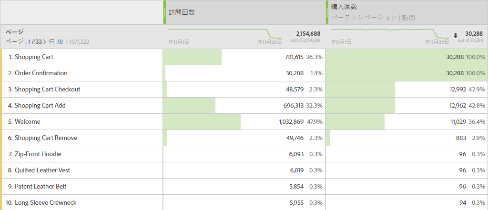

# パーティシペーション指標

以下に簡単な使用例を示します。コンテンツ所有者であり、注文を含む訪問に貢献したページを確認する必要があります。その方法を次に示します。

>[!NOTE]
>
>管理ツールを使用してこれを行う必要がありました。引き続き管理ツールでパーティシペーション指標を有効にできますが、カスタムイベント 1 ～ 100 に対してのみ可能です。

簡単な使用例を示します。コンテンツ所有者が、電子メールのサインアップを含む訪問に貢献した（関係した）ページを判断したいとします。方法は次のとおりです。

1. 計算指標ビルダーで新しい指標を作成します。
1. 成功イベントの「注文」を「定義」キャンバスにドラッグします。
1. Change the [attribution model](../../../../../components/c-calcmetrics/c-workflow/cm-workflow/c-build-metrics/m-metric-type-alloc.md#concept_B7A1FCFEFA9D4C4883208ACE8C9C8E5E) of that event to **[!UICONTROL Participation]** under the **[!UICONTROL Settings]** gear. **[!UICONTROL 「訪問]** ルックバック」を選択します。定義は次のようになるはずです。

   

1. 指標を保存します。
1. **[!UICONTROL ページ]** レポートで計算指標を使用します。

   

1. （オプション）指標を組織内の他のユーザーと共有します。

