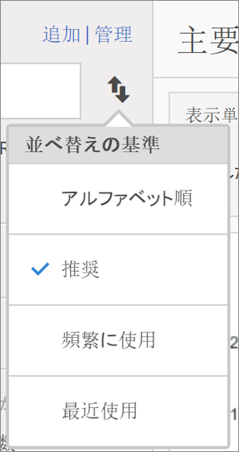

# 指標の検索

指標を検索するための 2 つの主な方法（並べ替えおよびフィルタリング）について説明します。

## 並べ替え {#section_89F9C4D515084F5796F2A54D468BF6C8}

レポートを開き、レポートの左側の指標アイコン  をクリックして指標レールを表示させると、指標セレクターの「**並べ替え順]」ドロップダウンリストに次の 4 つの並べ替えオプションが表示されます。[!UICONTROL **

| オプション | 使用するタイミング |
|---|---|
| アルファベット順 | 名前がわかっている場合に役立ちます。 |
| 推奨 | ユーザーがレポートで使用する一般的な指標です。これは、ユーザーがこのレポートでよく使用する指標からバックエンドで収集されます。 |
| 頻繁に使用 | レポートでよく使用される指標を初心者ユーザーが確認する必要がある場合に役立ちます。 |
| 最近使用 | 特定のプロジェクトで同じ指標のセットを繰り返し使用する場合に役立ちます。 |

## フィルタリング - 詳細選択 {#section_33818CC048C04F098703AC229693F8CA}

When you open a report and click the Metrics icon, then click **[!UICONTROL Manage]**. フィルターアイコンをクリックします。様々な方法でフィルタリングできます。

<table id="table_269081BC9DF54FFDA4E949FFC7488F42"> 
 <thead> 
  <tr> 
   <th colname="col1" class="entry"> 必要な処理 </th> 
   <th colname="col2" class="entry"> 並べ替えの基準 </th> 
  </tr>
 </thead>
 <tbody> 
  <tr> 
   <td colname="col1"> このレポートスイートのすべての指標を表示する </td> 
   <td colname="col2"> その他のフィルター／すべてを表示 </td> 
  </tr> 
  <tr> 
   <td colname="col1"> 自分の指標だけを表示する </td> 
   <td colname="col2"> その他のフィルター／自分が所有 </td> 
  </tr> 
  <tr> 
   <td colname="col1"> 他のユーザーが自分と共有している指標を表示する </td> 
   <td colname="col2">「所有者」または 
 その他のフィルター／自分と共有 
 </td> 
  </tr> 
  <tr> 
   <td colname="col1"> 会社で承認された指標だけを表示する </td> 
   <td colname="col2"> 承認済み </td> 
  </tr> 
  <tr> 
   <td colname="col1"> 作業中のプロジェクトの指標に対してフィルターを設定する </td> 
   <td colname="col2">いずれかのタグ </td> 
  </tr> 
 </tbody> 
</table>

