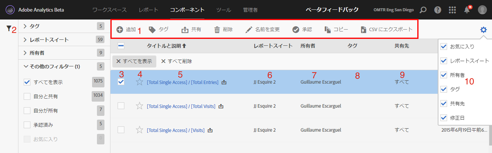

# 計算指標マネージャ

計算指標マネージャでは、指標を様々な方法で管理できます。例えば、共有、フィルタリング、タグ付け、承認、コピー、削除およびお気に入りへの登録が可能です。

計算指標マネージャには、自分が所有しているすべてのセグメントと、自分が共有しているセグメントが表示されます。管理者レベルのユーザーは、組織内のすべてのカスタム指標を表示できます。この概要では、計算指標マネージャのユーザーインターフェイスと機能について説明します。計算指標マネージャにアクセスするには、次の手順を使用します。

* Going to **[!UICONTROL Analytics]** &gt; **[!UICONTROL Components]** in the left navigation. Then click **[!UICONTROL Calculated Metrics]**.

| UI 機能 | 説明 |
|---|---|
| 計算指標の管理ツールバー | 指標をチェックすると、このツールバーが表示されます。ほとんどの管理タスクをこのツールバーから完了できます。 |
| フィルターを表示する／フィルターを非表示にする | 「フィルターを表示する」をクリックすると、フィルターメニューが表示されます。フィルターの基準として「タグ」、「レポートスイート」、「所有者」、「すべてを表示」（管理者のみ）、「自分と共有」、「自分が所有」、「お気に入り」および「承認済み」を使用できます。 |
| チェックボックス | 管理するカスタム指標をチェックします。 |
| お気に入り | 指標の横にある星をクリックすると、星が黄色に変わり、指標がお気に入りに登録されます。 |
| セグメントのタイトルと説明 | 計算指標ビルダーで指定されたものです。タイトルと説明を編集するには、タイトルリンクをクリックします。タイトルリンクをクリックすると、計算指標ビルダーに戻ります。 |
| レポートスイート | この列には、指標が最後に保存されたレポートスイートが示されます。 |
| 所有者 | カスタム指標の所有者を示します。管理者以外のユーザーは、自分が所有しているまたは自分が共有していた指標のみを表示できます。 |
| タグ | 自分または自分とセグメントを共有しているユーザーによって指標に適用されたタグが表示されます。 |
| 共有先 | 自分がセグメントを共有している個人、グループまたは全員が表示されます。グループまたは全員を表示できるのは管理者のみです。 |
| 列の選択 | 計算指標マネージャの列を選択または選択解除して表示をカスタマイズできます。 |
| 共有アイコン （表示されていません） | 既にこのカスタム指標を自分が共有していることを示します。 |
| 承認済みアイコン （表示されていません） | このカスタム指標が管理者によって承認されていることを示します。 |