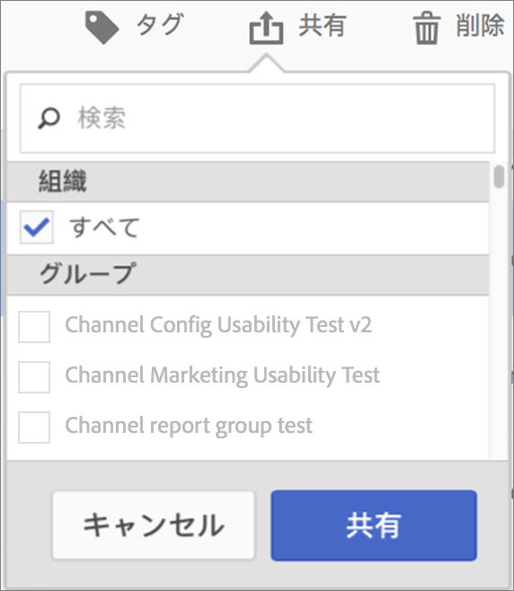

# 計算指標の共有

権限に応じて、指標を組織全体、グループまたは個々のユーザーと共有できます。

| 役割 | 権限 |
|---|---|
| 管理者 | 指標をすべてのユーザー、グループおよび特定のユーザーと共有できます。グループは、Admin Console で許可グループとして設定されます。 |
| 管理者以外 | 指標を個人ユーザーとのみ共有できます。 |

指標を会社全体で共有する必要があるのはどのような場合でしょうか。また、指標をユーザーグループまたは個々のユーザーとのみ共有する必要があるのはどのような場合でしょうか。次に、いくつかのベストプラクティスを示します。

* 管理者として、指標を会社全体およびすべてのユーザーで使用すると良いと判断される場合は、指標を&#x200B;**[!UICONTROL 全員]で共有します。**&#x200B;この場合、指標を承認済みの指標にすることを検討してください。
* 管理者として、指標が特定のチームに対して適切なビジネス価値を提供すると判断される場合は、指標を特定の&#x200B;**[!UICONTROL グループ]と共有します。**
* 管理者または個人ユーザーとして、指標を他の個人ユーザーと共有し、指標を綿密に調べて確認します。役に立たないと判断される場合は、指標を破棄できます。このような指標は正式に承認しないでください。

1. 計算指標マネージャで、共有する指標の横にあるチェックボックスを選択します。タスクバーが表示されます。

   

1. 「**[!UICONTROL 共有]」アイコンをクリックします。**

   

   管理者は、「**[!UICONTROL すべて]**」を選択できます。また、組織内の&#x200B;**[!UICONTROL グループ]または（下にスクロールして）**&#x200B;ユーザー]を選択することもできます。**[!UICONTROL **&#x200B;管理者以外は、個々のユーザーのみを表示できます。**[!UICONTROL 検索]フィールドを使用して、グループまたはユーザーを検索します。**

1. 「**[!UICONTROL 共有]**」をクリックします。

   指標の横に共有アイコン 

1. **[!UICONTROL フィルター]** / **[!UICONTROL その他のフィルター]** /自分と **[!UICONTROL 共有に移動して、自分と共有している指標をフィルタリング]**&#x200B;できます。

