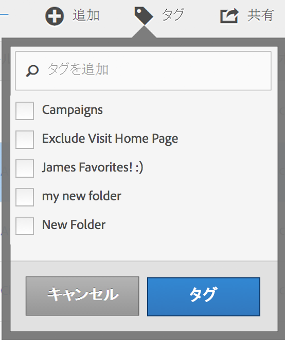

# 計算指標のタグ付け

計算指標マネージャでは、セグメントにタグを付けて管理できます。

すべてのユーザーが計算指標にタグを付けることができます。指標には 1 つ以上のタグを適用できます。ただし、自分が所有しているまたは自分が共有していた計算指標に対するタグのみを表示できます。どのような種類のタグを作成する必要がありますか。次に、便利なタグのいくつかを示します。

* ソーシャルマーケティング、モバイルマーケティングなど、**チーム名**&#x200B;に基づくタグ。
* **プロジェクト**&#x200B;タグ（分析タグ）：入口ページ分析など。
* **カテゴリ**&#x200B;タグ：メンズ、地域。
* **ワークフロー**&#x200B;タグ：承認済み、（特定のビジネスユニット向けの）キュレーション。

1. 計算指標マネージャで、タグを付ける指標の横にあるチェックボックスを選択します。管理ツールバーが表示されます。
1. 「**[!UICONTROL タグ]**」をクリックし、次のいずれかの操作を行います。

   * 既存のタグから選択するか、
   * 検索ダイアログボックスで新しいタグ名を追加して、**[!UICONTROL Enter]** キーを押します。

      

1. 「**[!UICONTROL タグ]**」を再度クリックして指標にタグを付けます。

これで、タグが「タグ」列に表示されます（右上のギアアイコンをクリックして列を管理します）。

また、**[!UICONTROL フィルターを表示する]**／**[!UICONTROL タグ]**&#x200B;に移動すると、タグをフィルタリングできます。
