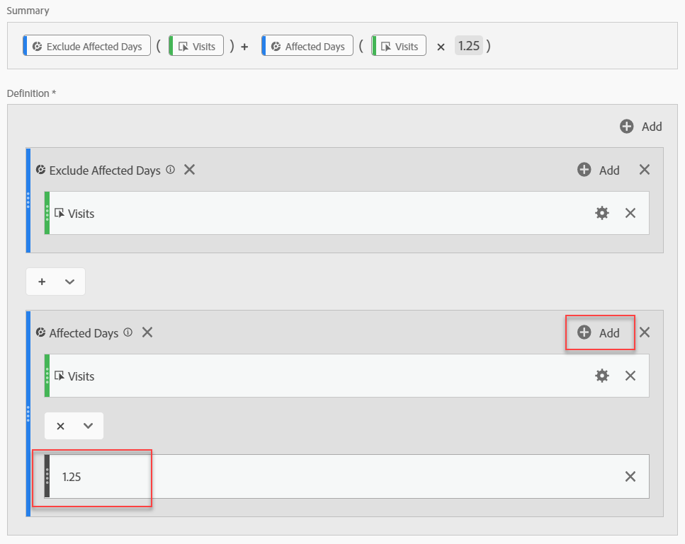

# データの影響を受けるイベント

イベントの影響を受け [たデータがある場合](/help/technotes/event-impacted.md)、計算指標を使用して、イベントの期間中のトレンド値を抽出できます。 例えば、イベントでデータが25%減少した場合、計算指標の乗数として使用できます。

>[!NOTE] これらの手順は、セグメント化と日付比較の両方の観点から、イベントの影響を理解する場合に最も効果的です。 イベントの影響を受けた [日付を前の範囲と比較し、このページをフォローする前に](/help/analyze/analysis-workspace/components/calendar-date-ranges/compare-event.md)[分析の特定の日付を除外します](../c-segmentation/use-cases/exclude-date-range.md) 。

1. 「影響を受ける日」と「影響を受ける日を除外する」の2つのセグメントを作成します(「分析内の特定の日 [付を除外する」を参照)](../c-segmentation/use-cases/exclude-date-range.md)。
2. /に移動 **[!UICONTROL Components]** します **[!UICONTROL Calculated metrics]**。
3. クリック **[!UICONTROL Add]**.
4. 上記の両方のセグメントを定義キャンバスにドラッグします。 演算子の間の演算子をに変更して、合計 `+` を求めます。
5. 両方追加のセグメント内の目的の指標。 例えば、「訪問回数」指標を使用できます。

   

6. 「影 **[!UICONTROL Add]** 響を受ける日」コンテナの右上をクリックし、をクリックしま **[!UICONTROL Static number]**&#x200B;す。 「イベントの影響を受けた日付を前の範囲と比較する」で説明しているように、静的な数値を、データをオフセ [ットする割合に設定します](/help/analyze/analysis-workspace/components/calendar-date-ranges/compare-event.md)。 この例では、オフセットは25%(1.25)です。

   

7. トレンドのフリーフォームテーブルに「修正済み」指標を並べて適用します。 イベント外のすべての日は通常の指標数を反映し、影響を受けるすべての日は乗数オフセットを使用します。

   

8. 表示を行のビジュアライゼーションに追加して、修正した指標の効果を確認します。

   
