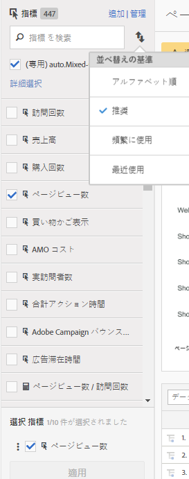

# 計算指標および高度な計算（派生）指標

計算指標および高度な計算（または派生）指標は、既存の指標から作成できるカスタム指標です。

計算指標ツールを使用すると、指標を極めて柔軟に作成および管理できます。マーケティング担当者、製品マネージャーおよびアナリストは、[!DNL Analytics] の実装を変更することなくデータを照会できます。各 [!DNL Analytics] パッケージで利用可能なカスタム指標を次に示します。

* Adobe [!DNL Analytics] Foundation：計算指標
* [Adobe Analytics Select](https://www.adobe.com/jp/data-analytics-cloud/analytics/select.html)：計算指標        + 高度な計算指標
* [Adobe Analytics Prime](https://www.adobe.com/jp/data-analytics-cloud/analytics/prime.html)：計算指標 + 高度な計算指標
* [Adobe Analytics Ultimate](https://www.adobe.com/jp/data-analytics-cloud/analytics/ultimate.html)：計算指標 + 高度な計算指標

次に、計算指標と高度な計算指標の機能の比較を示します。

| ビルダーのオプション | 計算指標 | 高度な計算（派生）指標 |
|---|---|---|
| [形式のタイプ（小数、時間、割合、通貨）](/help/components/c-calcmetrics/c-workflow/cm-workflow/c-build-metrics/cm-build-metrics.md) | ○ | ○ |
| [アトリビューションの変更（デフォルト、線形、パーティシペーションなど）](/help/components/c-calcmetrics/c-workflow/cm-workflow/c-build-metrics/m-metric-type-alloc.md) | ○ | ○ |
| [指標のタイプ（標準、合計）](/help/components/c-calcmetrics/c-workflow/cm-workflow/c-build-metrics/m-metric-type-alloc.md) | ○ | ○ |
| 基本的な演算子（可算、減算、乗算、除算） | ○ | ○ |
| [セグメントの適用](/help/components/c-calcmetrics/c-workflow/cm-workflow/c-build-metrics/metrics-with-segments.md) | × | ○ |
| [基本的な関数（カウント、絶対値、平均など）](/help/components/c-calcmetrics/cm-reference/cm-functions.md) | × | ○ |
| [高度な関数（回帰、if/then、t スコアなど）](/help/components/c-calcmetrics/cm-reference/cm-adv-functions.md) | × | ○ |

## 機能 {#section_A0A5C275B68A4D628950BBB0B1EE631F}

次のことが可能です。

* [!UICONTROL Analysis Workspace]、[!UICONTROL Reports &amp; Analytics]、[!UICONTROL Report Builder]、[!UICONTROL 異常値検出]、[!UICONTROL 貢献度分析]にわたる指標を作成します。
* [実装を変更することなく](https://youtu.be/CuQTm9RaUpY)、レポートの実行時に得られる、セグメント化された指標を作成する。これらの指標はセグメントに基づいているので、時系列で表示できます。
* レポートスイート間で指標を共有する。つまり、新しく作成されたすべての指標は、同じログイン会社のすべてのレポートスイートに適用されます。
* （高度な計算指標のみ）指標でセグメント化する。例えば、初回セッションの訪問者数を含む、「初回訪問者数」の指標を作成できます。
* （高度な計算指標のみ）統計関数を組み込んで、データからより適切な情報を得る。例えば、レポート内の項目数をカウントしたり、各項目の標準偏差の数を追加したりできます。

## 制限事項 {#section_CB878B02451541D68A68B508D4DBD19A}

一部の [!DNL Analytics] の機能では、イベントは使用できますが、計算指標は使用できません。

* [!UICONTROL Reports &amp; Analytics] の[!UICONTROL ファネル]
* [!UICONTROL Analysis Workspace ][!UICONTROL のフォールアウト]
* [!UICONTROL Analysis Workspace のコホート分析]
* [!UICONTROL Data Warehouse]
* [!UICONTROL セグメント]
* [!UICONTROL リアルタイムレポート]
* [!UICONTROL 現在のデータレポート]
* [!DNL Analytics] for [!DNL Target]

## ツール {#section_D65E9C067E9C45E1A50DD30F50561BB2}

ここでは、[!UICONTROL 計算指標]ツールの概要を簡単に示します。

<table id="table_520AFE97DB514958ABE23FD3C9CE0ABD"> 
 <thead> 
  <tr> 
   <th colname="col1" class="entry"> ツール </th> 
   <th colname="col2" class="entry"> 機能 </th> 
  </tr>
 </thead>
 <tbody> 
  <tr> 
   <td colname="col1"><a href="/help/components/c-calcmetrics/c-workflow/cm-workflow/c-build-metrics/cm-build-metrics.md"  > 計算指標ビルダー</a> </td> 
   <td colname="col2"> 
    <ul id="ul_E6F02AB9DF204C2F9A0AC92A31594B3E"> 
     <li id="li_A4A6E716374243A190C539A3F4A41C0C">高度な配分モデルを使用した計算指標および高度な計算指標を作成する。 </li> 
     <li id="li_C8C97BA4E227463E98077ABA5818FFC6">指標の数式にセグメントをインラインで追加する。 </li> 
     <li id="li_8503D9E06A3C46569B5CDB4B90F72446">同じレポート内のセグメントを比較する。例えば、各地域における訪問者と海外での訪問者を比較します。 </li> 
     <li id="li_4B528FDE1F96400DBA0D3276408FF919">統計関数を使用する。 </li> 
     <li id="li_C1162B1EA6784B8189A8A87E2B0DA79A">指標の詳細な説明を指定する（指標の用途や指標を使用する（または使用しない）場所を示します）。 </li> 
     <li id="li_DEA13F5E8BF94AF1B311C467FE6E2A74">新しい指標に定義をコピーする。 </li> 
     <li id="li_8C21F55015D44910904202D2BF74221C">インラインで指標をプレビューする。 </li> 
     <li id="li_3704F66C321C477F9D4F52E068C231BD">指標の両極性を設定する。これは、指定されたカスタムイベント（指標）が発生した場合に、それが良いか悪いかを示します。 </li> 
     <li id="li_9D45319FA965476FB1C90DE8AA72BBD7">指標にタグ付けする。 </li> 
    </ul> </td> 
  </tr> 
  <tr> 
   <td colname="col1"><a href="/help/components/c-calcmetrics/c-workflow/cm-workflow/cm-manager.md"  > 計算指標マネージャ</a> </td> 
   <td colname="col2"> 
    <ul id="ul_E4D20D5DD3904CC6A85785B5BD4C1B1E"> 
     <li id="li_E0B216BA1478406EB6212263DF71D85B">他のユーザーと指標を共有する。 </li> 
     <li id="li_96EB16FAF3454211AAEF78EA5B08927F">指標を承認して管理する。 </li> 
     <li id="li_3ADBD2428EAC4B0AA61222D87C3AF2B7">ユーザーが検索しやすいように指標を管理（タグ付け）する。 </li> 
     <li id="li_726F3C3390744E49BA63606FE196880E">指標を削除する。 </li> 
     <li id="li_F306BA4FA8AF4A6E987BA62634659A2F">指標の名前を変更する。 </li> 
    </ul> </td> 
  </tr> 
  <tr> 
   <td colname="col1"> 指標セレクターレール </td> 
   <td colname="col2"> 
Reports &amp; Analytics の指標を表示ポップアップを置き換えます。 
 
このレールを使用すると、指標を検索したり、指標をレポートに追加または適用したりできます。また、<a href="/help/components/c-calcmetrics/c-workflow/cm-workflow/cm-finding.md"  >並べ替え</a>順を変更することもできます（オプション：アルファベット順、推奨、頻繁に使用、最近使用）。さらに、レポートスイートをフィルタリングして、特定のレポートスイートで作成された指標だけを表示できます。 
 
この指標セレクターにアクセスするには、レポートの左側の指標アイコン  をクリックします。次の図に示すのが指標セレクターです。 
 
 
 </td> 
  </tr> 
  <tr> 
   <td colname="col1"><a href="https://www.adobe.io/apis/experiencecloud/analytics/docs.html#!AdobeDocs/analytics-2.0-apis/master/README.md"  > 計算指標の API</a> </td> 
   <td colname="col2"> 
Adobe Analytics 2.0 API セットの一部。 
 </td> 
  </tr> 
 </tbody> 
</table>

