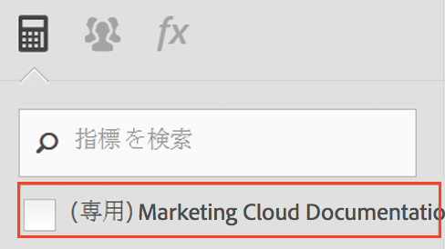

# よくある質問

These changes to the way calculated metrics work in [!DNL Analytics] may impact you.

[計算指標ビルダーにアクセスするにはどうすればよいですか？](../../components/c-calcmetrics/cm-transition.md#section_D9AE9A0ACF824BACB5D05F0C2F7E9CA1)

[計算指標マネージャにアクセスするにはどうすればよいですか？](../../components/c-calcmetrics/cm-transition.md#section_DD0BD13E9EC940268EBE8BC88241A152)

[同じ名前の計算指標が多数あるのはなぜですか？](../../components/c-calcmetrics/cm-transition.md#section_E15C5B6CCC58498CAEC3FBDA8988F0A1)

[グローバル計算指標はどうなりましたか？](../../components/c-calcmetrics/cm-transition.md#section_7351D4C7361F4ABAA1B43F8E89AAD211)

[ログイン会社で共有されていたグローバル計算指標はどうなりましたか？](../../components/c-calcmetrics/cm-transition.md#section_59E5CD948ED643AE9AD3D2E4277647F8)

[分類が Numeric または Numeric2 の計算指標はどうなりましたか？](../../components/c-calcmetrics/cm-transition.md#section_71AFE6C4A7CD4AA19AB3A9D3C41D115B)

[全期間指標はどうなりましたか？](../../components/c-calcmetrics/cm-transition.md#section_AEDB02EF24584DAD8731BED9DDCE4F48)

[日別／週別／月別／四半期別／年別訪問者数指標に基づく計算指標についてどのような情報が必要ですか？](../../components/c-calcmetrics/cm-transition.md#section_E9A77EBB41CE4881B196CC1C282B2DF3)

[古いレポートスイート API メソッドを使用して作成または管理されている計算指標はどうなりますか？](../../components/c-calcmetrics/cm-transition.md#section_13ED1BAD02634674BDAEB479B060A4B6)

[「現在のデータ」はすべてのタイプの計算指標をサポートしますか？](../../components/c-calcmetrics/cm-transition.md#section_1DAA718BB8DB4413BAF8AD4B4FAAFFA2)

[移行した計算指標とともに表示される「名前が指定されていません」というメッセージはどのような意味ですか？](../../components/c-calcmetrics/cm-transition.md#section_C90CBB72A67644F38D583301981F8D03)

[ユーザーが削除された場合、そのユーザーの計算指標はどうなりますか？](../../components/c-calcmetrics/cm-transition.md#section_42ED4C15830540879C4A161423690E5A)

[作成および他のレポートスイートへの適用が可能な計算指標がそれらのレポートスイートで「有効」でない場合、「不明」と表示されるのはなぜですか？](../../components/c-calcmetrics/cm-transition.md#section_6772818EFDED46E9B7095D64C3B77211)

[従来の計算指標に対して行った変更が保存されないのはなぜですか？](../../components/c-calcmetrics/cm-transition.md#section_81CDEFCA1FD542579AF183DA1494EAF0)

[計算指標がマーケティングチャネルレポートに表示されないのはなぜですか？](../../components/c-calcmetrics/cm-transition.md#section_FC350359A775433AB5F43C7CAB304D62)

[一部の計算指標の数式に、追加した丸括弧が表示されないのはなぜですか？](../../components/c-calcmetrics/cm-transition.md#section_AC0D1E9714AD487F9A1C73359F518B5E)

[（Ad Hoc Analysis のみ）埋め込みまたはインラインのセグメント定義を含む計算指標は引き続きサポートされますか？](../../components/c-calcmetrics/cm-transition.md#section_B25C924A282F49388AB604E3D826F44C)

[（Report Builder のみ）計算指標が要求に表示されなくなったのはなぜですか？](../../components/c-calcmetrics/cm-transition.md#section_DA4792FE5D7945218CD5E6328DE08E82)

[計算指標の合計はどのように計算されますか？](../../components/c-calcmetrics/cm-transition.md#section_57BA3A299C7948ABB82B0392A9B0F33E)

## 計算指標ビルダーにアクセスするにはどうすればよいですか？{#section_D9AE9A0ACF824BACB5D05F0C2F7E9CA1}

* 計算指標マネージャの上部にある「**[!UICONTROL 追加]」をクリックします。または、**
* In any Analytics report, click the Metrics icon   to the left of a report to bring up the Metrics rail, then click **[!UICONTROL Add]**.

## 計算指標マネージャにアクセスするにはどうすればよいですか？{#section_DD0BD13E9EC940268EBE8BC88241A152}

* Go to  **[!UICONTROL Analytics]** &gt; **[!UICONTROL Components]** in the left navigation. Then click **[!UICONTROL Calculated Metrics]**.

* In any [!DNL Analytics] report, click the Metrics icon   to the left of a report to bring up the Metrics rail, then click **[!UICONTROL Manage]**.

## Why do I see so many Calculated Metrics with the same name? {#section_E15C5B6CCC58498CAEC3FBDA8988F0A1}

これまで、グローバル計算指標は特定の管理者ユーザーが所有しておらず、対象のレポートスイートのすべてのユーザーに対して表示されていました。この指標はレポートスイートによって区別されていました。あるレポートスイート内の指標の名前が別のレポートスイート内の指標と同じである場合、レポートスイートを切り替えると、それらは同じ指標としてユーザーに表示されていました。

現在、指標はレポートスイートによって区別されなくなりました。あるレポートスイート内の指標の名前が別のレポートスイート内の指標と同じである場合、それらの定義が同じかどうかに関係なく、重複した指標として計算指標ビルダーと指標セレクターに表示されます。

You would see a number of calculated metrics with the same name (but created in different report suites) only if you unchecked the (Only `<report suite>`) checkbox as shown here:

**必要な処理**

名前や定義が類似している計算指標の統合を検討してください。ただし、その場合は、注意が必要です。計算指標マネージャでレポートスイートの計算指標をチェックして、元のレポートスイートを確認できます。また、指標の統合を正しく行うために、重複している可能性のある指標を削除する場合は、指標の定義もチェックしてください。

> [!NOTE] 計算指標が特定のレポートスイートに連結されなくなり、ログイン会社に表示されるレポートスイート全体で使用できるようになりましたが、計算指標が作成または最後に保存されたレポートスイートは、計算指標マネージャに表示されます。

> [!NOTE] 計算指標が削除されても、その指標を参照するブックマークまたはダッシュボードレポートは引き続き機能します。

## グローバル計算指標はどうなりましたか？{#section_7351D4C7361F4ABAA1B43F8E89AAD211}

これまでは、管理者が管理ツールを使用して、「グローバル計算指標」または「レポートスイート計算指標」と呼ばれる計算指標をレポートスイートで作成していました。

現在、グローバル計算指標は、ログイン会社の管理者ユーザーリスト内の最初の管理者ユーザーが所有しています。デフォルトでは、この指標は「全員」が共有します。このパターンは、セグメントと同じ共有モデルおよび移行プランに従います。

**必要な処理**

ありません。ただし、新しい管理者（所有者）がこのような計算指標を変更または削除する場合には注意が必要です。計算指標は複数のブックマーク付きレポートやダッシュボードで使用されている可能性があります。

> [!NOTE] 計算指標が削除されても、その指標を参照するブックマークまたはダッシュボードレポートは引き続き機能します。

## ログイン会社で共有されていたグローバル計算指標はどうなりましたか？{#section_59E5CD948ED643AE9AD3D2E4277647F8}

これまでは、管理者が管理ツールを使用して、「グローバル計算指標」または「レポートスイート計算指標」と呼ばれる計算指標をレポートスイートで作成していました。複数のログイン会社にレポートスイートを追加することによって、このような指標をログイン会社で「共有」することが可能でした。

グローバル計算指標はログイン会社で共有できなくなりました。このような指標は、特定のレポートスイートにバインドされる（結び付けられる）のではなく、特定のログイン会社に結び付けられるようになりました。ログイン会社で共有されていた計算指標は次のように処理されます。

* そのレポートスイートへのアクセス権を持つすべてのログイン会社に移行されました。
* デフォルトで「全員と共有」します。
* 他のすべてのログイン会社とは無関係のコピーとして扱われます。

>[!NOTE]
>
>ブックマーク、ダッシュボード、アラートまたは予定レポートで計算指標が使用されていた場合、新しいコピーを編集すると、維持されている古い計算指標には影響しません。

## 分類が Numeric または Numeric2 の計算指標はどうなりましたか？{#section_71AFE6C4A7CD4AA19AB3A9D3C41D115B}

(Previously, calculated metrics with a Numeric or Numeric2 classification were only visible in [!UICONTROL Reports &amp; Analytics], [!UICONTROL Report Builder], and the APIs.)

Now, calculated metrics with a Numeric or Numeric2 classification will continue to be visible in [!UICONTROL Reports &amp; Analytics], [!UICONTROL Report Builder], and the APIs. ただし、このような指標は、セグメントが適用されたレポートではサポートされません。

In addition, calculated metrics with a Numeric or Numeric2 classification will not be supported in the following components: [!UICONTROL Ad Hoc Analysis], [!UICONTROL Analysis Workspace], [!UICONTROL Real-Time] reports, [!UICONTROL Anomaly Detection], and [!UICONTROL Contribution Analysis]. 分類が Numeric または Numeric2 の計算指標を作成または編集すると、互換性に関する警告が表示されます。この警告は、特定の分野の製品との互換性がその計算指標にないことを示します。

**必要な処理**

セグメントまたは互換性のないいずれかのコンポーネントで指標を使用する場合は、分類が Numeric または Numeric2 の計算指標を作成しないようにしてください。

## 全期間指標はどうなりましたか？{#section_AEDB02EF24584DAD8731BED9DDCE4F48}

Life-Time metrics (a.k.a. all-time metrics) are no longer supported and no longer visible in the [!UICONTROL Reports &amp; Analytics] UI or any other UI. このような指標をレポート API で照会することはできません。

他に有効な指標が 1 つでもレポートにあれば、全期間指標が含まれていたブックマーク、ダッシュボード、予定レポートまたはアラートは、全期間指標がなくても引き続き実行されます。全期間指標がブックマーク、ダッシュボード、予定レポートまたはアラート上の唯一の指標である場合、レポートは実行されません。

## 日別／週別／月別／四半期別／年別訪問者数指標に基づく計算指標についてどのような情報が必要ですか？{#section_E9A77EBB41CE4881B196CC1C282B2DF3}

Calculated metrics based on Unique Visitor metrics will be visible in the following [!DNL Analytics] components: [!UICONTROL Reports &amp; Analytics], [!UICONTROL Report Builder], and Reporting API.

However, these metrics will not be supported in the following components: [!UICONTROL Segments], [!UICONTROL Analysis Workspace], [!UICONTROL Real-Time] reports, [!UICONTROL Anomaly Detection], and [!UICONTROL Contribution Analysis]. 個別訪問者数指標に基づく計算指標を作成または編集すると、互換性に関する警告が表示されます。この警告は、特定の分野の製品との互換性がその指標にないことを示します。

ベースの個別訪問者数指標は、セグメントを含むレポートで使用します。個別訪問者数指標に基づく計算指標の作成は可能ですが、セグメントを含むレポートにその計算指標を適用することはできません。また、その計算指標にセグメントを埋め込むこともできません。

## What happens to Calculated Metrics created or managed with the old report suite API methods? {#section_13ED1BAD02634674BDAEB479B060A4B6}

これまで、（1.3 または 1.4）API メソッド ReportSuite.SaveCalculatedMetrics を使用した計算指標の保存は、Admin Console での計算指標の作成または更新と同じでした。同じことが ReportSuite.DeleteCalculatedMetrics にも該当します。また、Admin Console に表示される計算指標のリストと、ReportSuite.GetCalculatedMetrics を呼び出したときに表示される計算指標のリストは同じでした。

現在、ReportSuite CalculatedMetrics APIメソッド（1.3または1.4）は、古いストアを使用して、引き続き計算指標の保存、削除、取得を行います。既存の計算指標は移行され、新しい計算指標ビルダーに表示されます。**API メソッドを使用して作成される新しい計算指標はその API にのみ表示されます。このような指標は引き続きレポート API で使用できます。**

**必要な処理**

API と計算指標ビルダーの両方を使用する必要がある場合は、ReportSuite CalculatedMetrics API メソッドの使用を中止し、代わりに新しい CalculatedMetrics API メソッド（Get、Save、Delete および GetFunctions）を使用してください。

## Does Current Data support all types of Calculated Metrics? {#section_1DAA718BB8DB4413BAF8AD4B4FAAFFA2}

「現在のデータ」では、セグメントと統計関数を含む計算指標はサポートされません。サポートされるのは、加算、減算、乗算、除算および否定（-x）などの基本的な数学関数のみです。

## 移行した計算指標とともに表示される「名前が指定されていません」というメッセージはどのような意味ですか？{#section_C90CBB72A67644F38D583301981F8D03}

「名前が指定されていません」は、指標名が移行された指標に関連付けられていない（つまり、説明的な名前のないただの数式である）ことを意味します。

## ユーザーが削除された場合、そのユーザーの計算指標はどうなりますか？{#section_42ED4C15830540879C4A161423690E5A}

削除されたユーザーが作成した計算指標もすべて削除されます。ただし、削除された計算指標は、保存済みのブックマーク、ダッシュボードまたは予定レポートの一部として引き続き機能します。

## 作成および他のレポートスイートへの適用が可能な計算指標がそれらのレポートスイートで「有効」でない場合、「不明」と表示されるのはなぜですか？{#section_6772818EFDED46E9B7095D64C3B77211}

選択したレポートスイートに存在しないベース指標またはベースディメンションが計算指標に含まれている場合は、ユーザーインターフェイスに「不明」と表示されます。

## 従来の計算指標に対して行った変更が保存されないのはなぜですか？{#section_81CDEFCA1FD542579AF183DA1494EAF0}

これは、新しい計算指標データベースへの移行のタイミングが原因である可能性があります。この移行は、2015 年 6 月 15 日から 6 月 18 日の期間に行われました。

**必要な処理**

従来の指標に対して行った変更をやり直してください。

## 計算指標がマーケティングチャネルレポートに表示されないのはなぜですか？{#section_FC350359A775433AB5F43C7CAB304D62}

これまで、ファーストタッチおよびラストタッチのオプションを指定したマーケティングチャネルレポートの指標セレクターには、すべての計算指標が表示されていました。

現在、マーケティングチャネルレポートの指標セレクターに表示されるのは、計算指標ビルダーで配分タイプが明確に「ファーストタッチ」または「ラストタッチ」に設定されている計算指標のみです。マーケティングチャネルレポートに適用済みの計算指標はこれまでどおり適用され、機能します。マーケティングチャネル用の計算指標を作成するには、計算指標ビルダーの設定アイコンをクリックし、配分タイプとして「ファーストタッチ」または「ラストタッチ」を選択します。この処理を行うと、計算指標がマーケティングチャネルレポートとのみ互換性を持つようになり、他のレポートでは使用できなくなるので注意が必要です。

## 一部の計算指標の数式に、追加した丸括弧が表示されないのはなぜですか？{#section_AC0D1E9714AD487F9A1C73359F518B5E}

移行時には、一部の数式から不必要な丸括弧が自動的に削除されます。削除されるのは、指標の計算に影響しない丸括弧のみです。この処理は数式を簡略化するためのものであり、データが変更されることはありません。

## (Ad Hoc Analysis only) Are Calculated Metrics with embedded or inline segment definitions still supported? {#section_B25C924A282F49388AB604E3D826F44C}

これまで、Ad Hoc Analysis で作成された計算指標にはインラインセグメント定義を含めることができました。現在では、この処理を行うことはできません。

**必要な処理**

セグメントを明示的に保存する必要があります。インラインセグメント定義を含む既存の計算指標は引き続き正しく実行され、Ad Hoc Analysis でも表示できます。ただし、このような計算指標を保存するには、セグメントを明示的に保存する必要があります。

## （Report Builder のみ）計算指標が要求に表示されなくなったのはなぜですか？{#section_DA4792FE5D7945218CD5E6328DE08E82}

リクエストがv5.2で作成され、計算指標が含まれている場合、それらの指標はv5.1（またはそれ以前のバージョン）では表示されません。これは、計算指標がグローバル ID（レポートスイートに固有ではない ID）を使用するようになったためです。

**必要な処理**

このような指標を表示するには、v5.2 にアップグレードする必要があります。

## 計算指標の合計はどのように計算されますか？{#section_57BA3A299C7948ABB82B0392A9B0F33E}

[!UICONTROL Reports&amp; Analytics] で [!UICONTROL Reports&amp; Analytics]の計算指標の合計が表示される場合、単に数式を合計に適用します。例えば、注文件数/訪問件数という計算指標の合計は、合計注文件数を取得して合計訪問回数で割ります。ただし、計算指標の合計が行項目の単なる合計ではなく、サイトの合計になる場合があります。

例 1：ある検索キーワードによる訪問者数：同じ訪問者が複数のキーワードを検索することがあるので、この場合、合計訪問者数は行項目の合計と等しくなりません。

例 2：商品に対するページビュー数：カート内に複数の商品が入っていることがあるので、結果として、そのカートに対して複数のページビューが発生します。行項目の合計とレポートの合計の比較について詳しくは、[こちらのナレッジベースの記事](https://helpx.adobe.com/analytics/kb/sum-line-items-different-from-total.html)を参照してください。
