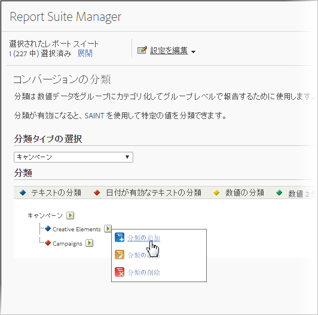

# 分類について

分類とは、Analytics変数データを分類し、レポートを生成するときに様々な方法でデータを表示する方法です。

[Analytics 分類](https://video.tv.adobe.com/v/16853/?captions=jpn)のビデオ概要。

**[!UICONTROL 管理]** 者/ **[!UICONTROL レポートスイート]** / **[!UICONTROL 設定を編集]** / *`<Traffic or Conversion>`*

分類を行う場合は、変数とその変数に関連するメタデータとの間に関係を確立します。分類は、キャンペーンに最もよく使用されます。変数（eVar、prop、event）情報を使用して収集されたデータは、変数内の収集された値にメタデータを適用することでロールアップできます。

分類後は、キー変数を使用して生成できるすべてのレポートが、関連付けられた属性を使用して生成することもできるようになります。例えば、[!UICONTROL 製品 ID] を、追加した製品属性（製品名、色、サイズ、説明、SKU など）によって分類できます。レポーティングと解析データに属性を追加し拡張することで、さらに詳しく複雑なレポートを作成できます。

>[!IMPORTANT]
>
>数値 2 分類および日付分類をインポートする機能が廃止されます。この変更は 2019 年 6 月のメンテナンスリリースから有効になります。「Numeric（数値）」列または「Date-Enabled（日付）」列がインポートファイルにある場合、それらの値は警告なく無視され、そのファイル内の他のすべてのデータは通常どおりインポートされます。インポート済みの既存の分類は、通常の分類ワークフローで引き続きエクスポートでき、レポートで使用できます。

>[!NOTE]
>
>2018年5月10日のAnalyticsメンテナンスリリースでは、日付の有効化および数値分類の機能の制限を開始しました。これらの分類タイプは、管理者および分類インポーターの各インターフェイスから削除されました。新しい日付が有効な分類および数値の分類は追加できません。既存の分類は、通常の分類ワークフローで引き続き管理（アップロード、削除）でき、レポートで使用できます。

分類を作成すると、Adobe Analytics全体で新しいデータ属性を活用できます。

**トラッキングコードの例**

トラッキングコード別にキャンペーンを表示する代わりに、検索エンジン、キーワードおよびキャンペーンチャネル別にキャンペーン結果を表示するとします。これらのそれぞれにコンバージョン変数を割り当てる代わりに、検索エンジン、キーワードおよびキャンペーンチャネルを表すキャンペーン変数の 3 つの分類を作成できます。この方法では、追加のタグを使用することなく、4 つの変数すべてを使ってサイトの成功イベントを表示できます。

レポーティングと解析には、トラッキングコード変数の分類が事前定義されており、クリエイティブエレメントやキャンペーンと呼ばれる分類ベースのレポートを作成できます。その他すべてのコンバージョン変数およびトラフィック変数については、分類を手動で設定する必要があります。

[トラフィック分類](/help/admin/admin/c-traffic-variables/traffic-classifications.md)および[コンバージョン分類](https://marketing.adobe.com/resources/help/en_US/reference/index.html?f=conversion_classifications)を参照してください。

次の表では、使用できる様々なタイプの分類およびこれらの分類をサポートする変数のタイプについて説明します。データファイルをアップロードする前に、[一般的なファイル構造](../../components/c-classifications2/c-classifications-importer/c-saint-data-files.md#concept_9EFF968DF5D244A887DE94075431C1BE) を参照してください。

<table id="table_279728C28D9C40EE832ACC9F211B5F17"> 
 <thead> 
  <tr> 
   <th colname="col1" class="entry"> 
分類のタイプ 
 </th> 
   <th colname="col2" class="entry"> 
サポートされる変数タイプ 
 </th> 
   <th colname="col3" class="entry"> 
説明 
 </th> 
  </tr> 
 </thead>
 <tbody> 
  <tr> 
   <td colname="col1"> 
  テキスト 
 </td> 
   <td colname="col2"> 
コンバージョン変数、トラフィック変数 
 </td> 
   <td colname="col3"> 
テキストの分類によって、レポート用に変数データをグループ分けするカテゴリを定義します。 
 
例えば、シャツを販売する場合、シャツの販売数（コンバージョン）を色、サイズ、スタイルでカテゴリに分け、シャツの販売数をこれらのカテゴリ別に表示するレポートを生成できます。 
 </td> 
  </tr> 
  <tr> 
   <td colname="col1"> 
  日付が有効なテキスト 
 
注意:2018年5月10日のAnalyticsメンテナンスリリースでは、日付が有効な分類の機能の制限を開始しました。これらの分類タイプは、管理者および分類インポーターの各インターフェイスから削除されました。新しい日付対応分類は追加できません。既存の分類は、通常の分類ワークフローで引き続き管理（アップロード、削除）でき、レポートで使用できます。 
 </td> 
   <td colname="col2"> 
コンバージョン変数 
 </td> 
   <td colname="col3"> 
日付が有効なテキストの分類によって、日付範囲をテキストの分類に割り当てることができます。この分類は通常、キャンペーン分類で使用します。これにより、キャンペーンレポートでガントチャート表示を利用できるようになります。 
 
分類データを入力するデータファイルに、実際のキャンペーン日を含めることができます。 
 
Reports&amp; Analyticsでは、キャンペーンの終了日が過ぎていてもキャンペーントラッキングコードが収集されますが、キャンペーンの終了日以降に収集されたキャンペーンデータはキャンペーンに関連付けられません。 
 </td> 
  </tr> 
  <tr> 
   <td colname="col1"> 
  数値 
注意:2018年5月10日のAnalyticsメンテナンスリリースでは、数値分類の機能の制限を開始しました。これらの分類タイプは、管理者および分類インポーターの各インターフェイスから削除されました。新しい数値分類は追加できません。既存の分類は、通常の分類ワークフローで引き続き管理（アップロード、削除）でき、レポートで使用できます。 
 
 </td> 
   <td colname="col2"> 
コンバージョン変数     
 </td> 
   <td colname="col3"> 
数値の分類によって、固定の数値をコンバージョンレポートに適用できます。これらの分類は、指標レポートとして表示されます。 
 
数値の分類を追加する場合、数値は固定値を使用し、長期にわたり変更しないことが必要になります。 
 </td> 
  </tr> 
 </tbody> 
</table>

