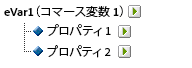
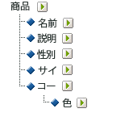

# 下位分類について

Adobe Analyticsでは、単一レベルと複数レベルの分類モデルの両方をサポートしています。分類階層を使用すると、分類に対して分類を適用できます。

>[!NOTE]
>
>下位分類は、分類の分類を作成する機能を指します。ただし、[!UICONTROL 階層レポート]の作成に使用する[!UICONTROL 分類階層]と同じものではありません。For more information about Classification hierarchies, see [Classification Hierarchies](classification-hierarchies.md).

<!-- 

Removed sub-classifications in rule builder. Preserve subclass files in project for future reference. 

 -->

<!-- 

c_single-level_classifications.xml

 -->

次に例を示します。

このモデルの分類はそれぞれ独立しており、選択したレポート変数の新しいサブレポートに対応しています。さらに、データファイルでは、各分類が 1 つのデータ列を構成しており、列見出しに分類名が付けられます。次に例を示します。

| キー | プロパティ 1 | プロパティ 2 |
|---|---|---|
| 123 | ABC | A12B |
| 456 | DEF | C3D4 |

データファイルについて詳しくは、[分類データファイル](../../components/c-classifications2/c-classifications-importer/c-saint-data-files.md#concept_EBA7669C546040BE8162ADACA3548735)を参照してください。

<!-- 

c_multiple-level_classifications.xml

 -->

複数レベルの分類は、親の分類と子の分類から構成されます。次に例を示します。

**親の分類：**&#x200B;子の分類が関連付けられている分類は、すべて親の分類となります。分類は、親の分類にも子の分類にも指定できます。最上位レベルの親の分類は、単一レベルの分類に相当します（[単一レベルの分類](../../components/c-classifications2/c-sub-classifications.md#concept_6B909B54221F4A9BAEA8E30594F06C49)を参照）。

**子の分類：**&#x200B;変数ではなく別の分類を親として持つ分類は、すべて子の分類になります。子の分類は、親の分類についての追加情報を示します。例えば、[!UICONTROL キャンペーン]分類はキャンペーン所有者という子の分類を持つ場合があります。[!UICONTROL 数値]の分類は、分類レポートで指標としても機能します。

各分類は、親の場合も子の場合も、データファイルで 1 つのデータ列を構成します。子の分類の列見出しには、次の名前形式が使用されます。

`<parent_name>^<child_name>`

For more information about the data file format, see [Classification Data Files](../../components/c-classifications2/c-classifications-importer/c-saint-data-files.md#concept_EBA7669C546040BE8162ADACA3548735).

次に例を示します。

| キー | プロパティ 1 | プロパティ1&amp; amp;帽子;プロパティ1-1 | プロパティ1&amp; amp;帽子;プロパティ1-2 | プロパティ 2 |
|---|---|---|---|---|
| 123 | ABC | グリーン | 小 | A12B |
| 456 | DEF | レッド | 大 | C3D4 |

複数レベルの分類用のファイルテンプレートはより複雑ですが、複数レベルの分類には、異なるレベルをそれぞれ別のファイルとしてアップロードできるという強力な利点があります。この方法を使用すると、データを時間の経過につれて変化するものと、変化しないものという分類レベルにグループ分けすることにより、定期的に（毎日、毎週など）アップロードする必要のあるデータの量を最小限に抑えることができます。

>[!NOTE]
>
>If the [!UICONTROL Key] column in a data file is blank, Adobe automatically generates unique keys for each data row. 第 2 レベル以上の分類データを使用してデータファイルをアップロードする場合のファイルの破損を防ぐために、[!UICONTROL キー]列の各行にアスタリスク（*）を入力してください。

トラブルシューティングヘルプについては、[一般的な分類のアップロードの問題](https://marketing.adobe.com/resources/help/en_US/home/index.html#kb-common-saint-upload-issues)を参照してください。

<!-- 

c_classifications_example.xml

 -->

>[!NOTE]
製品分類データは、製品に直接関連するデータ属性に制限されます。データは、Web サイトでの製品の分類方法や販売方法に制限されません。販売カテゴリ、サイト閲覧ノード、または販売項目などのデータ要素は製品分類データではありません。これらの要素は、レポートのコンバージョン変数によってキャプチャされます。

この製品分類のデータファイルをアップロードするとき、分類データを単一のファイルまたは複数のファイルとしてアップロードできます（以下を参照してください）。色コードをファイル 1 に、色名をファイル 2 に分けると、色名データ（数行のみの可能性があります）の更新は、新しい色コードが作成された場合にのみ必要となります。これにより、色名（コード&amp; amp;帽子;COLOR）より頻繁に更新されるファイル1。データファイルの生成時にファイルサイズと複雑さを軽減します。

## 製品の分類 - 単一ファイル {#section_E8C5E031869C449F9B636F5EB3BFEC17}

| キー | 製品名 | 製品の詳細 | 性別 | サイズ | コード | CODE&amp; amp;帽子;COLOR |
|---|---|---|---|---|---|---|
| 410390013 | Polo-SS | メンズポロシャツ、半袖（M、01） | M | M | 01 | グレー |
| 410390014 | Polo-SS | メンズポロシャツ、半袖（L、03） | M | L | 03 | アクアマリン |
| 410390015 | Polo-LS | レディースポロシャツ、長袖（S、23） | F | S | 23 | 水色 |

## 製品の分類 - 複数ファイル（ファイル 1） {#section_A99F7D0F145540069BA4EEC0597FF13F}

| キー | 製品名 | 製品の詳細 | 性別 | サイズ | コード |
|---|---|---|---|---|---|
| 410390013 | Polo-SS | メンズポロシャツ、半袖（M、01） | M | M | 01 |
| 410390014 | Polo-SS | メンズポロシャツ、半袖（L、03） | M | L | 03 |
| 410390015 | Polo-LS | レディースポロシャツ、長袖（S、23） | F | S | 23 |

## 製品の分類 - 複数ファイル（ファイル 2） {#section_19ED95C33B174A9687E81714568D56A3}

| キー | コード | CODE&amp; amp;帽子;COLOR |
|---|---|---|
| * | 01 | グレー |
| * | 03 | アクアマリン |
| * | 23 | 水色 |
