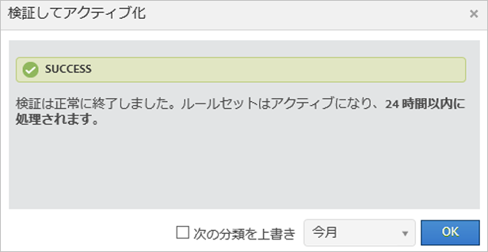
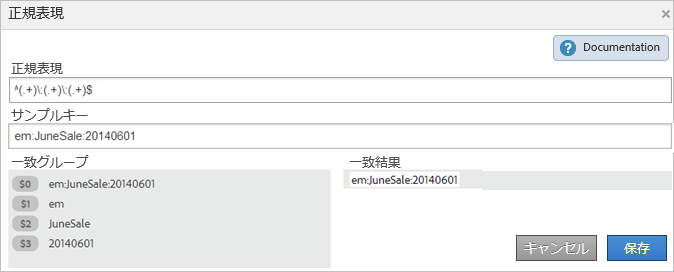
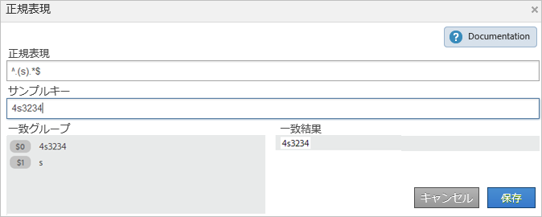
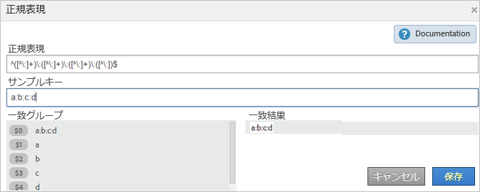
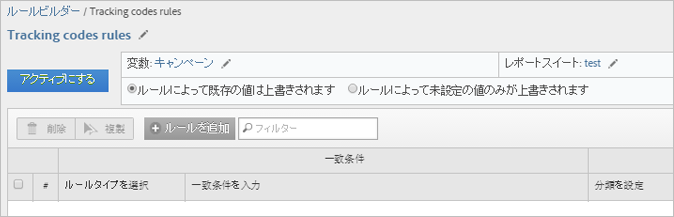
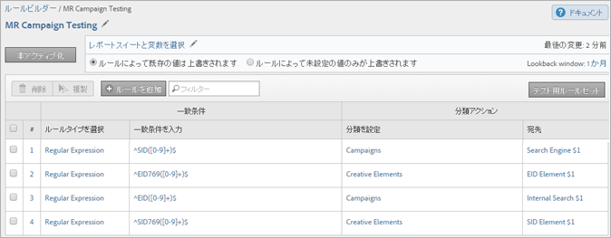
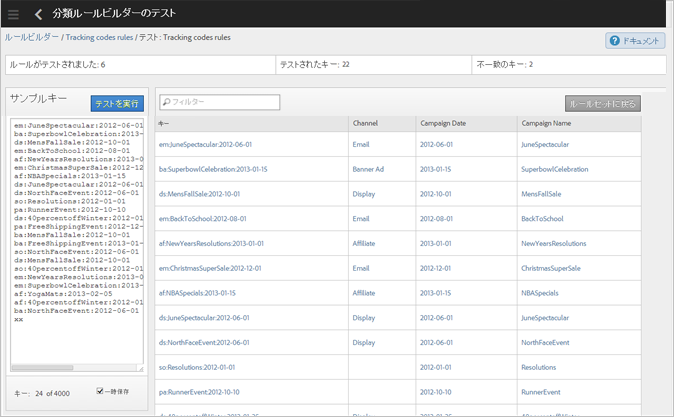

# 分類ルール

分類ルールを設定すると、分類されていない語句が定期的に検索されます。ルールとの一致が検出されると、ルールによってその語句が分類データテーブルに自動的に追加されます。分類ルールを使用して既存のキーを上書きすることもできます。

## Classification rules {#concept_CF2F64BD96454FBFAA84638FC7DEA263}

分類ルールを設定すると、分類されていない語句が定期的に検索されます。ルールとの一致が検出されると、ルールによってその語句が分類データテーブルに自動的に追加されます。分類ルールを使用して既存のキーを上書きすることもできます。

**[!UICONTROL Analytics]** / **[!UICONTROL 管理者]** / **[!UICONTROL 分類ルールビルダー]**

The Rule Builder lets you create a *`classification rule set`*, which is a list of *`classification rules`*. ルールは、指定された条件との照合を行い、アクションを実行します。

分類ルールは、次の項目に使用すると便利です。

* **電子メール**&#x200B;および&#x200B;**ディスプレイ広告**：電子メールキャンペーンと比較したディスプレイ広告キャンペーンのパフォーマンスを確認するために、個々のディスプレイ広告キャンペーンをグループ化する分類ルールを作成できます。

* **トラッキングコード**：トラッキングコードの文字列から派生するキー値を分類するための分類ルールを作成し、定義した特定の条件と照合します。
* **検索用語**：[正規表現](../../../components/c-classifications2/crb/classification-quickstart-rules.md#concept_8A63F9BCF9484963962E14E6286D312D)とワイルドカードを使用して、検索用語の分類を簡略化できます。For example if a search term contains *`baseball`*, you can set a *`Sports League`* classification to *`MLB`*.

例えば、電子メールキャンペーン ID が次のトラッキングコードを持つとします。

`em:Summer:2013:Sale` を参照してください。

ここで、文字列の一部を識別する 3 つのルールをルールセットに設定し、値を分類することができます。

| ルールタイプを選択 | 一致条件を入力 | 分類を設定 | 設定値 |
|---|---|---|---|
| 次で始まる | em: | チャネル | Email |
| 次で終わる | Sale | タイプ | Sale |
| 次を含む | 2013 | Year | 2013 |

## ルールの処理方法 {#concept_A67A23F523844D37898583C632DB9D25}

分類ルールの処理方法に関する重要な情報。

<!-- 

about_classification_rules.xml

 -->

* [ルールに関する重要な情報](/help/components/c-classifications2/crb/classification-rule-builder.md)
* [ルールによるキーの分類が行われない状況](/help/components/c-classifications2/crb/classification-rule-builder.md)
* [ルールの優先度について](../../../components/c-classifications2/crb/classification-quickstart-rules.md#concept_93527FEB3C9B48FB96FB7DF857E5F980)

>[!NOTE]
>
>[!UICONTROL ルールビルダー] は数値2分類をサポートしていません。

## ルールに関する重要な情報 {#section_0BD46702FBEC4D98A4DD2EA0BD428046}

* Specify [group permissions](https://marketing.adobe.com/resources/help/en_US/reference/?f=groups) for classifications in [!UICONTROL Admin Tools].

* **正規表現**:ヘルプは、分類ルールの [「正規表現」で利用](../../../components/c-classifications2/crb/classification-quickstart-rules.md#concept_8A63F9BCF9484963962E14E6286D312D)できます。

* **レポートスイート**：分類を選択するには、1 つ以上のレポートスイートが選択されている必要があります。レポートスイートは、ルールセットが作成され変数が割り当てられていないと、適用できません。

   ルールセットをテストするときは、レポートのキー（分類する変数）を使用して、ルールセットによる影響を確認します（[キー](../../../components/c-classifications2/c-classifications-importer/c-saint-data-files.md#concept_0B77B3079B5C414F9956058688990443)は、分類する変数、または分類アップロードテーブルの最初の列です）。

* **ルールの優先度**：キーが複数のルールに一致し、そのすべてのルールで（[!UICONTROL 分類を設定]列内に）同じ分類列が設定される場合は、分類に一致する最後のルールが使用されます。詳しくは、[ルールの優先度について](../../../components/c-classifications2/crb/classification-quickstart-rules.md#concept_93527FEB3C9B48FB96FB7DF857E5F980)を参照してください。

* **ルールの数に関する制限**：作成できるルールの数に制限はありません。ただし、大量にルールを作成すると、ブラウザーのパフォーマンスに影響が及ぶことがあります。
* **処理**：ルールは、分類に関連するトラフィックのボリュームに応じた頻度で処理されます。

   アクティブなルールは 4 時間ごとに処理され、通常、分類データの調査は月に 1 回行われます。ルールでは、自動的に新しい値がチェックされ、インポーターを使用して分類がアップロードされます。

* **既存の分類の上書き**：詳しくは、[ルールによるキーの分類が行われない状況を参照してください。](../../../components/c-classifications2/crb/classification-quickstart-rules.md#section_4481E88CA28246B6B19EA16E2D83A3A8) 必要に応じて、インポーターを使用して既存の分類を削除または削除できます。

## ルールによるキーの分類が行われない状況{#section_4481E88CA28246B6B19EA16E2D83A3A8}

ルールをアクティブにするとき、既存の分類を上書きできます。次の場合、分類ルールによる[キー](../../../components/c-classifications2/c-classifications-importer/c-saint-data-files.md#concept_0B77B3079B5C414F9956058688990443)（変数）の分類は行われません。

* キーが既に分類済みで、「[分類を上書き](../../../components/c-classifications2/crb/classification-rule-definitions.md#overwrite_classifications)」を選択していない。

   分類の上書きは、[](../../../components/c-classifications2/crb/classification-quickstart-rules.md#task_86F216DFD2534FA181E64ABDF306782B)ルールを追加およびアクティブ化するときと、data connectors の統合をアクティブ化するときに行うことができます（data connectors の場合、ルールは開発センターでパートナーによって作成され、[!UICONTROL 分類ルールビルダー]に表示されます）。

* 「[分類を上書き](../../../components/c-classifications2/crb/classification-rule-definitions.md#overwrite_classifications)」を有効にした後であっても、キーを上書きするときに指定された時間枠が経過した後、分類されたキーがデータに表示されていない。
* キーが分類されず、約 1 ヶ月前から始まる時間枠が経過した後もキーが [!DNL Adobe Analytics] に渡されない。

   >[!NOTE]
   >
   >レポートでは、キーが存在する場合は常に、指定されたすべての時間枠に分類が適用されます。レポートの日付範囲はレポートに影響しません。



## 分類ルールの正規表現 {#concept_8A63F9BCF9484963962E14E6286D312D}

正規表現を使用すると、一貫した形式の文字列値を分類に一致させることができます。例えば、トラッキングコードに含まれる特殊文字から分類を作成できます。特定の文字、単語または文字パターンを一致させることができます。

<!-- 

regex_classification_rules.xml

 -->

* [正規表現 - トラッキングコードの例](../../../components/c-classifications2/crb/classification-quickstart-rules.md#section_2EF7951398EB4C2F8E52CEFAB4032669)
* [正規表現 - 特定の文字の分類](../../../components/c-classifications2/crb/classification-quickstart-rules.md#section_5D300C03FA484BADACBFCA983E738ACF)
* [正規表現 - 様々な長さのトラッキングコードの一致](../../../components/c-classifications2/crb/classification-quickstart-rules.md#section_E86F5BF5C2F44ABC8FFCE3EA67EE3BB2)
* [正規表現 - 「含まない」の例](../../../components/c-classifications2/crb/classification-quickstart-rules.md#section_FCA88A612A4E4B099458E3EF7B60B59C)
* [正規表現 - 参照表](../../../components/c-classifications2/crb/classification-quickstart-rules.md#section_0211DCB1760042099CCD3ED7A665D716)

>[!NOTE]
>
>ベストプラクティスとして、正規表現は区切り文字を使用するトラッキングコードに最適です。

## 正規表現 - トラッキングコードの例 {#section_2EF7951398EB4C2F8E52CEFAB4032669}

>[!NOTE]
>
>If the tracking code is URL encoded, it will **not** be classified by the Rules Builder.

この例では、次のキャンペーン ID を分類することを前提とします。

[!UICONTROL Sample Key]: `em:JuneSale:20130601`

分類するトラッキングコードの一部：

* `em` = email
* `JuneSale` =キャンペーン名
* `20130601` = date

[!UICONTROL Regular Expression]: `^(.+)\:(.+)\:(.+)$`

正規表現とキャンペーン ID の相関関係：


[!UICONTROL 一致グループ]：キャンペーン ID 内の位置を分類できるように、正規表現とキャンペーン ID 文字の相関関係を示します。



This example tells the rule that the campaign date `20140601` is at the third group `(.+)`, identified by `$3`.

** [!UICONTROL ルールビルダー] **

[!UICONTROL ルールビルダー]で、次のようにルールを設定します。

| ルールタイプを選択 | 一致条件を入力 | 分類を設定 | 設定先 |
|---|---|---|---|
| 正規表現 | &amp; amp;帽子;（.+)\:(.+)\:(.+)$ | キャンペーンの日付 | $3 |

**構文**

| 正規表現 | 文字列または一致結果 | 対応する一致グループ |
|--- |--- |--- |
| `^(.+)\:(.+)\:(.+)$` | em:JuneSale:20130601 | `$0`:em:JuneSale:20130601:em `$1`:JuneSale `$2`:20130601`$3` |
| 構文の構築 | `^` =を指定すると、行（）=をグループ化し、括弧内の一致する文字を抽出できます。`(.+)` = 1 ( . ) 文字と（+）以上の\= startを追加します。`$` =は、直前の文字（または文字グループ）が最後の文字であることを示します。 |

正規表現の文字が何を意味しているかについては、[正規表現 - 参照表](../../../components/c-classifications2/crb/classification-quickstart-rules.md#section_0211DCB1760042099CCD3ED7A665D716)を参照してください。

## 正規表現 - 特定の文字の分類 {#section_5D300C03FA484BADACBFCA983E738ACF}

正規表現を使用する 1 つの方法は、文字を含む文字列内の特定の文字を分類することです。例えば、次のトラッキングコードに 2 つの重要な文字が含まれているとします。

[!UICONTROL Sample Key]: `4s3234`

* `4` =ブランド名
* `s` = Google などの検索エンジンを識別する



** [!UICONTROL ルールビルダー] **

[!UICONTROL ルールビルダー]で、次のようにルールを設定します。

| ルールタイプを選択 | 一致条件を入力 | 分類を設定 | 設定先 |
|--- |--- |--- |--- |
| 正規表現 | `^.(s).*$` | ブランドおよびエンジン | `$0` （ブランド名と検索エンジンの最初の2文字をキャプチャします）。 |
| Regular Expression | `^.(s).*$` | 検索エンジン | `$1` （Googleの2番目の文字をキャプチャします）。 |

## 正規表現 - 様々な長さのトラッキングコードの一致 {#section_E86F5BF5C2F44ABC8FFCE3EA67EE3BB2}

この例では、様々な長さのトラッキングコードがある場合に、コロン区切りの間の特定の文字を識別する方法を示しています。Adobe では、各トラッキングコードに 1 つの正規表現を使用することをお勧めします。

サンプルキー:

* `a:b`
* `a:b:c`
* `a:b:c:d`

**構文**




** [!UICONTROL ルールビルダー] **

[!UICONTROL ルールビルダー]で、次のようにルールを設定します。

| ルールタイプを選択 | 一致条件を入力 | 分類を設定 | 設定値 |
|--- |--- |--- |--- |
| 一致文字列aの正規表現:b | `^([^\:]+)\:([^\:]+)$` | a | `$1` |
| 一致文字列aの正規表現:b | `^([^\:]+)\:([^\:]+)$` | b | `$2` |
| 一致文字列aの正規表現:b:c | `^([^\:]+)\:([^\:]+)\:([^\:]+)$` | a | `$1` |
| 一致文字列aの正規表現:b:c | `^([^\:]+)\:([^\:]+)\:([^\:]+)$` | b | `$2` |
| 一致文字列aの正規表現:b:c | `^([^\:]+)\:([^\:]+)\:([^\:]+)$` | c | `$3` |
| 一致文字列aの正規表現:b:c:d | `^([^\:]+)\:([^\:]+)\:([^\:]+)\:([^\:])$` | d | `$4` |

## 正規表現 - 「含まない」の例 {#section_FCA88A612A4E4B099458E3EF7B60B59C}

この例では、特定の文字を含まないすべての文字列を一致させる正規表現を提供します。ここでは `13` です。

正規表現：

`^(?!.*13.*).*$`

テスト文字列：

```
a:b:
a:b:1313
c:d:xoxo
c:d:yoyo
```

一致結果：

```
a:b:
c:d:xoxo
c:d:yoyo
```

In this result, `a:b:1313` does not indicate a match.

## 正規表現 - 参照表 {#section_0211DCB1760042099CCD3ED7A665D716}

| 式 | 説明 |
|---|---|
| `(?ms)` | 正規表現全体を複数行の入力と照合し、.ワイルドカードがあらゆる改行文字と一致できるようにする |
| (`?i`) | 正規表現全体で大文字と小文字を区別しないようにする |
| [`abc`] | a、b または c の 1 文字 |
| [`^abc`] | a、b、c 以外の 1 文字 |
| [`a-z`] | a ～ z の範囲内の 1 文字 |
| [`a-zA-Z`] | a ～ z または A ～ Z の範囲内の 1 文字 |
| `^` | 行の開始（行の開始に一致） |
| `$` | 行の末尾（または末尾の新しい行の前に一致） |
| `\A` | 文字列の開始 |
| `\z` | 文字列の末尾 |
| `.` | 任意の文字の一致（改行を除く） |
| `\s` | 空白文字 |
| `\S` | 空白以外の文字 |
| `\d` | 数字 |
| `\D` | 数字以外 |
| `\w` | 任意の単語（文字、数字、アンダースコア） |
| `\W` | 任意の単語以外の文字 |
| `\b` | 任意の単語境界 |
| `(...)` | 囲まれている内容をすべてキャプチャ |
| `(a|b)` | a または b |
| `a?` | 0 または 1 個の a |
| `a*` | 0 個以上の a |
| `a+` | 1 つ以上の a |
| `a{3}` | 3 個の a |
| `a{3,}` | 3 個以上の a |
| `a{3,6}` | 3 ～ 6 個の a |

正規表現の有効性をテストするための適切なリソースは、https://rubular.com/です。

## ルールの優先度について {#concept_93527FEB3C9B48FB96FB7DF857E5F980}

キーが複数のルールに対して照合され、[!UICONTROL 分類を設定]列に表示されているのと同じ分類列が設定される場合は、最後のルールが使用されます。したがって、ルールセット内の最後のルールが最も重要になります。

<!-- 

rule_priority.xml

 -->

分類が同じでないルールを複数作成している場合には、処理の順番は関係ありません。

以下に示すのは、アスリートの検索タイプを分類する検索語ルールの例です。

| ルール番号 | ルールタイプ | 一致 | 分類の設定 | 設定値 |
|---|---|---|---|---|
| 1 | 次を含む | カウボーイズ | 検索タイプ | チーム |
| 2 | 次を含む | ファンタジー | 検索タイプ | ファンタジー |
| 3 | 次を含む | Romo | 検索タイプ | プレーヤー |

ユーザーが&#x200B;*`Cowboys fantasy Tony Romo`*&#x200B;に *`Player`* 分類されます。

同じように、以下の検索語についてルールを 2 つ設定している場合を考えます。

| ルール番号 | ルールタイプ | 一致 | 分類の設定 | 設定値 |
|---|---|---|---|---|
| 1 | 次を含む | カウボーイズ | 市区町村 | Dallas |
| 2 | 次を含む | ブロンコス | 市区町村 | Denver |

ユーザーが「*`Cowboys vs. Broncos`* と呼ばれる iFrame を読み込みます。ルールビルダーによってルールの一致に競合が発見され、この検索では 2 番目のルールの分類（Denver）が適用されます。

## Add a Classification Rule to a Rule Set {#task_86F216DFD2534FA181E64ABDF306782B}

<!-- 

t_classification_rule.xml

 -->

分類ルールを追加または編集する方法について手順を説明します。

分類に条件を対応させることによってルールを追加し、そのアクションを指定します。

>[!NOTE]
>
>この手順では、1つまたは複数のレポートスイートにルールを適用する必要があります。ルールセットあたりのルール数に制限はありませんが、500 ～ 1000 件にすることをお勧めします。ルールが 100 以上ある場合には、[下位分類](../../../components/c-classifications2/c-sub-classifications.md#concept_19EE5513A7DC43C38CC396E96F306CFE)を使ってルールセットを簡素化する方法の検討が必要です。

1. [分類ルールセットの作成](../../../components/c-classifications2/crb/classification-rule-set.md#task_86F216DFD2534FA181E64ABDF306782B) を参照してください。
1. On the rule set page, click **[!UICONTROL Add Rule]**.

   

1. **[!UICONTROL 「レポートスイート]**」の横の「スイート **** を追加」をクリックして、このルールセットに割り当てる1つまたは複数のレポートスイートを指定します。

   **[!UICONTROL レポートスイートを選択]ページが表示されます。**

   >[!NOTE]
   Report suites display on this page *`only`* when the following conditions are met:        &gt;

   * レポートスイートに、[!UICONTROL 管理ツール]でその変数に対して定義された分類が 1 つ以上あるとき。
   この前提条件の説明については、*`Variable`*[」を](../../../components/c-classifications2/crb/classification-rule-set.md#concept_CD3D510F5070486584F3BB535AE41524) 参照してください）。

   * **[!UICONTROL 利用可能なレポートスイート]** ページでレポートスイートを選択した場合は、「ルールセット [](/help/components/c-classifications2/crb/classification-rule-set.md) を追加」をクリックしてルールセットを作成した後に表示されます。


1. 既存の値を上書きするかどうかを指定します。

   | **ルールによって既存の値は上書きされます** | （デフォルト設定）インポーター（SAINT）を使用してアップロードされた分類を含む、既存の分類キーを常に上書きします。 |
   |---|---|
   | **ルールによって未設定の値のみが上書きされます** | 空欄（未設定）のセルにのみ記入します。既存の分類は、変更されません。 |

1. [ルールを定義します](../../../components/c-classifications2/crb/classification-rule-definitions.md#section_4A5BF384EEEE4994B6DC888339833529)。

   

   For examples of building rules, see [Classifications Rule Builder](/help/components/c-classifications2/crb/classification-rule-builder.md) and [Regular Expressions in Classification Rules](../../../components/c-classifications2/crb/classification-quickstart-rules.md#concept_8A63F9BCF9484963962E14E6286D312D).

   >[!NOTE]
   >
   >キーが（分類を設定列で）同じ分類を設定する複数のルールに一致する場合、分類に一致する最後のルールが使用されます。See **About Rule Priority** above for more information about sorting rules.

1. [ルールセット](../../../components/c-classifications2/crb/classification-quickstart-rules.md#task_618A1E7CC8664E728F312250E8367158)をテストします。
1. After testing, click **[!UICONTROL Active]** to validate and activate the rule.

   ルールをアクティブ化すると、自動的にファイルが構築され、アップロードされます。

   Field definitions: See [Classification Rule Builder](../../../components/c-classifications2/crb/classification-rule-definitions.md#concept_6CAEFB1CA4564E2CA5808097C11EF468) for complete definitions of interface options on this page.

## Test a Classification Rule Set {#task_618A1E7CC8664E728F312250E8367158}

<!-- 

t_classifications_test_rule.xml

 -->

分類ルールまたはルールセットをテストする方法について手順を説明します。テストを実行すると、セット内のすべてのルールがチェックされます。

1. [分類ルールセットの作成](../../../components/c-classifications2/crb/classification-rule-set.md#task_86F216DFD2534FA181E64ABDF306782B) を参照してください。
1. [!UICONTROL 分類ルールビルダー]で、ルールセット名をクリックします。
1. ルールセットがレポートスイートに関連付けられていることを確認します。
1. On the rule editor, click **[!UICONTROL Test Rule Set]**.

   

1. 「[!UICONTROL サンプルキー]」フィールドにテストキーを入力するか、貼り付けます。

   サンプルキーには以下が含まれています。

   * トラッキングコード
   * 検索キーワードまたは語句
   詳しくは、[分類ルールの正規表現](../../../components/c-classifications2/crb/classification-quickstart-rules.md#concept_8A63F9BCF9484963962E14E6286D312D)を参照してください。
1. Click **[!UICONTROL Run Test]**.

   「[!UICONTROL 結果]」テーブルに一致するルールが表示されます。
1. (Optional) Click **[!UICONTROL Activate]** to activate the rule, and to overwrite existing classifications.

   既存の分類を上書きするルールの使用について詳しくは、を参照してください。

## Validate and Activate Classification Rules {#task_2B4FA41F1EE64F4AAC6170C5EFC066AC}

<!-- 

t_validate_rules.xml

 -->

分類ルールを検証およびアクティブ化する方法について手順を説明します。

1. [分類ルールセット](../../../components/c-classifications2/crb/classification-rule-set.md#task_86F216DFD2534FA181E64ABDF306782B) の作成後 [、セットに分類ルール](../../../components/c-classifications2/crb/classification-quickstart-rules.md#task_86F216DFD2534FA181E64ABDF306782B) を追加します。
1. On the rule editor, click **[!UICONTROL Activate]**.

   

1. (Optional) To overwrite classifications, enable **[!UICONTROL Overwrite classifications for]** *`<selection>`*.

   このオプションを使用すると、影響を受けるキーの既存の分類を上書きできます。

   このオプションの定義については、[ルールページ](../../../components/c-classifications2/crb/classification-rule-definitions.md#section_4A5BF384EEEE4994B6DC888339833529)を参照してください。
