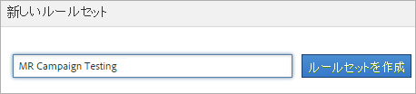

# 分類ルールセット

ルールセットは、特定の変数の分類ルールのグループです。変数をルールセットに適用します。1 つの変数に対して複数のルールセットを作成するには、それぞれのルールセットを複数のレポートスイートに適用する必要があります。

## Classification rule sets {#concept_CD3D510F5070486584F3BB535AE41524}

ルールセットは、特定の変数の分類ルールのグループです。変数をルールセットに適用します。1 つの変数に対して複数のルールセットを作成するには、それぞれのルールセットを複数のレポートスイートに適用する必要があります。

## 分類ルールビルダーページ {#section_C60B0888C76D49C596EF19F11808B718}

**[!UICONTROL Analytics]** / **[!UICONTROL 管理者]** / **[!UICONTROL 分類ルールビルダー]**

[!UICONTROL 分類ルールビルダー]には、次のフィールドとオプションがあります。

<table id="table_A5D92409969747E39E041216A5AA32CD"> 
 <thead> 
  <tr> 
   <th colname="col1" class="entry"> 要素 </th> 
   <th colname="col2" class="entry"> 説明 </th> 
  </tr> 
 </thead>
 <tbody> 
  <tr> 
   <td colname="col1"> 
<a href="../../../components/c-classifications2/crb/classification-rule-set.md#task_86F216DFD2534FA181E64ABDF306782B" format="dita" scope="local">ルールセットを追加</a>      
 </td> 
   <td colname="col2"> 
ルールセットを作成します。 
 </td> 
  </tr> 
  <tr> 
   <td colname="col1"> 
ルール 
 </td> 
   <td colname="col2"> セットに含まれるルールの数を表示します。 </td> 
  </tr> 
  <tr> 
   <td colname="col1"> 
ステータス 
 </td> 
   <td colname="col2"> ルールセットのアクティビティステータス（ドラフト、アクティブなど）を表示します。アクティブなルールは毎日処理され、通常、分類データの調査は月に 1 回行われます。ルールでは、自動的に新しい値がチェックされ、分類がアップロードされます。 </td> 
  </tr> 
  <tr> 
   <td colname="col1"> 
最後の変更 
 </td> 
   <td colname="col2"> ルールセットがいつ編集されたかを示します。 </td> 
  </tr> 
  <tr> 
   <td colname="col1"> 
複製 
 </td> 
   <td colname="col2"> ルールセットを別の変数や異なるレポートスイートの同じ変数に適用できるように、ルールセットを複製（コピー）します。 </td> 
  </tr> 
 </tbody> 
</table>

## Create a Classification Rule Set {#task_86F216DFD2534FA181E64ABDF306782B}

<!-- 

t_classification_rule_set.xml

 -->

分類ルールセットに名前を付け、変数を適用して、上書き設定を指定します。

1. (Prerequisite) Define the classification structure in **[!UICONTROL Admin]** &gt; **[!UICONTROL Report Suites]**.

   （分類の追加については、管理ツールのヘルプの[分類](https://marketing.adobe.com/resources/help/en_US/reference/index.html?f=classifications)を参照してください。）

   変数は、その変数に対して 1 つ以上の分類が定義されている場合にのみ[!UICONTROL 新しいルールセット]パネルに表示されます。

   **[!UICONTROL 管理]** 者/ **[!UICONTROL レポートスイート]** / **[!UICONTROL トラフィック]** / **[!UICONTROL トラフィック分類]** （または **[!UICONTROL コンバージョン]** / **[!UICONTROL コンバージョン分類]**）で、変数上の分類を作成できます。Then select the variable, then click **[!UICONTROL Add Classification]**.

1. To create the rule set, click **[!UICONTROL Admin]** &gt; **[!UICONTROL Classification Rule Builder]** &gt; **[!UICONTROL Add Rule Set]**.

   

1. Name the rule set, then click **[!UICONTROL Create Rule Set]**.
1. 編集するルールセットを選択します。

   

1. Click **[!UICONTROL Select Report Suites and Variables]**.

   レポートスイートと変数リストには、ログインしている会社のすべてのレポートスイートで利用できるすべての分類された変数が入力されます。レポートスイート内の 1 つの変数が所属することのできるルールセットは、1 つのみです。

   詳しくは、*`Variable`*（[分類ルールビルダー](../../../components/c-classifications2/crb/classification-rule-definitions.md#section_4D1A70A607C9419EB2116A5174EACB72)ページの定義）を参照してください。
1. Specify the report suites and variables to use, then click **[!UICONTROL Save]**.
1. Continue by [adding classification rules](../../../components/c-classifications2/crb/classification-rule-set.md#task_86F216DFD2534FA181E64ABDF306782B) to the rule set.
