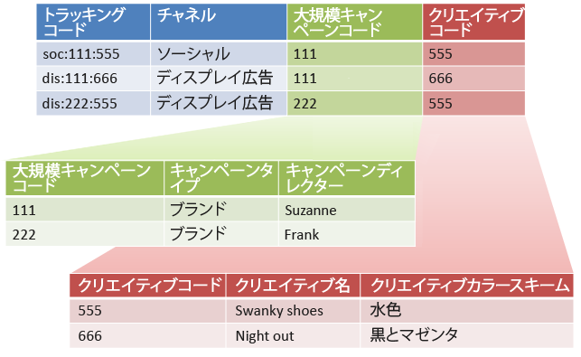

# 下位分類とルールビルダー

すべての副分類に親値が割り当てられている場合、分類ルールビルダーを副分類と組み合わせることができます。

分類ルールビルダーを下位分類と組み合わせると、分類管理が単純化され、必要なルール数が減ります。 トラッキングコードが、個別に分類するコードで構成されている場合は、この方法を使用できます。

下位分類の概念情報については、[下位分類](/help/components/c-classifications2/c-sub-classifications.md)を参照してください。

## 例

次のトラッキングコードを想定します。

`channel:broad_campaign:creative`

分類階層を使用すると、分類に対して分類を適用できます（ *`sub-classification`*）.つまり、複数のテーブルを持つリレーショナルデータベースと同様にインポーターを使用できます。 1つのテーブルは完全なトラッキングコードをキーにマッピングし、もう1つのテーブルはこれらのキーを他のテーブルにマッピングします。

この構造を作成したら、分類ルールビルダーを使用して、参照テーブル(前の画像の緑と赤のテーブル  )のみを更新する小さなファイルをアップロードできます。 その後、ルールビルダーを使用して、メインの分類テーブルを最新の状態に保つことができます。

次のタスクで、これを行う方法を説明します。

## ルールビルダーを使用した下位分類の設定 {#task_2D9016D8B4E84DBDAF88555E5369546F}

ルールビルダーを使用して下位分類をアップロードする方法についての手順の例を説明します。

>[!NOTE]
>
>次の手順では、「[下位分類とルールビルダー](/help/components/c-classifications2/crb/sub-classification-rule-builder.md)」に記載された使用例を実現する方法を説明します。

1. [分類マネージャー](https://marketing.adobe.com/resources/help/en_US/reference/classifications.html)で、分類と下位分類を作成します。

   例：

   

1. [分類ルールビルダー](/help/components/c-classifications2/crb/classification-rule-builder.md)で、元のトラッキングコードから下位分類キーを分類します。

   これは、正規表現を使用して実行します。 この例では、入力するルールで次の正規 *`Broad Campaign code`* 表現が使用されています。

   | `#` | ルールタイプ | フィルター適用条件 | 分類を設定 | 設定値 |
   |---|---|---|---|---|
   |  | 正規表現 | `[^\:]:([^\:]):([^\:]`) | 幅広いキャンペーンコード | `$1` |
   |  | 正規表現 | `[^\:]:([^\:]):([^\:]`) | クリエイティブコード | `$2` |

   >[!NOTE]
   >
   >この時点では、下位分類の *`Campaign Type`* および *`Campaign Director`* は入力しないでください。

1. 指定した下位分類のみを含む分類ファイルをアップロードします。

   「[複数レベルの分類](/help/components/c-classifications2/c-sub-classifications.md)」を参照してください。

   例：

   | キー | Channel | 幅広いキャンペーンコード | 幅広いキャンペーンコード&amp;Hat;キャンペーンタイプ | 幅広いキャンペーンコード&amp;Hat;キャンペーンディレクター | ： |
   |---|---|---|---|---|---|
   | * |  | 111 | ブランド | スザンヌ |  |
   | * |  | 222 | ブランド | フランク |  |

1. 参照テーブルをメンテナンスするために、（この例のような）小さなファイルをアップロードします。

   例えば、新しい *`Broad Campaign code`* が導入されたときにこのファイルをアップロードします。このファイルは、以前に分類した値に適用されます。同様に、新しい下位分類を作成する場合は（例えば     *`Creative Theme`* を *`Creative code`* の副分類として）、分類ファイル全体ではなく、副分類ファイルのみをアップロードします。

   レポートの場合、これらの下位分類は、最上位の分類とまったく同じように機能します。 これにより、それらを使用する際に必要な管理上の負担が軽減されます。-->
