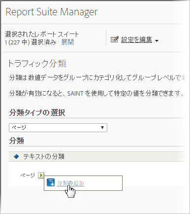

# トラフィック分類

トラフィック分類では、トラフィック変数（prop）の分類がおこなえます。トラフィック分類ではテキスト分類しか使用できません。

## Traffic classifications {#concept_028079B29A9C412AA68910A87E11176F}

トラフィック分類では、トラフィック変数（prop）の分類がおこなえます。トラフィック分類ではテキスト分類しか使用できません。

トラフィック分類ページでは、選択したレポートスイートの分類を作成することができます。分類後は、主要データを使用して生成できるすべてのレポートは、関連付けられた属性を使用して生成することもできます。

分類を有効にした後、[分類インポーター](../../components/c-classifications2/c-classifications-importer/c-working-with-saint.md#concept_08ED8C7A86C64E7DA5DE3044BB94B2EA)を使用して、該当する分類に特定の値を割り当てます。

## Add a Traffic Classification {#task_4DB49CCB1D764483907BC33A5CEB7315}

<!-- 

t_classification_add_traffic.xml

 -->

選択したレポートスイートの分類を追加または編集する方法について手順を説明します。

1. Click **[!UICONTROL Admin]** &gt; **[!UICONTROL Report Suites]** in the Suite header.
1. レポートスイートを選択します。
1. 「**分類タイプの選択**」フィールドで分類の追加先の変数を選択します。
1. Click **[!UICONTROL Edit Settings]** &gt; **[!UICONTROL Traffic]** &gt; **[!UICONTROL Traffic Classifications]**.

   

1. Mouse over the **[!UICONTROL Edit Classification]** icon, then select **[!UICONTROL Add Classification]** or **[!UICONTROL Edit Classification]**.
1. **[!UICONTROL テキスト分類]** ダイアログボックスで、必要に応じて分類を設定します。

   **[!UICONTROL 名前：]**&#x200B;分類に名前を付けます。

   **[!UICONTROL 説明]**：詳細な説明を入力します。
1. 「**[!UICONTROL 保存]**」をクリックします。
