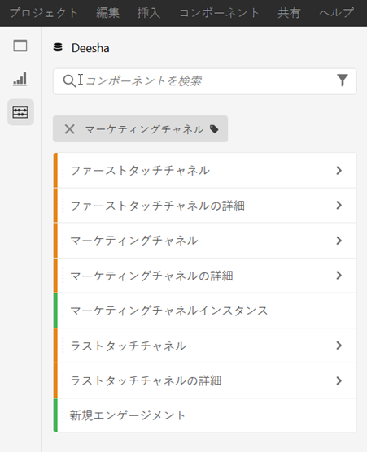
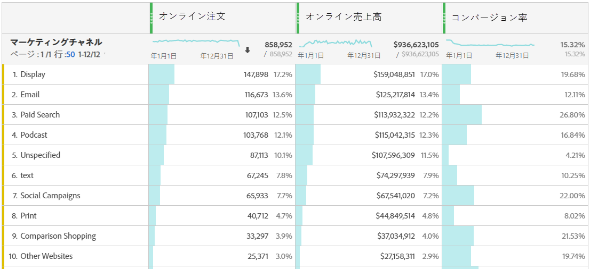
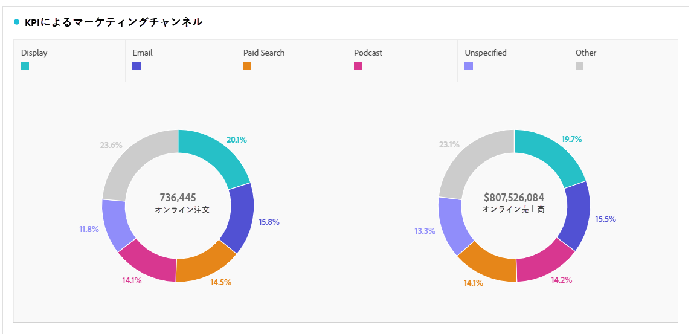
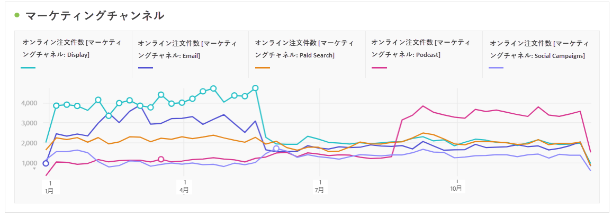
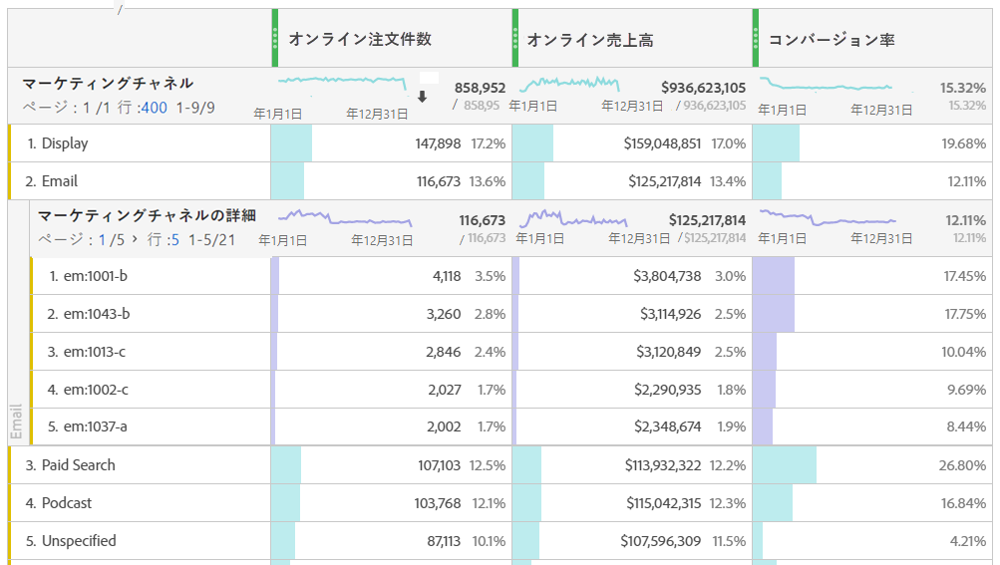
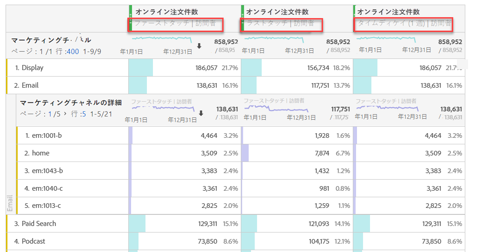
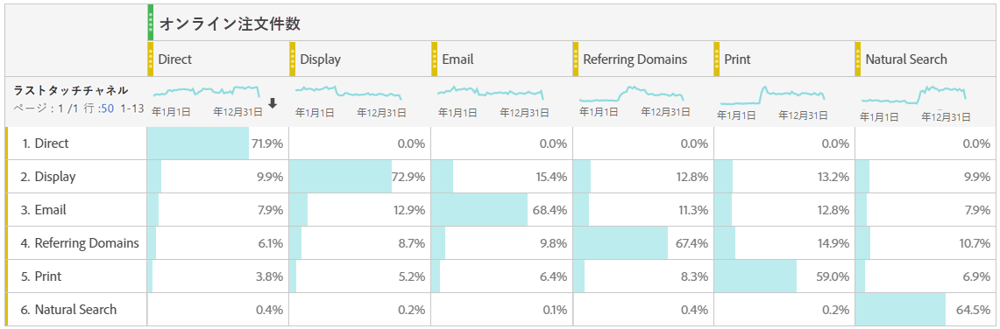

# マーケティングチャネルの分析

>[!NOTE]
>
>Attribution IQとCustomer Journey Analyticsに対するマーケティングチャネルの効果を最大限に高めるために、[改訂されたベストプラクティス](/help/components/c-marketing-channels/mchannel-best-practices.md)を公開しました。

ターゲットの精度を上げ、マーケティング収益を増加できるよう、最も効果的なマーケティングチャネルとそのユーザーを知りたい場合があります。Adobe Analytics では、Workspace のマーケティングチャネルディメンションとマーケティング指標は、様々なチャネルが注文件数や売上高などに与える影響を追跡し、有益なチャネルに関するインサイトを提供するツールです。マーケティングチャネルに使用できるディメンションと指標は次のとおりです。

| ディメンション／指標 | 定義 |
| --- | --- |
| マーケティングチャネル | これは、使用する推奨されるマーケティングチャネルディメンションです。Attribution IQ モデルは、実行時に適用できます。このディメンションは、ラストタッチチャネルディメンションと同じように動作しますが、異なるアトリビューションモデルでマーケティングチャネルを使用する場合の混乱を防ぐために、異なるラベルが付けられます。 |
| ラストタッチチャネル | ラストタッチアトリビューションモデルが事前に適用され、変更できない既存のディメンション。 |
| ファーストタッチチャネル | ファーストタッチアトリビューションモデルが事前に適用され、変更できない既存のディメンション。 |
| マーケティングチャネルインスタンス | この指標は、標準ページビューやカスタムリンクの呼び出しなど、マーケティングチャネルがイメージリクエストで定義された回数を測定します。永続化された値は含まれません。 |
| 新規エンゲージメント | この指標はインスタンスと似ていますが、イメージリクエストでファーストタッチマーケティングチャネルが定義された場合にのみ増加します。 |

## 基本分析

このフリーフォームテーブルは、各マーケティングチャネルのオンライン注文件数、オンライン売上高、およびコンバージョン率を示します。

各マーケティングチャネルのオンライン注文件数とオンライン売上高をドーナツグラフで示します。

この折れ線グラフは、様々なチャネルのオンライン注文件数の経時的なトレンドを示します。

## アドバンス分析

マーケティングチャネルの詳細では、各チャネルを深く掘り下げて、特定のキャンペーン、配置などを示します。各マーケティングチャネルを細かく分類できます。

## アトリビューションモデルの適用

[Attribution IQ](https://docs.adobe.com/content/help/ja-JP/analytics/analyze/analysis-workspace/panels/attribution.html) を使用すると、様々なアトリビューションモデルを瞬時に適用できます。

異なるアトリビューションモデルを適用すると、同じ指標（オンライン注文）から異なる結果が生成されます。

## クロスタブマーケティング分析

従来のファーストタッチチャネルとラストタッチチャネルを使用すると、チャネルのインタラクションに関する次の便利なビューを利用できます。

クロスタブマーケティングの分析について詳しくは、次のビデオを参照してください。[クロスタブ分析を使用した Analysis Workspace の基本的なマーケティング属性の調査](https://docs.adobe.com/content/help/ja-JP/analytics-learn/tutorials/analysis-workspace/attribution-iq/using-cross-tab-analysis-to-explore-basic-marketing-attribution-in-analysis-workspace.html)
