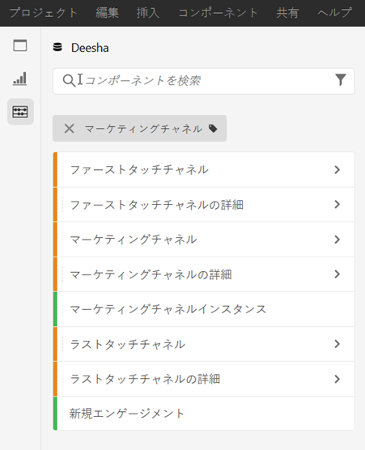
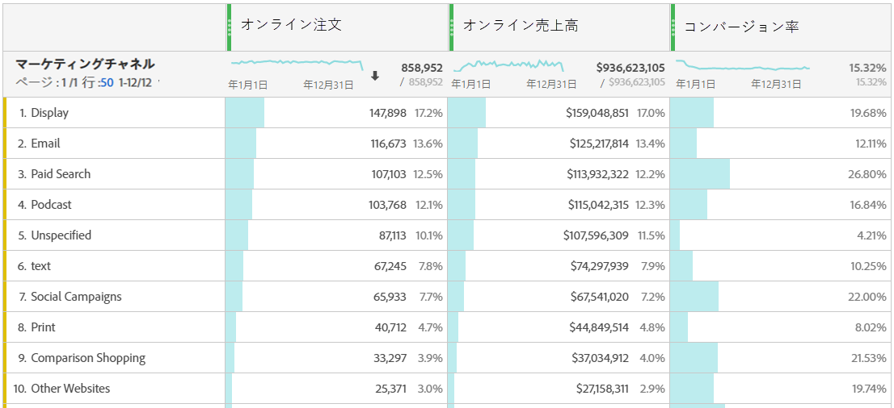
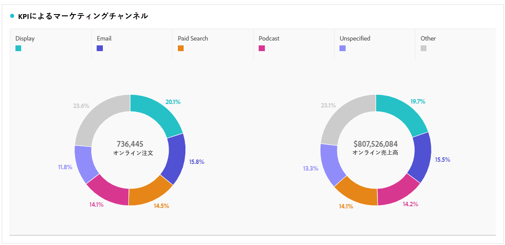
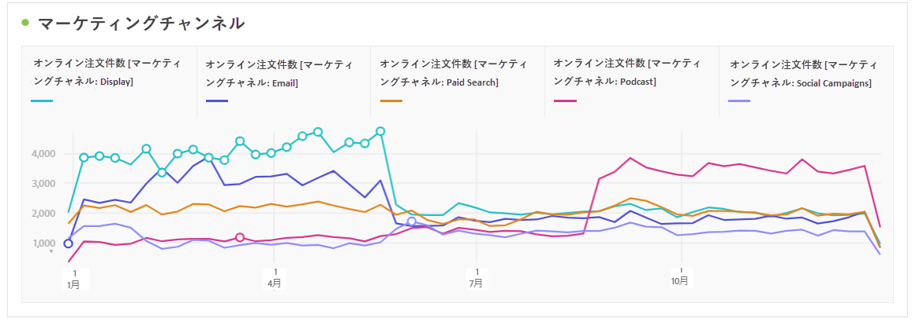
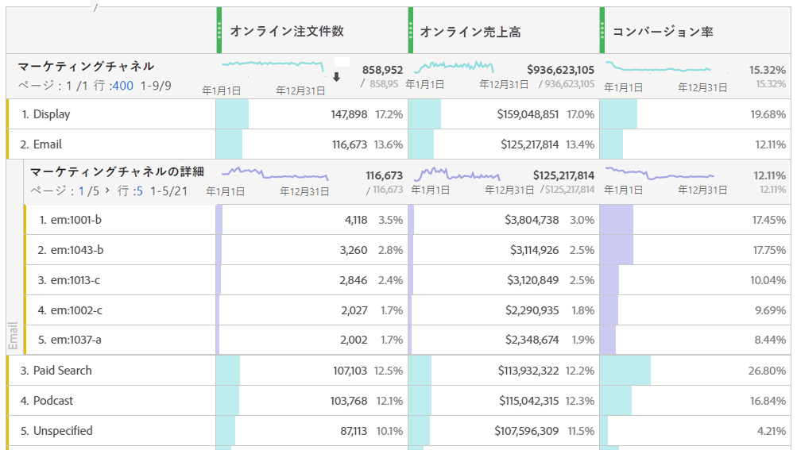
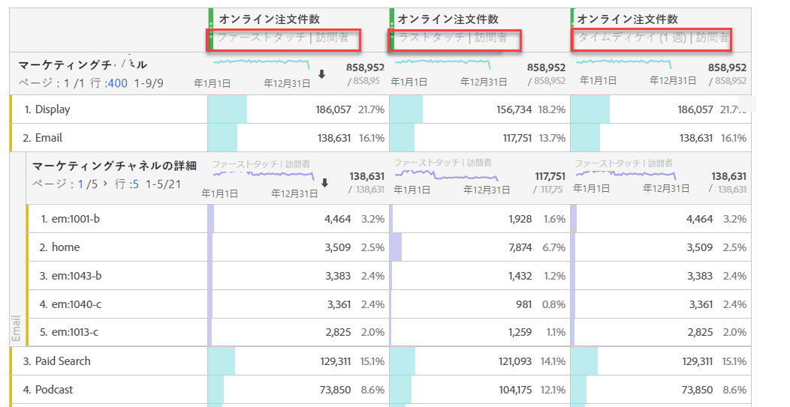
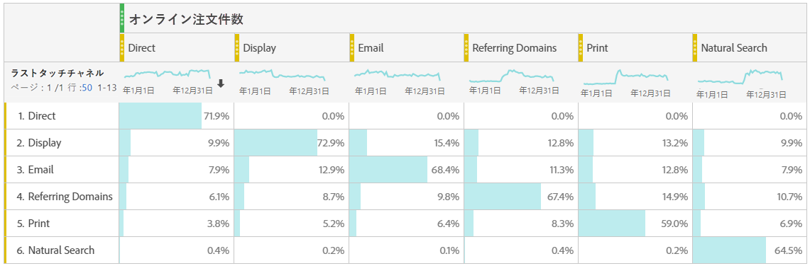

# マーケティングチャネルの分析

>[!NOTE]
>
>アトリビューションとAdobe Analyticsのマーケティングチャネルの効果を最大化するために、いくつかの[改訂されたベストプラクティス &#x200B;](/help/components/c-marketing-channels/mchannel-best-practices.md)を公開しました。
>
>Analytics 管理者は、[マーケティングチャネルの管理](/help/admin/tools/manage-rs/edit-settings/marketing-channels/c-channels.md)の説明に従って、組織のマーケティングチャネルを管理できます。

マーケティング施策のターゲットをより的確に絞り、マーケティング投資の費用対効果を高めるために、どのマーケティングチャネルが誰に対して最も効果的かを知りたい場合があるでしょう。 Adobe Adobe Analyticsでは、Workspaceのマーケティングチャネルのディメンションと指標は、注文や売上などにさまざまなチャネルが与える影響を追跡し、チャネルに関する有用なインサイトを獲得するのに役立つツールのひとつです。 マーケティングチャネルに関連して使用できるディメンションと指標は次のとおりです。

| ディメンション／指標 | 定義 |
| --- | --- |
| マーケティングチャネル | これは、使用が推奨されるマーケティングチャネルディメンションです。 アトリビューションモデルは、実行時に適用することができます。 このディメンションはラストタッチチャネルディメンションと同じように動作しますが、異なるアトリビューションモデルを適用して使用する際に混乱を招かないよう、異なるラベルが付けられています。 |
| ラストタッチチャネル | ラストタッチアトリビューションモデルが事前に適用され、変更できないレガシーディメンションです。 |
| ファーストタッチチャネル | ファーストタッチアトリビューションモデルが事前に適用され、変更できないレガシーディメンションです。 |
| マーケティングチャネルインスタンス | この指標は、ページビューやカスタムリンク名の呼び出しなど、マーケティングチャネルがイメージリクエストで定義された回数を測定します。 永続化された値は含まれません。 |
| 新規エンゲージメント | この指標はインスタンスと似ていますが、イメージリクエストでファーストタッチマーケティングチャネルが定義された場合にのみ増加します。 |

## 基本分析

このフリーフォームテーブルは、各マーケティングチャネルのオンライン注文件数、オンライン売上高、およびコンバージョン率を示します。

各マーケティングチャネルのオンライン注文件数とオンライン売上高をドーナツグラフで示します。

この折れ線グラフは、様々なチャネルのオンライン注文件数の経時的なトレンドを示します。

## アドバンス分析

マーケティングチャネルの詳細：各チャネルをより詳細に把握し、特定のキャンペーンや施策の配置などを表示できます。各マーケティングチャネルの内容は、次のとおりです。

## アトリビューションモデルの適用

[&#x200B; アトリビューション &#x200B;](/help/analyze/analysis-workspace/attribution/overview.md)を使用して、様々なアトリビューションモデルを瞬時に適用できます。

異なるアトリビューションモデルを適用すると、同じ指標（オンライン注文件数）から異なる結果が生成されます。

## クロスタブマーケティング分析

従来のファーストタッチチャネルとラストタッチチャネルを使用すると、チャネル間のインタラクションを便利なビューで確認できます。

クロスタブマーケティングの分析について詳しくは、次のビデオを参照してください。[クロスタブ分析を使用した Analysis Workspace の基本的なマーケティング属性の調査](https://experienceleague.adobe.com/docs/analytics-learn/tutorials/analysis-workspace/attribution-iq/using-cross-tab-analysis-to-explore-basic-marketing-attribution-in-analysis-workspace.html?lang=ja)
