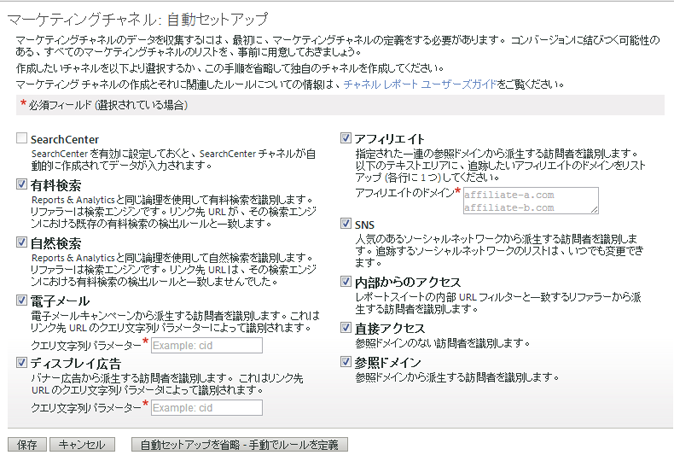

# 自動セットアップ

マーケティングチャネルレポートの一時設定を実行します。

## Automatic setup {#topic_E9ABE9E9E71B4E40A4E7EA9AD2C0372B}

マーケティングチャネルレポートの一時設定を実行します。

マーケティングチャネルレポートには、開始するための1回限りのセットアップページが用意されています。このレポートは、トラッキングに使用できる複数のマーケティングチャネルを提供します。チャネルとルールを問題なくご自分で作成できる場合には、このセットアップをスキップしてかまいません。ただし、アドビでは、ウィザードを使用してチャネルを作成することを推奨します。自動セットアップを使用すると、ルールの構成方法を確認できます。また、個々の目的に合わせてルールを編集することもできます。事前定義のチャネルは、いつでも無効にしたり削除したりできます。

## マーケティングチャネルの自動セットアップの実行 {#task_0F694146D48B4647BD7D5F060D394AB7}

マーケティングチャネルの自動セットアップの実行方法です。

1. **[!UICONTROL Analytics]** / **[!UICONTROL 管理者]** / **[!UICONTROL レポートスイート]**&#x200B;の順にクリックします。
1. 「[!UICONTROL Report Suite Manager]」でレポートスイートを選択します。
1. Click **[!UICONTROL Edit Settings]** &gt; **[!UICONTROL Marketing Channels]** &gt; **[!UICONTROL Marketing Channel Manager]**.

   

   >[!NOTE]
   >
   >[!UICONTROL マーケティングチャネル:管理ツールのチャネル設定アプリケーションにアクセスすると、自動セットアップ] ページが自動的に表示されます。[（マーケティングチャネルマネージャーを参照](../../components/c-marketing-channels/c-channels.md#topic_45CF1C6A783B4F96ABF6317EAB6A854F)）。このページは、レポートスイートに既にマーケティングチャネルが含まれている場合には表示されません。マーケティングチャネルのない別のレポートスイートを選択しない限り、再度このページにアクセスすることはできません。

1. 作成するチャネルが選択されていることを確認します。

   When selected, **[!UICONTROL Email]**, **[!UICONTROL Display]**, and **[!UICONTROL Affiliate]** are required fields.

   [マーケティングチャネルマネージャー](../../components/c-marketing-channels/c-channels.md#topic_45CF1C6A783B4F96ABF6317EAB6A854F)を参照してください。

1. 「**[!UICONTROL 保存]**」をクリックします。
