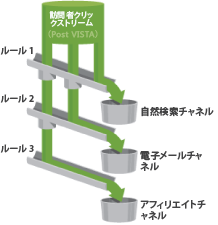

# チャネルとルールについて

レポートにチャネルとチャネルデータを表示できるようにするには、チャネルおよびそのデータを処理するための基本的なルールを作成してください。また、関連チャネルのコストと予算の金額を作成し、訪問者のエンゲージメント期間の長さも指定することができます。管理ツールでレポートの設定を行います。

チャネルを訪問件数のコンテナとすると、訪問件数を適切なコンテナに割り当てるのがルールです。

アドビでは、複数の事前定義のチャネルを[自動セットアップ](../../components/c-marketing-channels/c-channel-autosetup.md#topic_E9ABE9E9E71B4E40A4E7EA9AD2C0372B)を利用すると、事前定義された複数のチャネルが設定されます。このチャネルはニーズに合わせて編集できます。

>[!NOTE]
>
>アドビでは、テスト用にテンプレートとして使用できるレポートスイートにレポートを設定することを推奨します。それをひな形として、1 つまたはそれ以上の本番用レポートスイートにまとめてチャネルとルールセットを適用することができます。
>
>詳しくは、 [複数のレポートスイートへのテンプレートレポートスイート設定の適用](../../components/c-marketing-channels/t-template.md#task_0DE0A320EDA94FC5A6E5912868B6E2DC).

また、次のトピックを確認してください。

* [前提条件](../../components/c-marketing-channels/c-channels-rules.md#section_9913D2932E3140C099B7978CA95378B2)
* [重要な処理メモ](../../components/c-marketing-channels/c-channels-rules.md#section_DE372EEF02314F2395750CF2892DAAE1)

## 前提条件 {#section_9913D2932E3140C099B7978CA95378B2}

必要な場合は、次の前提条件に関してカスタマーケアに問い合わせることができます。

* In the Administration Console (General Account Settings), enable the **[!UICONTROL Conversion Level]** (e-commerce) option for the report suite.

   See [General Account Settings](https://marketing.adobe.com/resources/help/en_US/reference/general_acct_settings_admin.html) in Analytics help for more information.

* **[!UICONTROL マーケティングチャネルレポートへのユーザーグループのアクセス権を設定]**&#x200B;します。

   See [Configure User Group Access](../../components/c-marketing-channels/t-user-groups.md#task_B156E7527FE94055A43A697338FE8C8C).

* Ensure that your account manager has enabled **[!UICONTROL Channel Reports]** for your report suite.

## Important processing notes {#section_DE372EEF02314F2395750CF2892DAAE1}

* システムは指定された順序でルールを処理し、ルールの 1 つが満たされると残りのルールの処理を中止します。
* ルールは VISTA が設定した変数にはアクセスできますが、VISTA が削除したデータにはアクセスできません。
* チャネルはコンバージョン指標のみを保存します。トラフィック指標は利用できません。
* 2 つのマーケティングチャネルが同じイベント（購入やクリックなど）からクレジットを受けることはありません。この点でマーケティングチャネルは eVar と異なります（同一イベントから 2 つの eVar がクレジットを受ける場合がある）。
* レポートは一度に 25 のチャネルまで処理できます。

