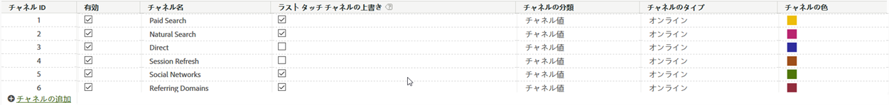

# マーケティングチャネルの管理

マーケティングチャネルマネージャーでマーケティングチャネルを追加または有効化します。レポートスイートにマーケティングチャネルがない場合は、自動セットアップによって複数のチャネルと各チャネルのルールを作成することができます。ニーズに合わせて事前定義のチャネルを編集したり、独自に作成したりすることができます（合計 25 個まで）。

[!UICONTROL マーケティングチャネル]ページへのチャネルの追加は、[マーケティングチャネルの処理ルール](/help/components/c-marketing-channels/c-rules.md)ページのルールの作成から独立して行うことができます。ルールを作成するときに、そのルールをチャネルに関連付けます。

チャネル作成時のガイドラインは次のとおりです。

* すべての訪問者が適切なチャネルに分類されるように、すべてのチャネルの一覧を作成し、事前に計画を立ててください。
* [内部](/help/components/c-marketing-channels/c-rules.md)ヒットのカテゴリ用のチャネルと、[直接](/help/components/c-marketing-channels/c-rules.md)ヒットのカテゴリ用のチャネルを含めてください。
* 包括的な「その他のキャンペーン」チャネルを含め、有料チャネルの後、および有機チャネルの前に配置します。

## 前提条件 {#prereqs}

* マーケティングチャネルディメンションへのアクセスを設定します。

   詳しくは、[マーケティングチャネルの権限](/help/components/c-marketing-channels/c-channel-report-access.md)を参照してください。

## マーケティングチャネルの追加 {#add-mktg-channels}

マーケティングチャネルマネージャーでマーケティングチャネルを追加します。

>[!NOTE]
>
>チャネルは削除できません。使用しないチャネルは、無効にするか名前を変更し、後で使用するためにとっておきます。

1. **[!UICONTROL Analytics]**／**[!UICONTROL 管理者]**／**[!UICONTROL レポートスイート]**&#x200B;の順にクリックします。
1. [!UICONTROL Report Suite Manager] ページで、レポートスイートを選択します。

   複数のレポートスイートを選択した場合、テンプレートから選択したレポートスイートに設定をコピーするために、テンプレートを選択する必要があります。

   詳しくは、[複数のレポートスイートへのテンプレートレポートスイート設定の適用](/help/components/c-marketing-channels/c-getting-started-mchannel.md)を参照してください。

1. **[!UICONTROL 設定を編集]**／**[!UICONTROL マーケティングチャネル]**／**[!UICONTROL マーケティングチャネルマネージャー]**&#x200B;をクリックします。

   レポートスイートでチャネルが定義されていない場合、[自動セットアップ](/help/components/c-marketing-channels/c-getting-started-mchannel.md)ページが表示されます。

1. [!UICONTROL マーケティングチャネルマネージャー]ページで、「**[!UICONTROL チャネルの追加]**」をクリックします。

   このオプションは、チャネルが 25 個定義されている場合は利用できません。

1. 「**[!UICONTROL 保存]**」をクリックします。
1. チャネルのルールを設定するには、「**[!UICONTROL マーケティングチャネルの処理ルール]**」をクリックします。

   [マーケティングチャネルの処理ルールの作成](/help/components/c-marketing-channels/c-rules.md)を参照してください。

## チャネル設定の適用 {#mktg-channel-mgr}

[!UICONTROL マーケティングチャネルマネージャー]ページの各チャネルに適用できる設定は様々です。

| フィールド | 定義 |
|--- |--- |
| 有効 |  このマーケティングチャネルの有効と無効を切り替えます。 |
| チャネル名 | マーケティングチャネルの分かりやすい名前をつけます。 |
| ラストタッチチャネルの上書き | ラストタッチチャネルを上書きするかどうかをチャネルごとに指定できます。このチェックボックスを選択すると、すべてのチャネル（「直接」と「内部」を含む）が既存のラストタッチチャネルを上書きします。設定を変更すると、誤ったチャネル（「直接」や「内部」）にコンバージョンが関連付けられるリスクがあるので、注意が必要です。たとえば、「自然検索」チャネルを通してユーザーが以前に獲得されている場合、「直接アクセス」での訪問が発生しても、「自然検索」のチャネルがコンバージョンのクレジットを引き続き受け取るようにしたい場合は、「直接アクセス」チャネルの「ラストタッチチャネルの上書き」オプションを外しておきます（デフォルト設定のまま変更しない）。 |
| チャネルの分類 |  この値によって、チャネルを分類できます。[マーケティングチャネルの分類](/help/components/c-marketing-channels/classifictions-mchannel.md)を作成する場合、チャネル分類（サブチャネル）を追加することができます。 |
| タイプ | サイトへのユーザーの訪問手段を指定します。「オンライン」または「オフライン」を選択できます。検索エンジンまたは電子メールキャンペーンから来訪した訪問者に対しては「オンライン」チャネルを使用します。「オフライン」チャネルは、新聞のクーポンや雑誌の広告でサイトの情報を見つけた訪問者に使用します。オフラインチャネルには通常、データソースからインポートされたデータが含まれます。[データソース](https://docs.adobe.com/content/help/ja-JP/analytics/import/data-sources/datasrc-home.html)を参照してください。[オフラインデータの追加](/help/components/c-marketing-channels/c-getting-started-mchannel.md)を参照してください。 |
| Color | Reports &amp; Analytics のみ：このマーケティングチャネルに関連付けられている色。この色は、マーケティングチャネルレポートで、このチャネルを表します。 |

### ベストプラクティスの上書き

「ダイレクト」チャネルと「内部」チャネルのラストタッチの上書きオプションは、他の永続的なラストタッチチャネル（または相互）からクレジットを受け取れないように、オフにすることをお勧めします。

## チャネルルールの定義

レポートにチャネルとチャネルデータを表示できるようにするには、チャネルおよびそのデータを処理するための基本的なルールを作成してください。また、[訪問者エンゲージメント期間](/help/components/c-marketing-channels/visitor-engagement.md)の長さも指定できます。

アドビでは、[自動セットアップ](/help/components/c-marketing-channels/c-getting-started-mchannel.md)中に定義済みのチャネルをいくつか提供します。これらはニーズに合わせて編集できます。また、この設定を変更し、[マーケティングチャネルの処理ルール](/help/components/c-marketing-channels/c-rules.md)内でカスタムルールを定義することもできます。

>[!NOTE]
>
>まずテスト用のレポートスイートにレポートを設定することを推奨します。それをひな形として、1 つまたはそれ以上の本番用レポートスイートにまとめてチャネルとルールセットを適用することができます。
>
>詳しくは、[複数のレポートスイートへのテンプレートレポートスイート設定の適用](/help/components/c-marketing-channels/c-getting-started-mchannel.md)を参照してください。
